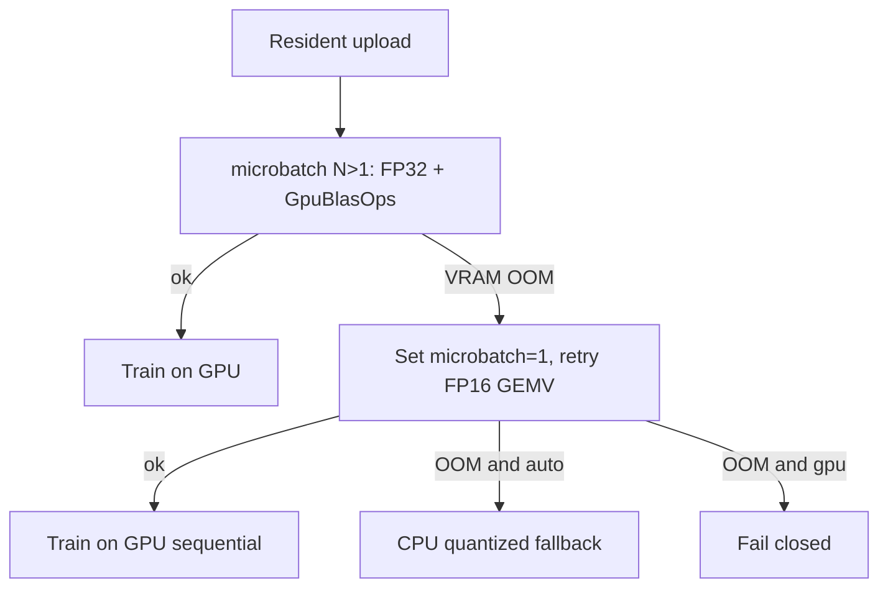

# Tier 11: LoRA Microbatch CLI + VRAM Auto-Fallback

## Agent handoff

Read and follow `models/CLAUDE.md` before implementing:

1. Unit tests first, only for valuable business logic.
2. Implementation details designed with performance in mind.
3. Follow KISS.
4. Prefer adding new Java classes over extending existing ones.
5. Update `docs/agent-arch.txt`, `docs/howto.md`, `README.md` when applicable.
6. No emojis; be strict and precise.
7. Output: list changed files for preview; never zip files back.

Also read:

- `PLAN-LoRA-ROADMAP.md`
- `PLAN-LoRA-Tier9.md` (microbatch GEMM / FP32 residency)
- `PLAN-LoRA-Tier10.md` (shared `LoraResidentWeights`, Phi-3 / Qwen3 upload)
- `docs/LoRA.md`, `docs/performance.md`, `CHANGELOG.md` Session 48
- `LoraTrainDevice.java` (CLI/env + system-property pattern to mirror)
- `LoraResidentWeights.java` (`microbatchSize`, `upload`, `tryRecoverFromUploadOom`)
- `LoraTrainableHandler` / `Phi3LoraTrainableHandler` / `Qwen3LoraTrainableHandler` (`uploadResidentWeights`)
- `LoraCliOptions.java`, `LoraTrainingConfig.java`, `ConsoleMain.java`, `LoraTrainer.java`
- `scripts/run.sh`, `scripts/run.bat`

Prerequisite: Tier 9 microbatch GEMM and Tier 10 residency helpers exist. Do **not** re-implement `GpuBlasOps`. Do not require `JAVA_TOOL_OPTIONS` for operators.

## Overview

Default `juno.lora.microbatch=8` forces FP32 residency for GEMM. That OOMs Phi-3.5 on ~8 GB cards that previously fit FP16. Recovery today jumps straight to CPU under `auto`, skipping the FP16 path. Operators must use `JAVA_TOOL_OPTIONS`, which is not in `--help`.

This tier exposes `--lora-microbatch` / `LORA_MICROBATCH` and adds VRAM OOM auto-fallback:

## Chosen design

- CLI/env: `--lora-microbatch N` / `LORA_MICROBATCH` (default **8**, range **1..128**).
- Explicit `1` starts on FP16 (no FP32 attempt).
- On VRAM OOM while `microbatch > 1` and half residency is supported: close partial buffers, set property to `1`, **retry once**.
- Second failure: existing policy — `auto` → CPU log+fallback; `gpu` → fail closed; never silent wrong math.
- Keep system property `juno.lora.microbatch` as the runtime source of truth (handlers already read it).

## Implementation

### 1. New `LoraMicrobatch` (node) — tests first

Add `node/src/main/java/cab/ml/juno/node/LoraMicrobatch.java` (mirror `LoraTrainDevice`):

- `DEFAULT = 8`, `MAX = 128`
- `validate(int n)` / `normalize(String)` — reject `<1` and `>MAX` with clear CLI error
- `apply(int n)` — `System.setProperty("juno.lora.microbatch", …)`
- `current()` — read property (delegate from `LoraResidentWeights.microbatchSize()`)

Tests: `LoraMicrobatchTest.java` for bounds, apply/current, blank/default.

### 2. Upload recovery helper (new class)

Add `LoraResidentUpload.java` so handlers do not duplicate retry logic:

- `run(GpuMatVec gpu, Logger log, Runnable closer, Runnable uploadAttempt)`
  1. Run `uploadAttempt`
  2. On VRAM OOM + `microbatchSize()>1` + `gpu.supportsHalfResident()`: `closer`, log warning, `LoraMicrobatch.apply(1)`, run `uploadAttempt` again
  3. On further OOM: existing `tryRecoverFromUploadOom` (CPU vs fail-closed `gpu`)

Keep `LoraResidentWeights.upload` precision rule unchanged (FP32 iff microbatch>1). Point `microbatchSize()` at `LoraMicrobatch.current()`.

Unit-test recovery decisions with package-visible hooks that simulate OOM without real GPU (which recovery branch), plus keep gated GPU coverage optional.

### 3. Wire handlers

Refactor catch/upload in:

- `LoraTrainableHandler.uploadResidentWeights`
- `Phi3LoraTrainableHandler.uploadResidentWeights`
- `Qwen3LoraTrainableHandler.uploadResidentWeights`

to call `LoraResidentUpload.run(...)`. Fix Phi-3/Qwen3 log lines to report precision from `LoraMicrobatch.current()` (not only `supportsHalfResident()`), so FP16 retries are not mislabeled.

### 4. CLI / config / launcher

Mirror `--lora-train-device` wiring:

- `LoraCliOptions`: field + `--lora-microbatch` + env `LORA_MICROBATCH`
- `LoraTrainingConfig`: `microbatch` on builder (default 8)
- `ConsoleMain` / `LoraTrainer.open`: call `LoraMicrobatch.apply(config.microbatch())` before handler load (same early point as `LoraTrainDevice.selectBackend`)
- `scripts/run.sh` / `scripts/run.bat`: parse, help, passthrough
- Tests: extend `LoraCliOptionsTest`

### 5. Docs

- `docs/LoRA.md`, `docs/howto.md`, `docs/performance.md`: flag, default 8, `1` for VRAM-tight Phi-3, auto-fallback ladder
- `docs/agent-arch.txt`: `LoraMicrobatch`, `LoraResidentUpload`
- `CHANGELOG.md` Session note; brief `README.md` / `RELEASE_NOTES.md` if LoRA GPU bullets list CLI knobs
- `PLAN-LoRA-ROADMAP.md`: mark Tier 11 done when exit gates pass

## Verification and exit gate

Exit only when:

1. `--lora-microbatch` / `LORA_MICROBATCH` parse and apply before resident upload.
2. Default 8 still enables FP32 GEMM when VRAM allows (TinyLlama path unchanged).
3. On FP32 OOM with half support: one retry at microbatch=1 (FP16); `auto` may then fall back to CPU; `gpu` fails closed after retry.
4. Unit tests cover `LoraMicrobatch` bounds and upload recovery branches.
5. Docs/help list the flag; Phi-3.5 no longer requires `JAVA_TOOL_OPTIONS` for the FP16 path.
6. `mvn test -pl node -am` and `mvn test -pl juno-player -am` pass.

## Implementation todos

1. Add `LoraMicrobatch` + unit tests (validate/apply/current).
2. Add `LoraResidentUpload` OOM retry FP16 then CPU/fail; wire three handlers.
3. Wire `--lora-microbatch` / `LORA_MICROBATCH` through CliOptions, TrainingConfig, ConsoleMain, LoraTrainer, run.sh/bat.
4. Update LoRA.md, howto, performance, agent-arch, CHANGELOG/README as needed.
5. List preview files; no zip.

## Preview files (expected)

New: `LoraMicrobatch.java`, `LoraMicrobatchTest.java`, `LoraResidentUpload.java`, `LoraResidentUploadTest.java`

Modified: `LoraResidentWeights.java`, three LoRA handlers, `LoraCliOptions.java`, `LoraTrainingConfig.java`, `ConsoleMain.java`, `LoraTrainer.java`, `run.sh`/`run.bat`, docs + CHANGELOG + ROADMAP
