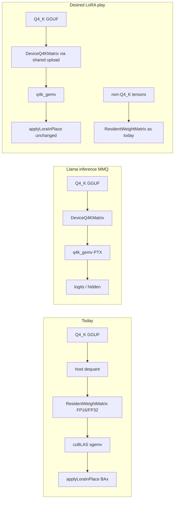

# Plan: LoRA fused Q4_K MMQ wiring (Tier 13B adjacency)

| Field | Value |
|-------|-------|
| **Status** | **Phase 1 in progress** — playback-only MMQ wiring started (Approach A) |
| **Adjacency** | Tier 13 Phase B (MMQ landed on `LlamaTransformerHandler` only) |
| **Not an Infra tier** | Does not consume the “one Infra tier in flight” slot; own exit gate under LoRA §2 |
| **Prompt** | [`PROMPT-LoRA-MMQ.md`](PROMPT-LoRA-MMQ.md) |
| **Depends on** | Tier 13B kernels (`DeviceQ4KMatrix`, `Q4KMmqKernel`, PTX `q4k_gemv`) already in tree |
| **Blocks** | Claiming `--mmq` helps `--lora-play` throughput (today flags coexist but MMQ is unused) |
| **ROADMAP** | Execution rules **§6** (cross-feature matrix); this plan is the **follow-up** cell for `--mmq` × `--lora-play` |

## Feature × surface interaction matrix (target after this plan)

| New feature / flag | Base inference | --lora-play | LoRA train | Vision | --parallel | --gpu-layers | --prefill-batch | CUDA | ROCm | Default |
|--------------------|----------------|-------------|------------|--------|------------|--------------|-----------------|------|------|---------|
| `--mmq` (LoRA play) | unchanged (Llama text) | **wired** (Phase 1) | **explicit no-op** + warn (Approach A) | N/A | as LoRA multi-decode allows | with LoRA residency policy | serial Q4 GEMVs OK | **wired** | **explicit no-op** | **off** |

## 1. Purpose / status

Wire fused Q4_K MMQ (`--mmq` / `JUNO_MMQ`) into LoRA frozen-weight residency (`LoraResidentWeights` / LoRA training handlers) so `--lora-play` can use packed-device GEMV instead of dequant → FP16/FP32 `ResidentWeightMatrix` → cuBLAS — **without** breaking LoRA train, playback recall, merge, or default (`--mmq off`) bit-compatibility.

Verified gap (2026-09-04): `--mmq on` + `--lora-play` recalls correctly, but logs show no `Fused Q4_K MMQ enabled`; path is `LoraTrainableHandler` → `LoraResidentWeights.uploadQuant` → dequant → FP16/FP32.

## 2. Current vs desired architecture

| Concern | Llama MMQ (done) | LoRA residency (today) | Desired (this plan) |
|---------|------------------|------------------------|---------------------|
| Upload | Q4 packed **or** FP16 half | Always dequant → FP16/FP32 | Play + MMQ: Q4 packed when `TYPE_Q4_K`; else FP path |
| Forward | `sgemv(DeviceQ4KMatrix)` | `ResidentWeightMatrix.sgemv` | Same Q4 GEMV when resident Q4 present |
| Transpose / train | N/A (inference) | FP32 GPU transpose **or** CPU quant (FP16 residency avoids GPU transpose — NaN history) | **Train unchanged** under recommended approach A |
| Microbatch | N/A | `>1` → FP32 + `GpuBlasOps` | MMQ **off** for LoRA when microbatch > 1 |
| Adapter order | N/A | `W*x` then `+= B(Ax)` | Unchanged |
| ROCm | No MMQ (`supportsQ4KMmq` false) | FP16/FP32 / rocBLAS | Stay FP16/FP32; no HIP kernel in this plan |

## 3. Recommended approach

**Primary: A — Playback-only MMQ**

Enable fused Q4_K residency for LoRA **inference / `--lora-play` only**. Training uploads stay today’s FP16/FP32 ladder until a Q4 transpose kernel (or an approved dual-resident follow-up) exists.

### Why A (evidence)

| Risk | Evidence |
|------|----------|
| **R1 Transpose** | PTX entry is forward-only `q4k_gemv`. No `sgemvTranspose(DeviceQ4KMatrix)`. Training needs `W^T*g`. |
| **R2 Microbatch** | `LoraMicrobatch > 1` forces FP32 `ResidentWeightMatrix` for `GpuBlasOps`; Q4 packed residency cannot drive batched GEMM. |
| **R3 Same class** | `--lora-play` and train both use `LoraTrainableHandler` (Qwen2 delegates to it). Upload runs at construct time. Play is detectable via `juno.lora.play.path` / play-adapter load path; dedicated `juno lora` train REPL does not set play path. |
| **R11 FP16 NaN** | `frozenTranspose` already skips FP16 GPU transpose (`supportsBatchedSgemm()` only); CPU quant adjoint is the safe train path for microbatch=1. Replacing forward with Q4 while training would still need a deliberate train policy — A avoids that by not changing train uploads. |

### Rejected / deferred alternatives

| Option | Verdict |
|--------|---------|
| **B. Dual resident** (Q4 forward + FP16/FP32 transpose) | Correct but ~2× frozen VRAM; defeats MMQ’s memory win on 8 GiB. Defer as optional Phase 2 if train must keep GPU transpose **and** MMQ forward. |
| **C. Defer until Q4 transpose kernel** | Too conservative: play path is inference-only and already the verified gap; A unblocks play TPS without a new kernel. |
| **D. Q4-only for train microbatch=1 + CPU transpose** | Tempting (matches today’s FP16 adjoint policy) but changes train forward numerics under `--mmq on`. Violates “train stays FP16/FP32” and default-safe philosophy. Not Phase 1. |

### Phase split

1. **Phase 1 (this plan’s implementation scope):** Playback-only MMQ on Llama-family `LoraTrainableHandler` (+ Qwen2 via delegate). Shared upload helper. Gates + docs.
2. **Phase 2 (checklist):** Phi-3 / Qwen3 LoRA handlers; optional dual-resident or Q4 transpose if train MMQ is ever required.

## 4. API / type design

Prefer **new classes** over stuffing Q4 into `ResidentWeightMatrix` (`models/CLAUDE.md`).

| Piece | Design |
|-------|--------|
| **`ResidentQ4KWeight`** (new) | Thin `AutoCloseable` around `DeviceQ4KMatrix` + `GpuMatVec`; `sgemv(x)` → `gpu.sgemv(q4, x)`. No transpose method. |
| **Shared upload helper** (new, e.g. `Q4KResidentUpload`) | Extract Llama’s `uploadProjection` logic: if `tryMmq && TYPE_Q4_K` → `uploadQ4K(raw)`; else caller’s FP path. Used by `LlamaTransformerHandler` (optional refactor in same PR or follow-up) and LoRA play upload. |
| **`LoraResidentWeights`** | Add `matVec(quant, ResidentQ4KWeight q4, ResidentWeightMatrix fp, x, …)` routing: q4 → MMQ; else existing fp/CPU. **Do not** change `uploadQuant` default behavior when MMQ play gate is false. |
| **Play gate helper** (new or on `MmqOptions`) | e.g. `LoraMmqPolicy.enabledForPlayback()`: `MmqOptions.preferMmq() && gpu.supportsQ4KMmq() && LoraMicrobatch.current()==1 && isLoraPlaybackContext()`. |
| **Playback context** | `System.getProperty("juno.lora.play.path") != null` **or** explicit property set when ConsoleMain loads `--lora-play` adapters in-process (local may not always set the cluster property — set one canonical flag at play load). |

Do **not** put Q4 inside `ResidentWeightMatrix` (would imply transpose/sgemm APIs that do not exist).

## 5. Handler scope

| Handler | Phase 1 | Phase 2 |
|---------|---------|---------|
| `LoraTrainableHandler` (llama / mistral / tinyllama) | **Yes** — primary | — |
| `Qwen2LoraTrainableHandler` | **Yes** (delegate) | — |
| `Phi3LoraTrainableHandler` | No — fused QKV / gate_up row layouts | Checklist: physical fused upload as one Q4 matrix + host slice (forward-only), parity vs CPU row-range |
| `Qwen3LoraTrainableHandler` | No — own residency arrays / qDim | Mirror Llama play upload once helper exists |
| Inference handlers (Phi-2/3, Qwen3 text) | Out of scope here | Remains Tier 13B architecture follow-up |

`LoraTrainingHandlerFactory` / `ForwardPassHandlerLoader.load(..., adapters)`: no API change required if upload policy is env/property driven inside handlers.

## 6. Flag semantics

| Flag / property | LoRA play + CUDA | LoRA train | Notes |
|-----------------|------------------|------------|-------|
| `--mmq off` (default) | FP16/FP32 as today | FP16/FP32 as today | Bit-compatible; required regression |
| `--mmq on` | Q4 packed when `TYPE_Q4_K` + kernel load | **Ignore MMQ for upload** — log once: train uses FP residency | Fail closed if `on` but kernel missing on play? Prefer fallback to FP16 + warning (match Llama upload resilience) |
| `--mmq auto` | Same as on when CUDA + kernel | Ignore for LoRA train upload | Do **not** let auto enable MMQ on train path (R9) |
| `--lora-microbatch > 1` | N/A for pure play (default 1) | FP32 ladder; MMQ stays off | If play somehow has microbatch > 1, refuse MMQ |
| `juno.lora.train.device` | Play does not use train device ladder for MMQ decision | Existing OOM ladder unchanged | Q4 play OOM: close partial Q4, fall back FP16 or CPU per play policy (mirror Llama layer OOM) |
| `--cpu` / non-CUDA | No MMQ | No MMQ | ROCm: FP16/FP32 only |
| ROCm | Explicit non-goal | Unchanged | HIP fused kernel = separate plan |

CLI help / howto: state that `--mmq` accelerates LoRA **playback** when CUDA fused kernel is available; training remains FP resident.

## 7. Risk register

| ID | Topic | Sev | Likely | Mitigation | Test |
|----|-------|-----|--------|------------|------|
| R1 | Transpose / backward — no Q4 transpose kernel | High | High if train uses Q4 | Approach A: train uploads never Q4-only | Train smoke with `--mmq on`: still FP16/FP32 logs; no NaN |
| R2 | Microbatch / FP32 vs Q4 | High | Med | MMQ only when microbatch==1; play defaults to 1 | Unit: policy false when microbatch>1 |
| R3 | Play vs train same handler | High | High | Canonical playback context flag; train path ignores MMQ | Play: JFR `cuda-resident-q4k`; train: `cuda_resident` / FP logs only |
| R4 | VRAM / OOM ladder leaks | High | Med | Closer must close Q4 arrays; no half-Q4/half-FP16 assign on failure; reuse `LoraResidentUpload` pattern for play | OOM inject / small VRAM manual; assert null device arrays after fallback |
| R5 | Non-Q4_K tensors (e.g. Q6_K LM head) | Med | High on Q4_K_M | Hybrid: Q4 tensors → MMQ; others → existing `uploadQuant` | TinyLlama play: layers Q4, output may stay FP/CPU |
| R6 | Adapter math order / dtype | High | Low if forward-only swap | Keep `applyLoraInPlace` after frozen `W*x`; adapters stay host FP | Recall gate; parity logits vs `--mmq off` within tol |
| R7 | Phi-3 / Qwen fused layouts | Med | High if rushed | Phase 2 only; fused physical matrix upload + slice | Phi-3 play parity test when Phase 2 starts |
| R8 | JFR / false “MMQ on” | Med | High today | Require `cuda-resident-q4k` counts under play+mmq; log `Fused Q4_K MMQ enabled` from LoRA play upload | Manual JFR + compare-lora playback tps |
| R9 | `auto` enables train MMQ | High | Med if shared preferMmq | Train upload ignores MMQ regardless of auto/on | Unit: train context + auto → no Q4 upload |
| R10 | Vision / Vector SIMD shared helpers | Med | Low | Do not touch `VectorQuantKernels` / vision encode; shared helper is Q4 upload only | No vision compare required unless helper touches weight-stationary CPU |
| R11 | FP16 GPU transpose NaN (history) | High | Known | A leaves train transpose policy untouched | Existing train gates |
| R12 | Local `--lora-play` may not set `juno.lora.play.path` | Med | Med | Set canonical property in ConsoleMain when loading play adapters | Local play enables MMQ without cluster property |
| R13 | Extracting Llama upload regresses Llama OOM | Med | Low | Prefer new helper called from LoRA first; Llama refactor optional / parity-tested | Existing `Q4KMmqParityTest` + Llama smoke |
| R14 | Merge / export paths assume dequant host weights | Low | Low | Merge reads GGUF/adapters, not device Q4 | Smoke merge after play session |

## 8. Test plan

### Unit / parity (first)

1. `LoraMmqPolicy` / play-context parsing tests (on/off/auto × play/train × microbatch).
2. `ResidentQ4KWeight` close / double-close / sgemv delegates (mock or GPU group).
3. Extend or add GPU parity: frozen Q4 play forward vs CPU `matVec` within existing MMQ tol (`1e-2`), **with** a dummy LoRA delta applied after (order check).
4. OOM closer unit: partial Q4 array closed (pattern from `LoraResidentUploadTest`).

### Integration / gates

| Gate | Command / check |
|------|-----------------|
| No regress `--mmq off` | `./scripts/performance-tests/compare-lora.sh --gpu --baseline …` (or `release-0.1.2`) — recall ok; train ≤1.25×; playback tps ≥0.80× |
| Play + MMQ | Same script with `JUNO_MMQ=on` (or harness flag once wired) — recall ok; playback tps not worse than off (expect uplift); artifacts under `docs/perf-compare/<ts>-lora/` |
| Manual recall | `./juno local --model-path models/tinyllama-1.1b-chat-v1.0.Q4_K_M.gguf --mmq on --nodes 1 --lora-play models/….lora` — answer contains `My name is Juno`; log has `Fused Q4_K MMQ enabled`; JFR `juno.MatVec.backend.cuda-resident-q4k.*` count > 0 |
| Train smoke | `juno lora` (or train path) with `--mmq on`: one `/train-qa` step — no NaN; upload log still FP16/FP32; loss finite |
| Llama inference | Unchanged `--mmq on` without LoRA still works (Tier 13B) |

## 9. Exit criteria

### When implementation may start

- [x] This plan reviewed / approved (approach A accepted or explicitly amended).
- [x] Tier 13B kernels remain loadable on the reference CUDA SKU.
- [x] Owner agrees play-context detection (`juno.lora.play.path` + ConsoleMain property).

### When LoRA MMQ may be called done (Phase 1)

- [ ] `--lora-play` + `--mmq on` uses Q4 packed path; JFR proves `cuda-resident-q4k`.
- [ ] `--mmq off` LoRA behavior bit-compatible with pre-change (compare-lora ratios).
- [ ] Train path with `--mmq on` does not switch frozen weights to Q4-only; no NaN on one-step smoke.
- [x] Docs: `howto.md`, `performance.md`, ROADMAP/Tier13 status; no competitor names outside infra-plan/perf-compare; no Infra tier numbers in CLI/JFR strings.
- [x] Preview file list published; no zip.

Phase 2 (Phi-3/Qwen3, train MMQ) is **not** required to mark Phase 1 done, but must be listed as follow-up (ROADMAP §5).

## 10. Out of scope

- FlashAttn / attention kernels
- ROCm / HIP fused Q4 kernel
- Full ggml MMQ port; non-Q4_K fused types
- Changing default `--mmq` to `on`
- Q4 transpose kernel / dual-resident train acceleration (Phase 2+ proposal only)
- Vision encoder paths; Vector SIMD policy changes
- Making LoRA MMQ a new Infra tier number

## 11. Preview files (future implementation PR — not this session)

**Docs (this planning session):**

- `docs/infra-plan/PLAN-Infra-LoRA-MMQ.md` (this file)
- `docs/infra-plan/PLAN-Infra-Tier13.md` (cross-link)
- `docs/infra-plan/PLAN-Infra-ROADMAP.md` (one-line adjacency note)

**Expected future code / docs (Phase 1):**

- `node/src/main/java/cab/ml/juno/node/ResidentQ4KWeight.java` (new)
- `node/src/main/java/cab/ml/juno/node/Q4KResidentUpload.java` or `LoraMmqPolicy.java` (new)
- `node/src/main/java/cab/ml/juno/node/LoraResidentWeights.java`
- `node/src/main/java/cab/ml/juno/node/LoraTrainableHandler.java`
- `juno-player/src/main/java/cab/ml/juno/player/ConsoleMain.java` (play-context property)
- `node/src/test/java/cab/ml/juno/node/LoraMmqPolicyTest.java` (new)
- `node/src/test/java/cab/ml/juno/node/LoraQ4KPlaybackParityTest.java` (new, GPU group)
- `docs/howto.md`, `docs/performance.md`, `docs/agent-arch.txt`, `CHANGELOG.md`
- Optional: `LlamaTransformerHandler.java` call-site to shared upload helper

**Phase 2 (later):**

- `Phi3LoraTrainableHandler.java`, `Qwen3LoraTrainableHandler.java` + tests
