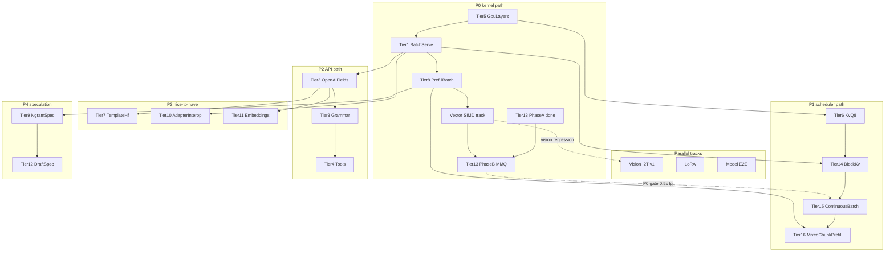

# Juno Infra Improvement Roadmap (llama.cpp + vLLM Parity)

## Purpose

This file is the authoritative execution order for raising Juno inference toward peer competitiveness while remaining a pure-JVM GGUF engine. Peer claims are scoped deliberately:


| Claim                      | Meaning                                                                                                | Not claimed                                            |
| -------------------------- | ------------------------------------------------------------------------------------------------------ | ------------------------------------------------------ |
| **llama.cpp product peer** | API / memory / DX for GGUF JVM serving (fields, grammar, tools, `-ngl`-style fit, quant KV, templates) | ggml / FlashAttn / MMQ kernel parity                   |
| **vLLM scheduler peer**    | Continuous batching + chunked prefill on **logical** block pages (gather-to-BLAS)                      | PagedAttention CUDA kernels, EAGLE/MTP, Ray/k8s deploy |
| **Not a kernel peer**      | Panama + cuBLAS/rocBLAS remains the default hot path; Tier 13 is gated only                            | Feature-for-feature CUDA stack chase                   |


**Tier numbers identify features. Execution phases (P0–P5) define when to build them. Always follow phases, not tier number order.**

Measured bake-off (2026-08-31, GTX 1080): Juno GPU decode is **0.17–0.22×** llama.cpp tg on models with full VRAM residency; **mistral-7b** falls to **0.01×** (100% CPU MatVec fallback). JFR shows `juno.MatVec` **≈ 93–96%** of decode time. Phase P1 (Tiers 14–16) improves aggregate QPS under load but does **not** close this gap.

See `[PLAN-Infra-PERF-ANALYSIS.md](PLAN-Infra-PERF-ANALYSIS.md)` for full numbers, JFR breakdown, and compare-script caveats.

## Execution rules

These rules apply to every Infra tier (Tiers 1–16, including Tier 13 phases). Rules §1–§5 are mandatory for implementation, tests, and bake-offs.

### 1. One tier at a time

Implement **exactly one** Infra tier until it is **feature complete** (tier exit checklist + published bake-off per §2). Do not start another Infra tier while one is in progress — even when a phase step lists multiple tiers (e.g. P0 step 2: complete **Tier 5**, then **Tier 1**, in that order). Phase **gate met** may lag feature complete; do not block the next *dependent* Infra tier solely on program P0 ratios, but do not claim “P0 done” or peer language until gates pass.

Parallel work is limited to non-Infra tracks (see [Parallel tracks](#parallel-tracks-not-infra-tiers): LoRA, model E2E, **Vision I2T**, **Vector SIMD**) that do not share the same Infra-tier exit gate. Parallel tracks may share a branch with Infra work, but each track keeps its own exit gate and must not mark an Infra tier complete.

Phases P0 → P1 → P2 → … advance **one tier at a time** on the critical path: finish the current tier before starting the next.

### Status vocabulary (feature vs gate)

ROADMAP **Status** may use two layers — do not collapse them:


| Label                | Meaning                                                                                        |
| -------------------- | ---------------------------------------------------------------------------------------------- |
| **Feature complete** | CLI/API/code + unit/parity tests + published bake-off artifacts for the tier’s feature scope   |
| **Gate met**         | Program or phase **exit gate** numbers pass (e.g. P0 mistral / Phi-3.5 ratios; LoRA §2 ratios) |


A tier may be **feature complete** while its phase gate remains **unmet**. Peer language and “P0 done” claims require **gate met**, not feature complete alone.

### 2. Perf compare at tier completion

Before marking a tier **feature complete** and beginning the next dependent tier:

1. Run `[scripts/performance-tests/compare-llama-cpp.sh](../../scripts/performance-tests/compare-llama-cpp.sh)` (CPU and/or GPU as relevant; default `--vector 0`, JFR on).
2. Run `[scripts/performance-tests/compare-lora.sh](../../scripts/performance-tests/compare-lora.sh)` on the same backend when the tier touches forward pass, MatVec, GPU residency, batching, or KV (Infra tiers 1, 5, 8, 13–16). Compare against the last published LoRA baseline or `release-0.1.2` (`--baseline release-0.1.2`). Exit gate: recall ok; train total ms and ms/pass ≤ **1.25×** baseline; playback tps ≥ **0.80×** baseline.
3. Run `[scripts/performance-tests/compare-vision.sh](../../scripts/performance-tests/compare-vision.sh)` when the change touches vision encode/splice, Phi-2 batched prefill used by vision, Q5_K / weight-stationary CPU MatVec, `VectorQuantKernels` / `SimdThreadPool`, or llamafile / embedded-mmproj loading. Compare against the last published vision baseline (e.g. `47-vision` / `[20260904T141315Z-vision](../perf-compare/20260904T141315Z-vision/)`). Exit gate: HTTP success + non-empty reply; `latency_ms` ≤ **1.25×** baseline; decode tps ≥ **0.80×** baseline when JFR `TokenProduced.tps` is present. Default script path uses `--prefill single` unless intentionally measuring batched vision prefill.
4. Publish artifacts under `[docs/perf-compare/](../perf-compare/README.md)` `<timestamp>/` (inference), `<timestamp>-lora/` (LoRA), and `<timestamp>-vision/` (vision).
5. Update `[docs/perf-compare/README.md](../perf-compare/README.md)` with the new run row and summary tables.
6. Record tier-specific metrics or regression notes in `docs/performance.md` and reference the compare run in CHANGELOG / ROADMAP tier status.

API-only tiers (2–4, 7, 11) still run inference compare as a **regression gate** even when throughput is unchanged; LoRA / vision compares are optional for those tiers unless the change touches their paths.

### 3. No llama.cpp or vLLM in Juno docs

Do not name **llama.cpp**, **vLLM**, or their variants (`llama-server`, `vllm`, etc.) in Juno documentation outside this planning tree.


| Scope                                                                                                                              | Rule                                                                                           |
| ---------------------------------------------------------------------------------------------------------------------------------- | ---------------------------------------------------------------------------------------------- |
| `docs/infra-plan/`, `docs/perf-compare/`                                                                                           | Internal engineering only — competitor names allowed for parity research and bake-off metadata |
| **Everything else** (`README.md`, `CHANGELOG.md`, `docs/howto.md`, `docs/performance.md`, shipped tier notes, marketing, API docs) | **Do not** name llama.cpp or vLLM in prose                                                     |


When writing or updating user-facing docs, describe targets in Juno terms only (throughput, TTFT, VRAM fit, continuous batching, OpenAI field parity, etc.). Point engineers at `[docs/perf-compare/](../perf-compare/README.md)` for measured baselines — do not cite competitor product names in prose.

When a tier ships, update `docs/howto.md`, `README.md`, and `CHANGELOG.md` per Adoption principle 5 — without naming external engines.

### 4. No Infra tier numbers in shipped docs or code

Infra tier numbers (e.g. `Tier 5`, `Tiers 14–16`) are planning identifiers inside `docs/infra-plan/` only. Do **not** embed them in user-facing documentation, code comments, JFR `@Description` strings, CLI help, error messages, or CHANGELOG prose.


| Avoid                   | Prefer                                       |
| ----------------------- | -------------------------------------------- |
| `(Tier 5 --gpu-layers)` | `(--gpu-layers)`                             |
| "ships in Tier 8"       | "prefill microbatching" or the flag/API name |
| `// Tier 9 verify loop` | `// ngram speculative verify loop`           |


Name the **feature, flag, or API** — not the planning tier that delivered it. When cross-linking planning work, link `docs/infra-plan/PLAN-Infra-TierN.md` or ROADMAP phase steps; do not copy tier labels into shipped surfaces.

**Exceptions:** `docs/infra-plan/`**; tier/phase status tables in this ROADMAP; `docs/lora-plan/**` for LoRA tier labels (separate track).

### 5. All supported models

Inference changes and their tests must cover **every GGUF architecture Juno loads**, not only the default LLaMA-family handler.

**Canonical architecture list** (dispatch in `ForwardPassHandlerLoader`):


| GGUF `general.architecture`                                  | Handler                      |
| ------------------------------------------------------------ | ---------------------------- |
| `llama`, `mistral`, `qwen2`, and other LLaMA-family defaults | `LlamaTransformerHandler`    |
| `phi2`                                                       | `Phi2TransformerHandler`     |
| `phi3`                                                       | `Phi3TransformerHandler`     |
| `qwen3`                                                      | `Qwen3TransformerHandler`    |
| `qwen3moe`                                                   | `Qwen3MoeTransformerHandler` |


LoRA playback (`LoraTrainableHandler`) and vision wrappers (`VisionAwareForwardPassHandler`) inherit the same rule via their underlying text handler.

**Implementation**

- Changes to forward, prefill, decode batching, KV, GPU matmul, or scheduler paths must either land in a **shared abstraction** used by all handlers, or be implemented with **parity in each handler family** that exercises the path.
- Llama-only landing is allowed only as an incremental step when the active tier doc names explicit follow-up for the remaining architectures **before** that tier’s exit gate.
- Do not rely on `ForwardPassHandler` serial defaults for performance-critical batch paths on non-Llama handlers without documenting the gap in the tier doc and perf notes.

**Tests**

- Extend or add tests **per handler family** — not only `LlamaTransformerHandler*Test`.
- Minimum: correctness parity (e.g. batched vs serial `forward` / `forwardMultiDecode`) on small synthetic fixtures; use existing live tests per arch where present (`*GenerationLoopLiveTest`, arch-specific node tests).
- A tier is not complete if only the Llama handler path was tested while Phi-2/3 or Qwen3 handlers share the same API surface.

**Perf / regression**

- `[compare-llama-cpp.sh](../../scripts/performance-tests/compare-llama-cpp.sh)` **default model set** is the minimum bake-off matrix: TinyLlama, Qwen2.5-3B, Phi-3.5-mini, Mistral-7B (covers LLaMA-family + `phi3`).
- Tier-specific scripts (e.g. `[compare-parallel.sh](../../scripts/performance-tests/compare-parallel.sh)`) must state which architectures they cover; expand to multi-arch before marking throughput tiers complete when the feature is architecture-specific.
- Record per-model pass/fail or “not yet implemented” in `docs/perf-compare/README.md` when a model cannot load — do not treat a single-model green run as tier completion.

See also `[PLAN-Infra-SUPPORTED-MODELS.md](PLAN-Infra-SUPPORTED-MODELS.md)`.

## Execution phases (authoritative schedule)

Follow this table — not tier number order (1, 2, 3, …).


| Phase                       | Steps                                                                                                                             | Tiers                   | Exit gate                                                                                                                                |
| --------------------------- | --------------------------------------------------------------------------------------------------------------------------------- | ----------------------- | ---------------------------------------------------------------------------------------------------------------------------------------- |
| **P0** — kernel path        | 1. Tier 13 Phase A ✓ → 2. **Tier 5 → Tier 1** → 3. **Tier 8** → 4. **Vector SIMD track** (P0 gate input) → 5. **Tier 13 Phase B** | 13A, 5, 1, 8, SIMD, 13B | Phi-3.5 Q4_K_M GPU tg ≥ **0.5×** llama (currently **0.22×**); mistral-7b on 8 GiB ≥ **0.15×** with Tier 5 `auto` (currently **~0.026×**) |
| **P1** — memory + scheduler | 1. **Tier 6** → 2. **Tier 14** → 3. **Tier 15** → 4. **Tier 16**                                                                  | 6, 14, 15, 16           | Gather-tax ≤ ~15% at batch 8 / ctx 8k; continuous SSE beats static on local/single-shard                                                 |
| **P2** — API / product      | **Tier 2 → 3 → 4** (after Tier 1 feature complete)                                                                                | 2, 3, 4                 | ≥95% valid JSON (Tier 3); tools round-trip (Tier 4)                                                                                      |
| **P3** — nice-to-have       | **Tier 7**, **10**, **11** (when free; do not block P0/P1)                                                                        | 7, 10, 11               | Per-tier exit gates                                                                                                                      |
| **P4** — speculation        | **Tier 9 → 12** (after Tier 8)                                                                                                    | 9, 12                   | Token identity vs non-speculative greedy                                                                                                 |
| **P5** — FlashAttn subset   | Tier 13 FlashAttn only (after Tier 8 long-prefill baselines)                                                                      | 13 (subset)             | Separate go memo; MMQ is P0                                                                                                              |


**P0 step detail:**

1. **Tier 13 Phase A** — **Complete** (2026-08-31 bake-off JFR; record final memo in `docs/performance.md`). **Go** for Phase B scoped to fused Q4 MMQ first.
2. **Tier 5 → Tier 1** — `--gpu-layers` partial offload, then `BatchConfig` / `--parallel` wiring (one tier at a time; Tier 5 first). **Feature complete**; P0 **gate unmet** until mistral / Phi-3.5 ratios pass (or ROADMAP amends the gate).
3. **Tier 8** — prefill microbatching, JFR prefill instrumentation, compare-script prompt-token parity (`--raw-prompt`). **Feature complete** (CPU bake-off published; GPU prefill re-run still open in `docs/performance.md`).
4. **Vector SIMD track** (parallel track; also P0 step 4) — not a bake-off-only checkbox. Own correctness + publish `--vector 0` vs `--vector 1` under `[docs/perf-compare/](../perf-compare/README.md)`; see [Parallel tracks → Vector SIMD](#vector-simd-cpu-kernels). Must not regress vision (`compare-vision.sh`).
5. **Tier 13 Phase B** — fused quant matmul / batched decode GEMV behind a flag. Prefer starting after SIMD track publishes its bake-off so CPU and GPU MatVec stories stay separable in JFR.

```
P0:  13A ✓  →  5†  →  1†  →  8†  →  Vector SIMD†  →  13B     GATE: 0.5× tg († feature complete; phase gate open)
P1:              6  →  14  →  15  →  16
P2:  (after Tier 1 feature complete)  2  →  3  →  4
P3:  (when free)  7, 10, 11
P4:  (after 8)    9  →  12
P5:  (after 8)    13 FlashAttn subset
Parallel (non-blocking): Vision I2T · LoRA · model E2E
```


## Feature catalog (tier number ≠ execution order)


| Tier | Doc                    | Domain                                  | Phase                    | Status                                                                           |
| ---- | ---------------------- | --------------------------------------- | ------------------------ | -------------------------------------------------------------------------------- |
| 1    | `PLAN-Infra-Tier1.md`  | Concurrent batch serving (`--parallel`) | P0 step 2                | **Feature complete**; multi-arch `forwardMultiDecode` landed; P0 phase gate open |
| 2    | `PLAN-Infra-Tier2.md`  | OpenAI field parity                     | P2                       | Pending                                                                          |
| 3    | `PLAN-Infra-Tier3.md`  | GBNF + JSON Schema                      | P2                       | Pending                                                                          |
| 4    | `PLAN-Infra-Tier4.md`  | Function calling / tools                | P2                       | Pending                                                                          |
| 5    | `PLAN-Infra-Tier5.md`  | Hybrid `--gpu-layers` offload           | P0 step 2                | **Feature complete**; P0 gate unmet (mistral ~**0.026×** vs **0.15×**)           |
| 6    | `PLAN-Infra-Tier6.md`  | Quantized KV cache (`q8_0`)             | P1 step 1                | Pending                                                                          |
| 7    | `PLAN-Infra-Tier7.md`  | Chat template + HF download             | P3                       | Pending                                                                          |
| 8    | `PLAN-Infra-Tier8.md`  | Prefill microbatching                   | P0 step 3                | **Feature complete**; CPU bake-off published; GPU re-run open                    |
| 9    | `PLAN-Infra-Tier9.md`  | Ngram speculative decoding              | P4                       | Pending                                                                          |
| 10   | `PLAN-Infra-Tier10.md` | Multi-adapter + GGUF LoRA interop       | P3                       | Pending                                                                          |
| 11   | `PLAN-Infra-Tier11.md` | Embeddings API                          | P3                       | Pending                                                                          |
| 12   | `PLAN-Infra-Tier12.md` | Draft-model speculation                 | P4                       | Pending                                                                          |
| 13   | `PLAN-Infra-Tier13.md` | Fused quant / FlashAttn (gated)         | P0 (13A ✓, 13B); P5 (FA) | 13A complete; 13B pending                                                        |
| 14   | `PLAN-Infra-Tier14.md` | Block KV allocator                      | P1 step 2                | Pending                                                                          |
| 15   | `PLAN-Infra-Tier15.md` | Continuous batching scheduler           | P1 step 3                | Pending                                                                          |
| 16   | `PLAN-Infra-Tier16.md` | Mixed chunked prefill + decode          | P1 step 4                | Pending                                                                          |


Read and follow `models/CLAUDE.md` before implementing any tier. **Only one Infra tier may be in flight at a time** (see Execution rules). Each tier is test-first and must reach **feature complete** (exit checklist + published `[docs/perf-compare/](../perf-compare/README.md)` bake-off) before the next dependent Infra tier begins. Phase **gate met** is separate and may lag.

## Measured performance baseline (2026-08-31)

Host: Xeon E5-1650 v2 · GTX 1080 8 GiB · Juno `--vector 0` · JFR tg. Artifacts: `[docs/perf-compare/](../perf-compare/README.md)`, analysis: `[PLAN-Infra-PERF-ANALYSIS.md](PLAN-Infra-PERF-ANALYSIS.md)`.


| Model                 | llama tg (GPU) | Juno tg (GPU) | Juno/llama | Bottleneck                       |
| --------------------- | -------------- | ------------- | ---------- | -------------------------------- |
| tinyllama-1.1b Q4_K_M | 186            | 31.4          | 0.17       | MatVec 96% decode                |
| qwen2.5-3b Q4_K_M     | 68.0           | 13.3          | 0.19       | MatVec 93% decode                |
| Phi-3.5-mini Q4_K_M   | 57.8           | 12.6          | 0.22       | MatVec 93% decode                |
| mistral-7b Q4_K_M     | 35.2           | 0.48          | 0.01       | 100% CPU MatVec (no partial GPU) |


Prefill (pp) rows are **not** peer-comparable until compare script matches prompt token count and JFR prefill events are wired — see PERF-ANALYSIS.

## Research baseline (llama.cpp vs vLLM vs Juno)


| Dimension                | llama.cpp (mid-2026, ~b10xxx)             | vLLM                                   | Juno today                                                                                                                      | After amended Infra                                |
| ------------------------ | ----------------------------------------- | -------------------------------------- | ------------------------------------------------------------------------------------------------------------------------------- | -------------------------------------------------- |
| Identity                 | C/C++ + ggml; SOTA local LLM/VLM          | Python + custom CUDA; high-QPS serving | Pure Java (JDK 25) distributed GGUF + in-process LoRA                                                                           | Unchanged identity                                 |
| Multi-request throughput | `-np` slots                               | Continuous batch + PagedAttention      | Static micro-batch coded; launchers use `BatchConfig.disabled()`                                                                | Tier 1 → Tiers 14–16                               |
| Prefill                  | ubatch                                    | Chunked prefill                        | Full-window `PrefillMode.BATCHED`; no ubatch chunks                                                                             | Tier 8 + Tier 16 mix                               |
| KV layout                | Dense / typed cache                       | Block pages + page table               | Dense `float[][]` + whole-seq `KVBlock`                                                                                         | Tier 14 block allocator                            |
| Prefix reuse             | Cache / slots                             | Automatic prefix caching               | `PrefixCache` trie; batch path weaker                                                                                           | Tier 15 measurable hit-rate / TTFT gates           |
| OpenAI API               | llama-server                              | Full-ish OpenAI                        | Chat + SSE; many fields ignored                                                                                                 | Tiers 2–4, 11                                      |
| Structured / tools       | GBNF, tools                               | Guided decode, tools                   | Absent                                                                                                                          | Tiers 3–4                                          |
| Memory fit               | `-ngl`, quant KV                          | Quant / FP8 etc.                       | All-or-little GPU residency; f16/f32 KV                                                                                         | Tiers 5–6                                          |
| Speculation              | ngram / draft                             | Draft / EAGLE family                   | None                                                                                                                            | Tiers 9, 12 (not EAGLE)                            |
| Multi-adapter            | multi `-lora`                             | Multi-LoRA                             | Single `--lora-play`                                                                                                            | Tier 10; continuous × multi-LoRA = v1 policy below |
| Training                 | Inference LoRA *playback* (GGUF adapters) | Multi-LoRA serving focus               | First-class train/merge (LoRA/rsLoRA/DoRA/QA-LoRA, GPU microbatch)                                                              | Keep Juno training edge                            |
| Models                   | Broad arch + VLM coverage                 | Broad HF coverage                      | LLaMA-family + Phi-3 solid; **Vision I2T v1** (moondream / embedded llamafile) parallel track; Qwen/Gemma E2E under development | Model E2E + Vision track; not “full VLM catalog”   |
| Kernels                  | FlashAttn / MMQ                           | Custom CUDA                            | Panama + cuBLAS/rocBLAS; **Vector SIMD** CPU track **feature complete**                                                                         | Tier 13 gated; SIMD track ≠ MMQ                    |
| Streaming under batch    | Slot / server dependent                   | Continuous + stream                    | Tier 1: SSE per-request only                                                                                                    | Tier 15: SSE shares continuous steps               |


**Strategic rule:** Do not chase llama.cpp or vLLM feature-for-feature, and do **not** embed either engine as a subprocess. Adopt ideas that raise inference competitiveness and API/DX while preserving JVM-native distributed serving and GGUF-base LoRA training. Prefer scheduler / API / memory algorithms over porting ggml or vLLM CUDA stacks. Panama + cuBLAS/rocBLAS remains the default hot path. Continuous batching is **in scope** (Tiers 14–16); wholesale PagedAttention *kernels* stay gated like Tier 13.

## Parallel tracks (not Infra tiers)

These continue under their own plans/exit gates. They do **not** consume the “one Infra tier in flight” slot, but they **do** share Execution rules §2–§5 (perf publish, naming, all supported models) when they touch inference code.


| Track            | Plan / prompts                                                                                                                                            | Status                                                       | Note                                                                           |
| ---------------- | --------------------------------------------------------------------------------------------------------------------------------------------------------- | ------------------------------------------------------------ | ------------------------------------------------------------------------------ |
| LoRA VRAM ladder | `[PLAN-LoRA-Tier11.md](../lora-plan/PLAN-LoRA-Tier11.md)`                                                                                                 | Active                                                       | `--lora-microbatch` + FP32→FP16→CPU                                            |
| LoRA training    | `[PLAN-LoRA-ROADMAP.md](../lora-plan/PLAN-LoRA-ROADMAP.md)`                                                                                               | Tiers 1–10 done                                              | Infra MatVec/GPU changes still run `compare-lora.sh` (§2)                      |
| Model E2E        | `[model_support_summary.md](../model_support_summary.md)`                                                                                                 | Active                                                       | Qwen2/3, Gemma polish — owns arch quality; peer *marketing* waits on solid E2E |
| **Vision I2T**   | `[PROMPT-Vision-Perf.md](PROMPT-Vision-Perf.md)`, `[PROMPT-Vision-Regression-Fix.md](PROMPT-Vision-Regression-Fix.md)`; docs `juno-documentation/part12/` | **In flight** (v1 shipped; regression hardening)             | See below — **not** an Infra tier                                              |
| **Vector SIMD**  | [`PLAN-Infra-Vector-SIMD.md`](PLAN-Infra-Vector-SIMD.md); `VectorQuantKernels` / `SimdThreadPool`                                                         | **Feature complete** (policy + `--vector 0`/`1` bake-off)    | P0 step 4 done; next Infra = Tier 13B                                          |


Infra Tiers 5–6 benefit from residency patterns in `LoraResidentWeights` / `GpuMatVec`, but do not require LoRA Tier 11 to start Tiers 1–4.

### Vision I2T (parallel track)

**Scope (v1 in tree):** `vision/` module (`VisionEncoder`, `VisionAwareForwardPassHandler`, LLaVA/moondream factory), `POST /v1/vision/chat` (`VisionChatHandler`), llamafile / embedded projector loading (`LlamafileGgufIndex`, `VisionModelPaths`), local-only routes (cluster does not register vision).

**Canonical gate:** `[scripts/performance-tests/compare-vision.sh](../../scripts/performance-tests/compare-vision.sh)` on `moondream2-q5_k.llamafile`, fixed ~741-token image+text prefill, `max_tokens=32`, temperature 0. Known-good snapshot: `[docs/perf-compare/20260904T141315Z-vision/](../perf-compare/20260904T141315Z-vision/)` (`47-vision`).

**Exit (v1 track):**

- `compare-vision.sh` green vs published baseline (§2 ratios).
- Prefill policy documented: default `--prefill single` for the gate; batched Phi-2 / Q5_K vision prefill is opt-in until caption parity is proven.
- Loading helpers (`LlamafileGgufIndex`, `ModelIdResolver` as used by vision) covered by tests; failures fail closed.
- Regression note in `docs/performance.md` / `docs/perf-compare/README.md` when SIMD or prefill defaults change.

**Agent prompts:** `[PROMPT-Vision-Perf.md](PROMPT-Vision-Perf.md)` (harness), `[PROMPT-Vision-Regression-Fix.md](PROMPT-Vision-Regression-Fix.md)` (hang / Q5_K×SIMD).

**Out of v1 track (remain deferred):** auto-download of `mmproj`; broad multi-VLM catalog; cluster vision routes; claiming peer VLM throughput without published bake-offs.

### Vector SIMD (CPU kernels)

**Plan:** [`PLAN-Infra-Vector-SIMD.md`](PLAN-Infra-Vector-SIMD.md).

**Scope:** JDK Vector API path in `VectorQuantKernels` + row-parallel `SimdThreadPool` for CPU quantized MatVec (Q4_K / Q5_K / Q8_0 as wired). Compare-script `--vector 0|1` toggles `--add-modules jdk.incubator.vector` (scalar fallback when the module is absent).

**This is P0 step 4** and a named parallel track — **not** “only re-run compare once.”

**Policy (locked):** weight-stationary Q4_K/Q5_K/Q8_0 **accumulate** stays scalar; Q4_K/Q5_K dequant scalar; Q8_0 dequant Vector when self-probe passes; `VectorQuantKernels.dot` not on the weight-stationary hot path (vision-scale hang on narrow SPECIES). Recorded in `VectorQuantKernels.policySummary()` and [`docs/performance.md`](../performance.md).

**Exit:**

1. Unit / parity tests for Vector paths in use (Q8_0 dequant + `dot` API) and Q5_K weight-stationary regression bench — **done**.
2. Published bake-off: `compare-llama-cpp.sh` `--vector 0` **vs** `--vector 1` — **done** ([`20260904T194612Z`](../perf-compare/20260904T194612Z/) / [`20260904T195731Z`](../perf-compare/20260904T195731Z/); Juno tg v1/v0 ≈ 0.99–1.03).
3. Vision regression: hang fix + scalar Q4/Q5 accumulate; gate vs `47-vision` — **done**.
4. No silent pathological slowdown at vision-scale B — scalar accumulate + common-pool `forEachRow` — **done**.

**Status: Feature complete.** Next P0 Infra tier: Tier 13 Phase B.

**Does not replace Tier 13B** (GPU fused MMQ). SIMD improves CPU MatVec and long CPU prefills; 13B owns the resident-GPU decode gap.

## Adoption principles

1. Prefer algorithms and product contracts over porting ggml / vLLM CUDA kernels.
2. Panama + cuBLAS/rocBLAS remains the default hot path.
3. Unit tests first for valuable business logic; KISS; prefer new classes over mega-extensions.
4. Every tier completes with a `[docs/perf-compare/](../perf-compare/README.md)` bake-off and updates `docs/performance.md` / JFR with measured evidence before marketing claims.
5. Update `docs/agent-arch.txt`, `docs/howto.md`, `README.md` / `CHANGELOG.md` when behavior ships.
6. Phase P1 (Tiers 6, 14–16) is on the **critical path** after Tier 1 + memory/prefill prerequisites — do not bury it behind API polish (P2: Tiers 2–4) or nice-to-haves (P3: 7, 10, 11).
7. External bake-off numbers (same GGUF, same GPU SKU) gate “peer” language in README / marketing — not architecture checklists alone.


## Dependency graph




### Critical path (highest leverage)

**P0:** 13A ✓ → 5† → 1† → 8† → Vector SIMD track → 13B († feature complete; phase gate open)

**P1:** 6 → 14 → 15 → 16 (Tier 8 required before Tier 16 only)

**P2** (2 → 3 → 4) begins after Tier 1 **feature complete**. **P3** (7, 10, 11) and **P4** (9 → 12) follow their phase dependencies, one tier at a time. **P5** (Tier 13 FlashAttn) only after Tier 8 long-prefill baselines.

**Parallel (non-blocking):** Vision I2T v1 · LoRA · model E2E — own exit gates; run §2 compares when touching shared MatVec / prefill / handler code.

## Cross-tier API ownership


### Serving / batching

- Tier 1 owns `BatchConfig` production wiring, `--parallel`, `--batch-window-ms`, and static micro-batch semantics. Under **static** schedule, non-stream may batch; SSE remains per-request (documented limitation until Tier 15). Static uses **dense** KV (Tier 14 dual path).
- Tier 8 owns prefill chunk size (`--prefill-batch`) and does not redefine multi-request batching.
- Tier 15 owns `--schedule static|continuous` (default `static` ≡ Tier 1), iteration-level continuous batching, **SSE sharing continuous steps**, and measurable prefix-cache gates.
- Tier 16 owns mixed chunked prefill + decode fairness under continuous schedule; reuses Tier 8 chunk size.
- Continuous batching is **not** deferred; it is Phase P1 (Tiers 14–16).


### Defaults after P1 stability

- Ship P1 with `--schedule static` default for back-compat.
- After continuous gates pass for **N releases** (document N in CHANGELOG / performance notes; suggested N≥2), flip **API server modes** (`--api-port` / master serve) to default `--schedule continuous` and document recommended `--parallel`.
- REPL / debug paths may keep `static`. Users can always force either mode via CLI/env.


### OpenAI / sampling

- Tier 2 owns `stop`, `seed`, `presence_penalty`, and `response_format` request acceptance (reject unsupported until Tier 3).
- Tier 3 owns GBNF, JSON Schema→GBNF, and logit masking.
- Tier 4 owns `tools` / `tool_choice` prompt injection and parse; reuses Tier 3 constraints.
- Tier 11 owns `/v1/embeddings` and pooling knobs.


### Memory / device

- Tier 5 owns `--gpu-layers` and selective weight residency.
- Tier 6 owns `--cache-type-k/v` and q8_0 KV codecs.
- Tier 14 owns block / page KV layout (`--kv-page-size`), page tables, **dual KV path** (dense for `--schedule static`, paged + gather for `--schedule continuous`), gather-to-workspace attention for the continuous path, and **gather-tax microbench** with an explicit budget decision before Tier 15 starts.
- Tier 13 may add fused Q4 MMQ (P0 priority) only after the Phase A go memo. Page-native / PagedAttention kernels are a **separate** follow-on — not the default escape hatch for gather tax.


### Speculation

- Tier 9 owns ngram draft + verify and shared verify contracts.
- Tier 12 owns draft-model load and reuses Tier 9 verify.


### Adapters

- Tier 10 owns multi-scale `--lora-play` and GGUF-LoRA → `.lora` v2 import.
- LoRA *training* remains under `docs/lora-plan/` only.
- **Multi-LoRA × continuous (v1 policy):** under `--schedule continuous`, v1 supports a **single global** adapter set (process-wide `--lora-play`). Per-request `x_juno_loras` / heterogeneous adapters in one continuous batch are **deferred** (document; fail closed or fall back to static/serial for mismatched sets). Revisit after Tier 15+16 stabilize.


### Distributed continuous batching (v1 decisions — design note before Tier 15 code)

Juno’s identity includes master + shard nodes (TP/PP over gRPC). **Record these v1 decisions** in `PLAN-Infra-Tier15.md` (or a linked short doc) **before** implementing the continuous engine loop. Do not implement Tier 15 as if single-JVM local and multi-node cluster are identical.


| Decision               | v1 choice                                                                                              | Rationale                                                                                  |
| ---------------------- | ------------------------------------------------------------------------------------------------------ | ------------------------------------------------------------------------------------------ |
| **Scope**              | `--schedule continuous` is **local JVM or single-shard only**                                          | Iteration-level running set is natural on one process; TP/PP + gRPC add hard sync problems |
| **Cluster behavior**   | **Fail closed or auto-fallback to** `static` with a clear log line                                     | No silent cluster continuous                                                               |
| **Running-set owner**  | Coordinator on **local/single-shard**; **not** master-coordinated across shards in v1                  | Master-owned cross-shard running set is follow-on scope                                    |
| **TP / PP**            | Continuous **not supported** on tensor-parallel or pipeline-parallel cluster launchers in v1           | All shards need identical batch composition each step; PP mixes pipeline stages            |
| **Docs / positioning** | README + howto: `continuous` = local/single-shard; `cluster` = static (or explicit unsupported)        | Avoid overselling “vLLM on a cluster” for v1                                               |
| **Follow-on**          | **Multi-node continuous** is a **named deferral** (`Tier 15b` or equivalent) — not a silent assumption | See Explicit deferrals                                                                     |


Tier 15 **cluster exit is acceptable** when continuous is documented unsupported / falls back to static. Local/single-shard continuous is the Tier 15 success target.

## Tier summaries and exit gates


### Tier 1 — concurrent batch serving

Enable production `BatchConfig` (llama.cpp `-np` analogue). Static micro-batching only. Continuous batching is Tiers 14–16.

Exit only when:

- CLI `--parallel` / `--batch-window-ms` work;
- local and master no longer hardcode `BatchConfig.disabled()`;
- concurrent multi-session TPS shows measured uplift;
- docs/help match behavior;
- streaming policy documented: under static schedule, SSE is per-request (Tier 15 owns continuous streaming).

draft the ROADMAP/parallel-track edits next

### Tier 2 — OpenAI field parity

Honor `stop`, `seed`, `presence_penalty`; accept `response_format` for Tier 3.

Exit only when:

- fields are no longer ignored;
- unit tests cover stop strings/token ids, seeded sampling, presence penalty;
- OpenAPI + `docs/features.md` updated.


### Tier 3 — GBNF + JSON Schema

Constrained decoding FSM in `sampler`; OpenAI grammar / `json_schema`.

Exit only when:

- sample grammars produce valid constrained tokens;
- JSON schema→GBNF works for the documented subset;
- ≥95% valid JSON on a fixed eval set;
- invalid schema fails closed.


### Tier 4 — function calling / tools

Parse/emit tool calls; OpenAI `tools` / `tool_choice`.

Exit only when:

- round-trip tool call works for ChatML and Llama3-style templates;
- grammar optionally constrains tool JSON;
- docs describe the supported subset.


### Tier 5 — hybrid `--gpu-layers`

Partial layer residency; cold layers stay CPU quantized.

Exit only when:

- CLI works for `N`, `all`, `0`, and `auto`;
- partial-N logits agree with all-CPU within declared tolerance;
- OOM policy is documented;
- performance notes record fit improvement on a fixed GPU SKU.


### Tier 6 — quantized KV (`q8_0`)

Store K/V as q8_0; CLI `--cache-type-k/v`.

Exit only when:

- f16 path remains bit-compatible with today;
- ≥2× KV memory reduction vs f16 at same context;
- attention parity / short greedy agreement gate passes;
- f16 remains the default.


### Tier 7 — chat template + HF download

Prefer GGUF embedded chat template; optional `--hf repo[:quant]`. Phase P3 (may trail P1).

Exit only when:

- models with template metadata use it (with named fallback);
- `--hf` resolves and caches GGUF without Python;
- mmproj is not auto-downloaded.


### Tier 8 — inference prefill microbatching

Chunk long prefills on the GPU GEMM / `forwardBatch` path.

Exit only when:

- long-prompt prefill improves vs sequential on GPU;
- end-of-prefill logits match within tolerance;
- JFR prefill fields are populated.


### Tier 9 — ngram speculative decoding

Coordinator ngram draft + verify.

Exit only when:

- greedy + speculation ≡ greedy without speculation (token identity);
- acceptance rate and TPS are logged in JFR;
- `--spec-type none` remains the default and matches Tier 8 behavior.


### Tier 10 — multi-adapter + GGUF LoRA interop

Per-request / multi-file adapter scales; import GGUF-LoRA → `.lora` v2. Phase P3 (may trail P1). Continuous × multi-LoRA follows v1 global-adapter policy (see Adapters ownership).

Exit only when:

- multi-scale playback matches reference math;
- GGUF adapter import round-trips logical keys on a fixture;
- arch / rank mismatch fails closed;
- docs state continuous-schedule multi-LoRA v1 policy (global set only).


### Tier 11 — embeddings API

`POST /v1/embeddings` with pooling. Phase P3 (may trail P1).

Exit only when:

- deterministic embeddings for fixed input;
- batch string inputs work;
- chat routes remain unbroken.


### Tier 12 — draft-model speculation

Small draft GGUF + target verify (`draft-simple` only).

Exit only when:

- token identity vs non-speculative greedy holds;
- TPS uplift is documented when acceptance is high;
- disable path is clean.


### Tier 13 — FlashAttn / fused quant (gated)

Only if profiling shows attention or dequant-GEMM dominates. **Phase A complete:** bake-off JFR (2026-08-31) shows MatVec **>90%** of GPU decode → **go** for Phase B scoped to **fused Q4 MMQ** first; FlashAttn deferred until Tier 8 long-prefill baselines. See `[PLAN-Infra-PERF-ANALYSIS.md](PLAN-Infra-PERF-ANALYSIS.md)`.

Exit only when **one of**:

- ship: ≥1.3× decode TPS or ≥1.5× long-context prefill with parity tests; or
- close: memo shows BLAS path sufficient; tier marked deferred without code.

**P0 gate contribution:** Phase B MMQ should contribute to Phi-3.5 tg ≥ **0.5×** llama on reference SKU.

### Tier 14 — block KV allocator

Replace dense per-request `float[][]` growth with fixed-size token blocks (default **16** tokens/block) + per-request page table. Extend `KVBlock` / `KVCacheManager` toward block IDs.

**Dual KV path (default architecture):**

- `--schedule static` (default): **dense** `float[][]` KV — no gather; Tier 1 behavior and perf preserved.
- `--schedule continuous`: **paged** KV + gather-to-workspace attention for existing BLAS paths.

Logical paging for continuous; no custom PagedAttention CUDA kernel in this tier. Optional q8_0 block payload if Tier 6 already landed.

**Gather-tax gate (hard prerequisite for Tier 15):** microbench dense vs gather at ctx **2k / 8k / 32k** × batch **1 / 8 / 32**. Publish in `docs/performance.md` with an explicit budget decision.

**Mitigation ladder** if tax exceeds budget:

1. Raise default `--kv-page-size` (try **64** then **128** tokens/block).
2. Rely on dual path — static stays dense (no regression on default schedule).
3. Gate `--schedule continuous` behind an explicit overhead note in docs/help.
4. **Pause Tier 15** until tax is acceptable with mitigations — do not start blind.
5. Page-native kernels (Tier 13 subset) only via a **separate** go memo — not the default escape hatch.

**Proceed to Tier 15 when:** gather overhead is **≤ ~10–15% of attention time** at batch **8**, ctx **8k** on reference SKU (or documented exception with continuous gated).

Exit only when:

- allocate/free works under concurrent sessions;
- greedy decode ≡ dense path within declared tolerance;
- CLI `--kv-page-size` is documented;
- dual KV path wired: dense under `static`, paged under `continuous`;
- KV memory scales with used tokens at block granularity for the continuous path;
- gather-tax microbench published with budget decision and mitigation outcome recorded.


### Tier 15 — continuous batching scheduler

Admit requests at arbitrary decode steps into one running batch (vLLM iteration-level scheduling). Static Tier 1 cohort batching remains the path when continuous mode is off.

CLI `--schedule continuous|static` (default `static` for back-compat). Running set tracks phase (`prefill`/`decode`), position, block-table ref, sampler state. Each engine step: build token batch → `forwardBatch` → sample → retire finished → admit waiting queue under max tokens/batch and KV capacity.

**Streaming:** under `--schedule continuous`, SSE / publisher streams are first-class: tokens emit from the shared running set (one publisher per request, shared `forwardBatch` steps). Do not leave production chat on serial-per-stream while only non-stream batches.

**Prefix cache:** harden `PrefixCache` with measurable gates (hit rate and TTFT on a fixed shared-system-prompt workload); continuous must not always evict after a cohort. Document behavior with LoRA / tools when prefix hits conflict.

**Distributed (v1):** local JVM or single-shard only. Multi-node / TP / PP launchers **fail closed or auto-fallback to** `static` with a clear log. Cluster continuous is **not** a Tier 15 requirement.

Exit only when:

- distributed v1 design note is written (see Cross-tier → Distributed continuous batching);
- two overlapping requests at different positions share steps **on local/single-shard**;
- **concurrent SSE** requests share continuous steps; TTFT/TPOT under concurrent stream load recorded in JFR / `docs/performance.md`;
- prefix-cache hit-rate / TTFT gates pass on the shared-prefix workload (numbers documented);
- measured multi-session latency/TPS vs Tier 1 static is recorded;
- `--schedule static` ≡ Tier 1 behavior (dense KV, including Tier 1 stream isolation);
- cluster launchers refuse or fall back from `--schedule continuous` with documented behavior;
- README / howto state: `continuous` = local/single-shard; `cluster` = static;
- docs and `--help` list the flag.


### Tier 16 — mixed chunked prefill + decode

Under continuous schedule, long prefills submit **ubatch chunks** (Tier 8 size) interleaved with other requests’ decode tokens — without starving decodes. Applies to stream and non-stream running-set members alike.

Prefill state machine emits chunks into the same step builder as decode; fairness knob prefers decode when the batch is full. Depends on Tier 8 chunk size + Tier 15 scheduler + Tier 14 pages.

Exit only when:

- long-prompt + short-decode concurrency improves TTFT/TPOT vs “prefill-to-completion then decode others”;
- logits at chunk boundaries match full prefill within tolerance;
- short-decode latency under load stays within a documented bound.


## Explicit deferrals

- **Beyond Vision I2T v1:** auto-downloaded `mmproj`, multi-VLM catalog expansion, cluster-registered vision routes, and peer VLM throughput claims without bake-offs. (v1 moondream / embedded-llamafile path is an active **parallel track**, not deferred.)
- Built-in agent filesystem tools / WebUI.
- Metal / Vulkan / WebGPU backends.
- Exhaustive exotic arches before Qwen3/Mixtral quality bar.
- NF4 QLoRA branding; replacing Juno LoRA training with external trainers.
- Custom **PagedAttention / FlashAttn CUDA kernels** as a prerequisite for continuous batching (Tier 14 is logical blocks + gather; kernels remain under Tier 13 go/no-go).
- Porting full ggml MMQ / FlashAttn stacks wholesale.
- EAGLE3 / DFlash / MTP speculative variants (Tier 12 is draft-simple only).
- Disaggregated prefill/decode; Ray / k8s-native vLLM-style deploy.
- Non-GGUF serving formats (AWQ / GPTQ / FP8 checkpoints).
- Wrapping llama.cpp or vLLM as a subprocess backend.
- IQ / imatrix quant read support until Hub demand justifies it.
- **Per-request heterogeneous multi-LoRA inside one continuous batch** (v1 = global adapter set only).
- **Multi-node continuous batching** — named follow-on (`Tier 15b` or equivalent): master-owned running set, TP step sync, PP stage mixing. v1 = local/single-shard only (see Cross-tier → Distributed continuous batching).
- **Page-native / PagedAttention kernels** as the default gather-tax mitigation — use dual KV + larger pages first; Tier 13 page-aware attention only via separate go memo.


## Program-level success metrics


### Internal (self-uplift)

- **P0 gate:** Phi-3.5 Q4_K_M GPU tg ≥ **0.5×** llama.cpp (currently **0.22×**); mistral-7b on 8 GiB ≥ **0.15×** with Tier 5 `--gpu-layers auto` (baseline without partial offload was **0.01×**; post–Tier 5 auto ≈ **0.026×** — still unmet).
- Multi-session TPS uplift after Tier 1 (**feature complete**; keep monitoring under SIMD / 13B).
- Larger models on fixed VRAM after Tier 5 (**feature complete**; gate unmet).
- Vector SIMD track exit (published `--vector 0` vs `1` + vision-safe Q5_K policy) — **feature complete** (`20260904T194612Z` / `20260904T195731Z`).
- Vision I2T v1 gate (`compare-vision.sh` vs published baseline).
- ≥2× KV memory improvement after Tier 6.
- ≥95% valid JSON after Tier 3.
- Speculative acceptance + TPS after Tier 9 / 12.
- After Tier 14: KV memory scales with used tokens (block granularity on continuous path); dual KV path (dense static / paged continuous); gather-tax microbench published with budget decision.
- After Tier 15: continuous beats Tier 1 static on mixed-arrival load **including concurrent SSE** on **local/single-shard**; prefix hit-rate / TTFT documented; cluster falls back to static or refuses continuous.
- After Tier 16: chunked prefill under load does not regress short-decode latency beyond a documented bound.
- No regression on LoRA GPU training gates in `docs/performance.md` (§2 ratios; current `20260902T200210Z-lora` vs `release-0.1.2` is **failing** — treat as open before claiming Infra MatVec/GPU stability).


### External bake-off (gates “peer” language)

Fixed matrix: **same GGUF, same GPU SKU**, numbers in `docs/performance.md` before README peer claims:


| Workload                                        | Compare to                           | Metrics                                    |
| ----------------------------------------------- | ------------------------------------ | ------------------------------------------ |
| 1-stream interactive                            | llama.cpp                            | latency / TPS                              |
| 8 concurrent chat (**SSE**, local/single-shard) | vLLM (and llama-server if practical) | TTFT / TPOT / aggregate TPS                |
| Long prefill + short decode mix                 | vLLM                                 | TTFT / TPOT / short-decode bound (Tier 16) |
| VRAM for N concurrent contexts                  | llama.cpp + vLLM                     | fit / KV footprint                         |


Peer claims require published bake-off rows for the workloads above that Juno claims to match — not architecture checklists alone.