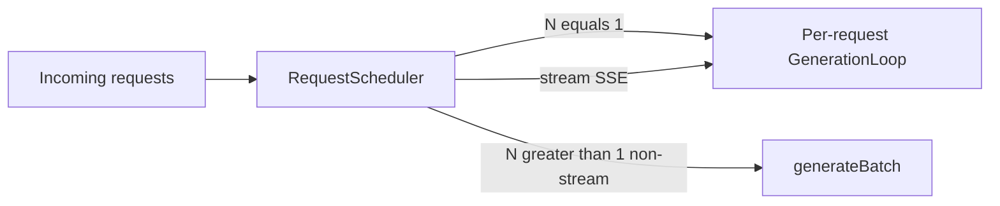

# Tier 1: Concurrent Batch Serving

## Agent handoff

Read and follow `models/CLAUDE.md` before implementing:

1. Unit tests first, only for valuable business logic.
2. Implementation details designed with performance in mind.
3. Follow KISS.
4. Prefer adding new Java classes over extending existing ones.
5. Update `docs/agent-arch.txt`, `docs/howto.md`, `README.md` when applicable.
6. No emojis; be strict and precise.
7. Output: list changed files for preview; never zip files back.

Also read:

- `PLAN-Infra-ROADMAP.md`
- `coordinator/.../BatchConfig.java`
- `coordinator/.../RequestScheduler.java`
- `GenerationLoop` (including `generateBatch` if present)
- `juno-player/.../ConsoleMain.java`
- `juno-master/.../CoordinatorMain.java`
- `juno-player/.../JunoPlayer.java`
- `docs/features.md`, `docs/performance.md` (s9 concurrent sessions)

## Execution placement

| Field | Value |
|-------|-------|
| **Phase** | P0 |
| **Exec step** | 2 (after Tier 5) |
| **Depends on** | Tier 5 (P0 step 2) |
| **Blocks** | Tiers 2, 8, 14 |

Do **not** implement continuous batching (requests at different decode steps) — that is Phase P1 (Tiers 14–16).

## Overview

llama.cpp serves multiple users via `-np` slots. Juno already has static micro-batching (`BatchConfig.defaults()` = maxBatchSize 8, batchWindowMs 50) but production launchers pass `BatchConfig.disabled()`.

This tier productizes concurrent serving without inventing a new scheduler model.

## Current state (do not redo)

Already present:

- `BatchConfig` record with `defaults()`, `disabled()`, `of(n, ms)`
- `RequestScheduler` documented for enabled and disabled batching
- Tests in `BatchConfigTest`

Still missing (this tier):

1. CLI / env for parallel batch size and window
2. Launchers still hardcode `BatchConfig.disabled()`
3. Measured multi-session TPS evidence with batching on
4. Documented streaming vs non-stream batch policy

## Scope and compatibility

Goals:

1. Wire `--parallel` / `--batch-window-ms` through local, master, and `JunoPlayer`.
2. Keep static batching: only freshly submitted requests (generation step 0) share a batch.
3. Non-stream requests may batch; stream/SSE remains per-request under **static** schedule (documented limitation).
4. Record aggregate TPS uplift vs `--parallel 1`.
5. Docs must state that **Tier 15** makes SSE a first-class continuous-batch citizen — Tier 1 does not solve production streaming concurrency.

Non-goals:

- Continuous batching / paged attention scheduling (owned by **Phase P1: Tiers 14–16**; see `PLAN-Infra-ROADMAP.md`).
- Sharing `forwardBatch` steps across SSE streams (Tier 15).
- Changing LoRA training batching.
- Flash attention or KV quantization (later tiers).

## Chosen design

- CLI: `--parallel N` → `maxBatchSize` (default **1** for back-compat; docs recommend **8** for API servers).
- CLI: `--batch-window-ms M` (default **50** when `N > 1`, else **0**).
- Env: `JUNO_PARALLEL`, `JUNO_BATCH_WINDOW_MS`.
- Prefer a small new class (e.g. `ServeBatchOptions`) for parse/validate/apply over growing `ConsoleMain` further.

## Implementation

### 1. CLI / options — tests first

- Add `ServeBatchOptions` (or equivalent) with validate bounds (`N >= 1`, `M >= 0`).
- Wire `scripts/run.sh` / `scripts/run.bat` help + passthrough.
- Unit tests for defaults and invalid values.

### 2. Launcher wiring

Replace `BatchConfig.disabled()` in:

- `ConsoleMain` (local / API paths)
- `CoordinatorMain`
- `JunoPlayer`

with `BatchConfig.of(parallel, windowMs)` from parsed options.

### 3. Scheduler / generateBatch audit

- Confirm `RequestScheduler` + `GenerationLoop.generateBatch` behave correctly for `N > 1`.
- Add or extend coordinator tests for multi-request dispatch within the window.
- Ensure stream requests are not incorrectly merged into static batches.

### 4. Observability

- Expose `batchSize` on existing JFR forward events if missing.
- Document how to reproduce s9-style concurrent load with `--parallel 8`.

### 5. Docs

- `docs/howto.md`, `docs/features.md`, `docs/performance.md`, `docs/agent-arch.txt`
- `CHANGELOG.md` session note; brief README if serving bullets list concurrency

## Verification and exit gate

**Global rules** ([`PLAN-Infra-ROADMAP.md`](PLAN-Infra-ROADMAP.md) → Execution rules): only one Infra tier in flight at a time; publish a [`docs/perf-compare/`](../perf-compare/README.md) bake-off before marking this tier complete.

Exit only when:

1. `--parallel 1` is behaviorally equivalent to today’s disabled batching.
2. `--parallel 8` accepts concurrent chat completions without errors on TinyLlama (CPU and GPU when available).
3. Aggregate TPS for a fixed multi-session load improves vs `--parallel 1` (numbers recorded in `docs/performance.md`).
4. Stream / SSE requests still complete correctly under the non-batched streaming policy; howto/features document that static schedule does not batch SSE (P1 Tier 15 does).
5. `mvn test -pl coordinator,juno-player,juno-master -am` passes.
6. Docs and `--help` list the flags.

## Implementation todos

1. Add `ServeBatchOptions` + unit tests (validate/defaults).
2. Wire CLI/env through ConsoleMain, CoordinatorMain, JunoPlayer, run.sh/bat.
3. Audit/fix RequestScheduler + generateBatch tests for N>1; stream isolation.
4. JFR batchSize + performance.md evidence + howto/features/agent-arch.
5. List preview files; no zip.

## Preview files (expected)

New: `ServeBatchOptions.java`, `ServeBatchOptionsTest.java` (names may vary)

Modified: `ConsoleMain.java`, `CoordinatorMain.java`, `JunoPlayer.java`, `RequestScheduler.java` (if needed), `GenerationLoop.java` (if needed), `run.sh` / `run.bat`, docs + CHANGELOG + ROADMAP status
