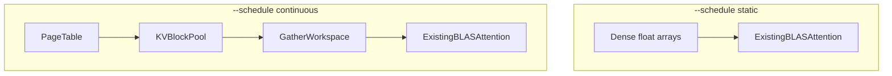

# Tier 14: Block KV Allocator

## Agent handoff

Read and follow `models/CLAUDE.md` before implementing:

1. Unit tests first, only for valuable business logic.
2. Implementation details designed with performance in mind.
3. Follow KISS.
4. Prefer adding new Java classes over extending existing ones.
5. Update `docs/agent-arch.txt`, `docs/howto.md`, `README.md` when applicable.
6. No emojis; be strict and precise.
7. Output: list changed files for preview; never zip files back.

Also read:

- `PLAN-Infra-ROADMAP.md` (Phase P1, dual KV path, gather-tax gate)
- `PLAN-Infra-Tier1.md` (serving baseline)
- `PLAN-Infra-Tier6.md` (q8_0 KV codecs; recommended before or with this tier)
- `kvcache` module: `KVBlock`, `KVCacheManager`, `CpuKVCache`, `GpuKVCache`, `PrefixCache`
- Handler dense KV: `LlamaTransformerHandler`, `Phi3TransformerHandler` (`float[][]` growth)
- `NodeKVCacheAdapter`

## Execution placement

| Field | Value |
|-------|-------|
| **Phase** | P1 |
| **Exec step** | 2 (after Tier 6) |
| **Depends on** | Tier 1 complete; Tier 6 landed (q8_0 block payload optional) |
| **Blocks** | Tier 15 (gather-tax gate must pass) |
| **Parallel with** | P2 if staffed |
| **Status** | **Feature complete** (2026-09-10) |

Tier 8 is **not** a code dependency for Tier 14 — only required before Tier 16.

## Design lock (2026-09-10)

| Decision | Choice |
|----------|--------|
| Primary new types | `KvBlockPool` + `KvPageTable` (+ gather helper) — not only extending `DenseKvTensor` |
| Default path | `--schedule static` → dense `DenseKvTensor` / float path (Tier 1 + 6 unchanged) |
| Continuous path | `--schedule continuous` → paged pool + gather-to-workspace (scheduler engine is Tier 15) |
| Page size | `--kv-page-size N` / `JUNO_KV_PAGE_SIZE`, default **16** |
| Schedule flag | Introduced here for KV path selection (default `static`); Tier 15 owns continuous engine semantics |
| q8_0 blocks | Optional payload via Tier 6 codecs inside pool blocks |

## Feature × surface interaction matrix

| New feature / flag | Base inference | --lora-play | LoRA train | Vision | --parallel | --gpu-layers | --prefill-batch | CUDA | ROCm | Default |
|--------------------|----------------|-------------|------------|--------|------------|--------------|-----------------|------|------|---------|
| `--kv-page-size` | **wired** when schedule=continuous; **explicit no-op** under static (dense) | **wired** (same dual path) | **explicit no-op** (ephemeral float train KV) | **wired** via text handler | **wired** (static keeps dense) | **wired** (independent) | **wired** | N/A (host KV) | N/A | **16** |
| `--schedule static\|continuous` | **wired** (KV path only in this tier; continuous **engine** = Tier 15 follow-up) | **wired** | **explicit no-op** / warn if continuous | **wired** | **fail closed** or static fallback until Tier 15 | **wired** | **wired** | N/A | N/A | **static** |

## Cross-feature smoke (before feature complete)

- [x] Static default: dense path bit-compatible; `--kv-page-size` ignored with startup note
- [x] Continuous KV path (unit / short greedy): allocate/free + gather parity vs dense
- [x] `--lora-play` + static: unchanged (recall `My name is Juno`; [`target/tier14-smoke/20260910T220100Z/`](../../target/tier14-smoke/20260910T220100Z/))
- [x] LoRA train + flags: warn / ephemeral float
- [x] Gather-tax microbench + budget decision ([`../perf-compare/20260910T214300Z-gather-tax.md`](../perf-compare/20260910T214300Z-gather-tax.md); gate **4.61%** ≤ 15%)
- [x] §2 compares: inference [`20260910T222026Z`](../perf-compare/20260910T222026Z/) failures=0; LoRA [`20260910T221031Z-lora`](../perf-compare/20260910T221031Z-lora/) **ok** (wall play 0.88×)

## Exit checklist (compatibility)

- [x] Interaction matrix complete (no empty cells)
- [x] No silent flag ignore
- [x] Launchers forward `--kv-page-size` / `--schedule` for local (cluster as documented)
- [x] User-facing docs: dual path + gather stance
- [x] ROADMAP §5 architectures covered (SessionKvLayout in all text + LoRA handlers)
- [x] Gather-tax microbench + budget decision in `docs/performance.md`

## Overview

Peer engines store KV in fixed-size blocks with a per-request page table. Juno today grows dense per-request tensors up to `MAX_SEQ_LEN` and stores whole-sequence `KVBlock` blobs.

This tier introduces **logical** block/page KV allocation so memory scales with used tokens and continuous batching (Tier 15) can share a pool. Attention on the continuous path **gathers** active blocks into a contiguous workspace for existing Panama + BLAS paths. No custom PagedAttention CUDA kernel.

**Dual KV path (default architecture):** do not replace dense KV everywhere. Under `--schedule static` (default), handlers keep **dense** `float[][]` — no gather, Tier 1 perf preserved. Under `--schedule continuous`, handlers use **paged** KV + gather-to-workspace.

**Gather tax:** copying scattered blocks into a workspace before BLAS attention. If expensive, continuous batching (Tiers 15–16) may not beat Tier 1 static micro-batch by much. Quantify before Tier 15; do not start Tier 15 blind.

## Scope and compatibility

Goals:

1. CLI `--kv-page-size N` (default **16** tokens) and env `JUNO_KV_PAGE_SIZE`.
2. Per-request page table; allocate/append/free fixed-size token blocks (continuous path).
3. **Dual KV:** dense arrays for `--schedule static`; paged pool for `--schedule continuous`.
4. Gather-to-workspace attention on the continuous path, compatible with current BLAS matmul paths.
5. Optional q8_0 block payload when Tier 6 codecs are present (same codecs, block-shaped storage).

Non-goals:

- Custom PagedAttention / FlashAttn CUDA kernels (separate Tier 13 follow-on; not default gather mitigation).
- Continuous batching scheduler (Tier 15).
- Mixed chunked prefill (Tier 16).
- Wrapping llama.cpp or vLLM.
- Changing Tier 1 static micro-batch semantics.
- Removing dense KV from the static path.

## Chosen design

- Fixed page size `N` tokens per block; page table maps logical positions → block IDs.
- Extend `KVBlock` / `KVCacheManager` toward block IDs and a free list / pool.
- **Static schedule:** existing dense `float[][]` growth (no gather).
- **Continuous schedule:** gather K/V for the active sequence into a workspace, then existing BLAS path; scatter writes on append.
- Default page size **16**; document memory vs gather overhead tradeoff.

## Gather-tax gate (hard prerequisite for Tier 15)

Run **before** Tier 15 implementation starts.

### Microbench matrix

Measure dense vs gather attention at:

| Context | Batch sizes |
|---------|-------------|
| 2k | 1, 8, 32 |
| 8k | 1, 8, 32 |
| 32k | 1, 8, 32 |

Record in `docs/performance.md`: absolute times, gather overhead as % of attention time, and the mitigation applied.

### Budget (reference SKU: same as `docs/perf-compare/` bake-off)

**Proceed to Tier 15 when:** gather overhead is **≤ ~10–15% of attention time** at batch **8**, ctx **8k** — or a documented exception with `--schedule continuous` gated behind an explicit overhead note.

Note: bake-off JFR shows MatVec ≈ 93–96% of decode today; gather tax matters more as context grows (attention is O(seq) per token). The **32k** column is the stress case.

### Mitigation ladder (apply in order)

1. **Raise `--kv-page-size`** — try **64** then **128** tokens/block (fewer gather ops; more per-block waste).
2. **Dual path** — static schedule stays dense (default schedule unaffected).
3. **Gate continuous** — document overhead in README/howto/help; do not oversell continuous vs static.
4. **Pause Tier 15** — if tax still exceeds budget with steps 1–3, do not start continuous scheduler until mitigated.
5. **Page-native kernels** — Tier 13 subset only via a **separate** go memo; not the default gather escape hatch (P0 MMQ is unrelated).

## Implementation

### 1. Page table + pool — tests first

- Allocate, append token, free under concurrent sessions.
- Memory footprint scales with used tokens at block granularity (continuous path).

### 2. KVBlock / manager plumbing

- Block-shaped storage; wire through `CpuKVCache` / `GpuKVCache` as needed.
- If Tier 6 landed: store q8_0 payloads inside blocks without new codecs.

### 3. Handler integration (dual path)

- **Static:** retain dense `float[][]` for LLaMA/Phi3 (and other live handlers).
- **Continuous:** page-table append + gather/scatter in attention.
- Greedy decode ≡ dense path within declared tolerance on both paths.

### 4. Gather-tax microbench

- Run the matrix above; apply mitigation ladder if needed.
- Record budget decision and outcome in `docs/performance.md`.

### 5. CLI + docs

- Wire `--kv-page-size` / `JUNO_KV_PAGE_SIZE` through local, master, player.
- Document dual KV path, gather-vs-kernel stance, microbench outcome; update ROADMAP status when done.

## Verification and exit gate

**Global rules** ([`PLAN-Infra-ROADMAP.md`](PLAN-Infra-ROADMAP.md) → Execution rules): only one Infra tier in flight at a time; publish a [`docs/perf-compare/`](../perf-compare/README.md) bake-off before marking this tier complete.

Exit only when:

1. Allocate/free works under concurrent sessions (continuous path).
2. Greedy decode ≡ prior dense path within declared tolerance (both paths).
3. CLI `--kv-page-size` is documented and honored.
4. Dual KV path wired: dense under `static`, paged under `continuous`.
5. KV memory scales with used tokens at block granularity on the continuous path.
6. Gather-tax microbench published (ctx 2k/8k/32k × batch 1/8/32) with explicit budget decision and mitigation outcome recorded.
7. Tier 15 start criteria met (budget passed or continuous explicitly gated).
8. No custom attention kernels required for correctness.
9. Relevant `mvn test -pl kvcache,node,coordinator -am` passes.

## Implementation todos

1. ~~Page table + block pool + unit tests~~
2. ~~KVBlock / KVCacheManager plumbing (+ q8_0 if Tier 6 present)~~
3. ~~Dual-path handler integration (dense static + paged continuous) + parity tests~~
4. ~~Gather-tax microbench + mitigation ladder + `docs/performance.md` decision~~ (**PASS** 4.61% at 8k×batch8; F16 page-bulk gather)
5. ~~CLI/docs; ROADMAP status; preview files; no zip.~~

## Preview files (expected)

New: page-table / block-pool types (names may vary), unit tests

Modified: `KVBlock`, `KVCacheManager`, `CpuKVCache` / `GpuKVCache`, `NodeKVCacheAdapter`, transformer handlers, CLI/run scripts, docs, ROADMAP status
