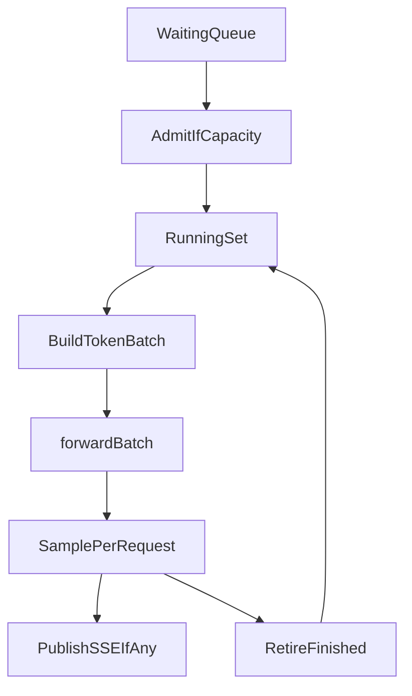

# Tier 15: Continuous Batching Scheduler

## Agent handoff

Read and follow `models/CLAUDE.md` before implementing:

1. Unit tests first, only for valuable business logic.
2. Implementation details designed with performance in mind.
3. Follow KISS.
4. Prefer adding new Java classes over extending existing ones.
5. Update `docs/agent-arch.txt`, `docs/howto.md`, `README.md` when applicable.
6. No emojis; be strict and precise.
7. Output: list changed files for preview; never zip files back.

Also read:

- `PLAN-Infra-ROADMAP.md` (Phase P1, distributed continuous v1 decisions, multi-LoRA × continuous policy, defaults)
- `PLAN-Infra-Tier1.md` (static micro-batch baseline; `--schedule static` must match)
- `PLAN-Infra-Tier14.md` (block KV / page tables — hard prerequisite; gather-tax gate must pass)
- `coordinator/.../RequestScheduler.java`
- `coordinator/.../GenerationLoop.java` (`generate`, `generateBatch`, `forwardBatch`)
- `kvcache/.../PrefixCache.java` (today `generateBatch` weakens cross-request reuse)
- Launchers: `ConsoleMain`, `CoordinatorMain`, `JunoPlayer`

## Execution placement

| Field | Value |
|-------|-------|
| **Phase** | P1 |
| **Exec step** | 3 (after Tier 14 gather-tax gate) |
| **Depends on** | Tier 14 complete (including gather-tax decision); Tier 1 complete |
| **Blocks** | Tier 16 |
| **Parallel with** | P2 if staffed |
| **Status** | **Feature complete** (2026-09-11) — bake-off published; P1 SSE-beats-static gate unmet on synchronized load |

**Confirm distributed v1 decisions (below) in docs before coding the continuous engine loop.**

## Feature × surface interaction matrix

| New feature / flag | Base inference | --lora-play | LoRA train | Vision | --parallel | --gpu-layers | --prefill-batch | CUDA | ROCm | Default |
|--------------------|----------------|-------------|------------|--------|------------|--------------|-----------------|------|------|---------|
| `--schedule continuous` (engine) | **wired** local/single-shard; **auto-fallback** to static on cluster/TP/PP | **wired** (global adapter set only) | **explicit no-op** / warn (ephemeral float KV; no engine) | **wired** via text handler + same scheduler | **wired** (caps running set; default cap 8 if parallel=1) | **wired** (independent) | **wired** (admit-time prefill; mixed chunks = follow-on) | N/A (host scheduler) | N/A | **static** |
| `--schedule static` | **wired** (dense KV; SSE isolated) | **wired** | **explicit no-op** | **wired** | **wired** (Tier 1 micro-batch) | **wired** | **wired** | N/A | N/A | **static** |
| `x_juno_loras` under continuous | **fail closed** | **fail closed** (use process-wide `--lora-play`) | N/A | **fail closed** | **fail closed** | N/A | N/A | N/A | N/A | absent |

## Cross-feature smoke (before feature complete)

- [x] Each **wired** cell: command + expected JFR/log proof recorded ([`target/tier15-smoke/20260911T200500Z/`](../../target/tier15-smoke/20260911T200500Z/) — continuous+parallel SSE `ContinuousStep.max_decode_batch=2`)
- [x] Each **explicit no-op** cell: warning string + howto note (`kv-page-size ignored (dense)`; LoRA train `schedule=continuous is a no-op…`)
- [x] Each **follow-up** cell: link to plan (mixed chunked prefill = `PLAN-Infra-Tier16.md`; multi-node = Tier 15b)
- [x] §2 compares run as required by change surface ([`20260911T195008Z`](../perf-compare/20260911T195008Z/) + [`20260911T195711Z-lora`](../perf-compare/20260911T195711Z-lora/))

## Exit checklist (compatibility)

- [x] Interaction matrix complete (no empty cells)
- [x] No silent flag ignore on any surface that accepts the flag in the launcher
- [x] Launcher (`scripts/run.sh` / `run.bat`) forwards `--schedule` for every command mode that should honor it (`local` engine; `cluster` auto-fallback)
- [x] User-facing docs state which modes honor the feature
- [x] ROADMAP §5 architectures covered or named follow-up (engine is handler-agnostic via `forwardBatch`)

## Overview

vLLM admits requests at arbitrary decode steps into one running batch (iteration-level scheduling). Juno Tier 1 only cohorts freshly submitted requests (step 0) via `BatchConfig`, and leaves SSE per-request.

This tier adds `--schedule continuous` so overlapping requests at different positions share engine steps — **including SSE / publisher streams** — while `--schedule static` remains the default and stays behaviorally equivalent to Tier 1 (dense KV, no gather).

**v1 scope:** continuous batching ships for **local JVM or single-shard** only. Multi-node / TP / PP cluster continuous is a named follow-on — not a Tier 15 requirement.

## Distributed continuous batching (v1 decisions — required in docs before engine loop)

Juno’s identity includes master + shard nodes (TP/PP over gRPC). Record these decisions in this section (keep in sync with `PLAN-Infra-ROADMAP.md`):

| Decision | v1 choice |
|----------|-----------|
| **Scope** | `--schedule continuous` = **local JVM or single-shard only** |
| **Cluster / TP / PP** | **Not supported** in v1 — fail closed or **auto-fallback to `static`** with a clear log line |
| **Running-set owner** | Coordinator on local/single-shard; **not** master-coordinated across shards |
| **Page tables under TP/PP** | Out of v1 scope (follow-on must define per-shard vs replicated tables) |
| **Admit/retire across gRPC** | Out of v1 scope (follow-on must define step-sync unit) |
| **Docs** | README + howto: `continuous` = local/single-shard; `cluster` = static or explicit unsupported |
| **Follow-on** | **Multi-node continuous** (`Tier 15b` or equivalent) — master-owned running set, TP step sync, PP stage mixing |

Do not implement Tier 15 as if single-JVM local and multi-node cluster are identical.

**Cluster launcher behavior (locked):** **Auto-fallback.** Log `WARN: continuous unsupported on cluster; using static` and force `--schedule static` (dense KV + static micro-batch) before handlers load. Applied to `juno cluster`, `CoordinatorMain`, and TP/PP launchers — including `--nodes 1` cluster (still gRPC). Local in-process (`juno local`, `JunoPlayer`) keeps `continuous`.

Tier 15 **cluster exit is acceptable** when continuous is documented unsupported / falls back to static. Local/single-shard continuous is the success target.

## Scope and compatibility

Goals:

1. CLI `--schedule static|continuous` (default **`static`**) and env `JUNO_SCHEDULE`.
2. Running set: phase (`prefill` / `decode`), position, block-table ref, sampler state.
3. Each engine step: build token batch → `forwardBatch` → sample → retire finished → admit waiting queue under max tokens/batch and KV capacity.
4. **Streaming:** under `continuous`, SSE / publisher streams share the running set (one publisher per request, shared `forwardBatch` steps). Concurrent SSE TTFT/TPOT must be measured.
5. **Prefix cache:** measurable hit-rate and TTFT gates on a fixed shared-system-prompt workload; continuous must not always evict after a cohort. Document conflicts with LoRA / tools.
6. Honor ROADMAP multi-LoRA × continuous **v1 policy**: global adapter set only; heterogeneous per-request adapters deferred (fail closed or static/serial fallback).
7. **Cluster:** refuse or fall back from `--schedule continuous`; document in README/howto/help.
8. **Static path:** dense KV (Tier 14 dual path); no gather.

Non-goals:

- Block KV allocator design (Tier 14).
- Mixed chunked prefill interleaved with decode (Tier 16).
- Custom PagedAttention kernels (Tier 13).
- Changing Tier 1 `--parallel` / `--batch-window-ms` meaning when schedule is `static`.
- Per-request heterogeneous multi-LoRA in one continuous batch (deferred).
- **Multi-node / TP / PP continuous** (named follow-on `Tier 15b`).
- Wrapping llama.cpp or vLLM; EAGLE / MTP; disaggregated prefill/decode.
- Flipping API default to `continuous` (post-stability ROADMAP step after N releases).

## Chosen design

- `static`: existing Tier 1 collector + `generateBatch` for non-stream; streams per-request; **dense KV** (unchanged).
- `continuous`: iteration loop over a running set; new admissions when capacity allows; uses Tier 14 **paged** KV + gather path; **stream and non-stream** members share steps.
- **Local/single-shard only** in v1; cluster launchers fail closed or fall back to `static`.
- Reuse `InferencePipeline.forwardBatch` / Tier 1 batch machinery where possible; prefer new scheduler types over mega-extending `RequestScheduler` if clearer.
- JFR / `docs/performance.md`: multi-session latency/TPS vs Tier 1 static; concurrent SSE; prefix hit-rate / TTFT.

## Implementation

### 0. Distributed v1 decisions in docs

- Confirm the table above in this file + README/howto before the engine loop lands.
- Implement cluster fail-closed or auto-fallback behavior in `CoordinatorMain` / cluster launchers.

### 1. Schedule options — tests first

- Parse/validate `--schedule`; default `static`.
- Reject or downgrade `continuous` on multi-node / TP / PP configs (tests for both behaviors).
- `static` path ≡ Tier 1 behavior (dense KV; existing batch tests remain green; SSE still isolated under static).

### 2. Continuous engine loop (local / single-shard)

- Running-set state machine; admit/retire under max batch tokens and KV pages.
- Two overlapping requests at different positions share steps (unit/IT with stub pipeline).
- Stream publishers attach to running-set members; tokens emit as steps complete.

### 3. PrefixCache harden + gates

- Continuous path must not always evict after a cohort; keep session/prefix hits as designed.
- Fixed shared-system-prompt workload: record hit rate and TTFT; document LoRA/tools conflict behavior.

### 4. Multi-LoRA policy wiring

- Enforce global-adapter-only under continuous (or documented fallback); tests for mismatch fail-closed / fallback.

### 5. Launchers + observability + docs

- Wire CLI/env through local, player (continuous allowed); master/cluster per v1 scope (refuse or fallback).
- Document: stream policy, prefix gates, multi-LoRA v1, dual KV, cluster limitation, post-stability default flip; ROADMAP status when done.

## Verification and exit gate

**Global rules** ([`PLAN-Infra-ROADMAP.md`](PLAN-Infra-ROADMAP.md) → Execution rules): only one Infra tier in flight at a time; publish a [`docs/perf-compare/`](../perf-compare/README.md) bake-off before marking this tier complete.

Exit only when: **done** (2026-09-11) — see bake-off [`20260911T194430Z-continuous`](../perf-compare/20260911T194430Z-continuous/); P1 SSE-beats-static gate remains unmet on synchronized load.

1. ~~Distributed v1 decisions documented; cluster refuse/fallback implemented and tested.~~
2. ~~Two overlapping requests at different positions share steps under `--schedule continuous` **on local/single-shard**.~~
3. ~~Concurrent SSE requests share continuous steps; TTFT/TPOT under concurrent stream load recorded in JFR / `docs/performance.md`.~~
4. ~~Prefix-cache hit-rate / TTFT gates pass on the shared-prefix workload (numbers documented).~~
5. ~~Measured multi-session latency/TPS vs Tier 1 static is recorded.~~
6. ~~`--schedule static` ≡ Tier 1 behavior (dense KV, including Tier 1 stream isolation).~~
7. ~~Multi-LoRA × continuous v1 policy is enforced and documented.~~
8. ~~README / howto state: `continuous` = local/single-shard; `cluster` = static (or unsupported).~~
9. ~~Docs and `--help` list the flag.~~
10. ~~`mvn test -pl coordinator,juno-player,juno-master -am` passes.~~

**Not required for Tier 15 exit:** multi-node continuous, TP/PP continuous, master-owned cross-shard running set.

## Implementation todos

1. ~~Document distributed v1 decisions + cluster auto-fallback.~~
2. ~~`ServeSchedulePolicy` + tests (cluster downgrade).~~
3. ~~Continuous running-set loop + overlap + **SSE share** tests (local/single-shard).~~
4. ~~PrefixCache continuous-path harden + hit-rate/TTFT gates~~ — counters + session multi-turn hit rate **0.875** in bake-off.
5. ~~Multi-LoRA global-only policy under continuous (fail-closed `x_juno_loras`).~~
6. ~~CLI/JFR/docs; ROADMAP status; bake-off published~~ ([`20260911T194430Z-continuous`](../perf-compare/20260911T194430Z-continuous/)).

## Preview files (expected)

New: schedule options / continuous engine types (names may vary), tests

Modified: `RequestScheduler`, `GenerationLoop`, `PrefixCache`, launchers, run scripts, docs, ROADMAP status

## Follow-on: multi-node continuous (`Tier 15b` — deferred)

Scope for a future tier (not Tier 15):

- Master-owned running set vs per-node ownership decision.
- Page tables / KV blocks under TP (identical batch per shard) and PP (stage-aware scheduling).
- Admit/retire unit across gRPC round-trips.
- Step synchronization protocol and failure modes.

Do not silently expand Tier 15 scope to include this work.
