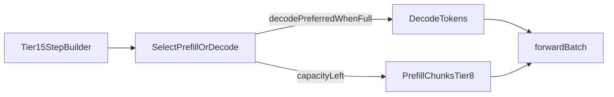

# Tier 16: Mixed Chunked Prefill + Decode

## Agent handoff

Read and follow `models/CLAUDE.md` before implementing:

1. Unit tests first, only for valuable business logic.
2. Implementation details designed with performance in mind.
3. Follow KISS.
4. Prefer adding new Java classes over extending existing ones.
5. Update `docs/agent-arch.txt`, `docs/howto.md`, `README.md` when applicable.
6. No emojis; be strict and precise.
7. Output: list changed files for preview; never zip files back.

Also read:

- `PLAN-Infra-ROADMAP.md` (Phase P1)
- `PLAN-Infra-Tier8.md` (owns `--prefill-batch` chunk size)
- `PLAN-Infra-Tier14.md` (block KV)
- `PLAN-Infra-Tier15.md` (continuous scheduler — hard prerequisite)
- `GenerationLoop` prefill / continuous step builder
- `assets/batched-prefil.md` (design notes only)

## Execution placement

| Field | Value |
|-------|-------|
| **Phase** | P1 |
| **Exec step** | 4 |
| **Depends on** | Tiers 8, 14, and 15 complete |
| **Blocks** | None |
| **Parallel with** | P4 if staffed |

## Overview

vLLM chunked prefill interleaves long-prompt ubatch chunks with other requests’ decode tokens so decode is not starved. Juno Tier 8 chunks a single request’s prefill; Tier 15 continuous schedule still needs a policy for mixing prefill chunks and decode in one step.

This tier wires Tier 8 chunk size into the Tier 15 step builder with a fairness rule: prefer decode when the batch is full. Stream and non-stream running-set members are both subject to the mix (Tier 15 already made SSE continuous-first-class).

## Scope and compatibility

Goals:

1. Under `--schedule continuous`, long prefills emit ubatch chunks of size `--prefill-batch` (Tier 8) into the shared step builder.
2. Fairness: when the step batch is full, prefer decode tokens over additional prefill chunks.
3. Measurable TTFT/TPOT improvement vs “prefill-to-completion then decode others” on a fixed mixed load (include concurrent SSE when practical).
4. Logits at chunk boundaries match full prefill within declared tolerance.
5. Document a short-decode latency bound under load.

Non-goals:

- Redefining `--prefill-batch` (Tier 8 owns the knob).
- Redefining continuous admit/retire (Tier 15).
- Block KV layout (Tier 14).
- Custom PagedAttention kernels; wrapping llama.cpp or vLLM.
- EAGLE / MTP; disaggregated prefill/decode.

## Chosen design

- Prefill state machine per running request: remaining prompt window advanced by Tier 8 chunk size each time the request is selected for a prefill slot.
- Same `forwardBatch` step may contain decode tokens from some requests and prefill-chunk tokens from others (subject to max batch tokens / KV capacity).
- Fairness knob: prefer decode when batch is full (document; keep KISS — one policy, not a zoo of schedulers).

## Implementation

### 1. Prefill chunk state — tests first

- Chunk boundaries; prompt length not multiple of N; N=1 edge.
- Logit parity at end of each chunk vs sequential full prefill (tolerance).

### 2. Mix into continuous step builder

- Interleave with decode under capacity limits.
- Fairness: decode wins when batch full.

### 3. Perf evidence + docs

- Mixed long-prompt + short-decode load; record TTFT/TPOT and short-decode latency bound in JFR / `docs/performance.md`.
- ROADMAP status when done.

## Verification and exit gate

**Global rules** ([`PLAN-Infra-ROADMAP.md`](PLAN-Infra-ROADMAP.md) → Execution rules): only one Infra tier in flight at a time; publish a [`docs/perf-compare/`](../perf-compare/README.md) bake-off before marking this tier complete.

Exit only when:

1. Long-prompt + short-decode concurrency improves TTFT/TPOT vs “prefill-to-completion then decode others”.
2. Logits at chunk boundaries match full prefill within tolerance.
3. Short-decode latency under load stays within a documented bound.
4. Tier 8 `--prefill-batch` semantics unchanged for static / single-request paths.
5. Docs describe the fairness policy; relevant tests pass.

## Implementation todos

1. Prefill chunk state machine + parity tests.
2. Continuous step-builder mix + fairness.
3. Perf evidence + docs; ROADMAP status; preview files; no zip.

## Preview files (expected)

New: prefill-chunk state helpers if needed (names may vary), tests

Modified: continuous engine / `GenerationLoop`, docs, JFR fields if needed, ROADMAP status
