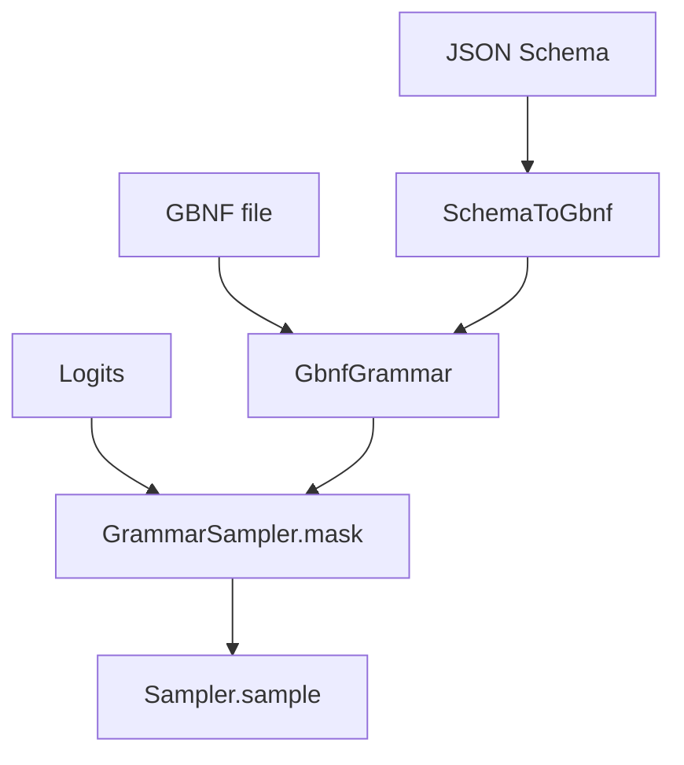

# Tier 3: GBNF + JSON Schema Constrained Decoding

## Agent handoff

Read and follow `models/CLAUDE.md` before implementing:

1. Unit tests first, only for valuable business logic.
2. Implementation details designed with performance in mind.
3. Follow KISS.
4. Prefer adding new Java classes over extending existing ones.
5. Update `docs/agent-arch.txt`, `docs/howto.md`, `README.md` when applicable.
6. No emojis; be strict and precise.
7. Output: list changed files for preview; never zip files back.

Also read:

- `PLAN-Infra-ROADMAP.md`
- `PLAN-Infra-Tier2.md` (hard prerequisite: `response_format` accepted)
- Tier 2 sampling / GenerationLoop sample call sites
- `sampler` module layout
- llama.cpp GBNF / json-schema-to-grammar concepts (reference only; do not copy C++ wholesale)

## Execution placement

| Field | Value |
|-------|-------|
| **Phase** | P2 |
| **Exec step** | 2 |
| **Depends on** | Tier 2 complete |
| **Blocks** | Tier 4 |
| **Parallel with** | P0 / P1 if staffed |

## Overview

llama.cpp GBNF grammars and `--json-schema` make structured outputs reliable for agents and APIs. Juno needs the same product contract on the JVM sampler path.

## Scope and compatibility

Goals:

1. GBNF parser + per-step logit masking.
2. JSON Schema → GBNF for a **documented subset**.
3. Wire OpenAI `response_format: { type: json_schema, ... }` and optional Juno grammar fields.
4. CLI `--grammar-file` / `--json-schema-file` for local REPL.

Non-goals:

- Remote `$ref` fetch.
- Full JSON Schema Draft coverage.
- Tool-call orchestration (Tier 4 builds on this).
- Changing unconstrained sampling when no grammar is set.

## Chosen design

- New classes under `sampler` (prefer new): e.g. `GbnfGrammar`, `GrammarSampler`.
- Schema subset v1: `object`, `array`, `string`, `number`, `integer`, `boolean`, `enum`, `required`, nested objects/arrays. Reject unsupported constructs with a clear error.
- OpenAI: `response_format.json_schema`; optional `x_juno_grammar` / raw grammar string.
- Mask illegal tokens each step; never emit a token outside the grammar.

## Implementation

### 1. GBNF engine — tests first

- Tiny vocab fixtures; pushdown / state machine advances; reject invalid grammar text.
- Token mask tests: only legal next tokens have finite logits (or non -inf).

### 2. Schema compiler

- Implement subset; unit tests for objects, arrays, enums, required keys.
- Unsupported keyword → fail closed with pointer to subset docs.

### 3. Generation integration

- Hook GenerationLoop (and OpenAI path) so active grammar masks before sample.
- Unconstrained path unchanged when grammar is absent.

### 4. Eval gate

- Fixed set of ~20 prompts with json_schema; ≥95% parseable JSON outputs.
- Record results in `docs/howto.md` or `docs/performance.md`.

### 5. Samples and docs

- Sample grammars under `docs/grammars/` or `sampler/src/test/resources`.
- Document subset and CLI flags.

## Verification and exit gate

**Global rules** ([`PLAN-Infra-ROADMAP.md`](PLAN-Infra-ROADMAP.md) → Execution rules): only one Infra tier in flight at a time; publish a [`docs/perf-compare/`](../perf-compare/README.md) bake-off before marking this tier complete.

Exit only when:

1. A JSON-forcing grammar produces only valid JSON token sequences on fixtures.
2. Unsupported schema returns HTTP 400 (API) or clear CLI error.
3. Unconstrained path is unchanged when no grammar is set.
4. Eval gate ≥95% valid JSON on the fixed set.
5. `mvn test` for `sampler`, `coordinator`, and player wiring passes.

## Implementation todos

1. GBNF engine + unit tests.
2. Schema→GBNF subset compiler + rejection tests.
3. GenerationLoop / OpenAI / CLI wiring.
4. Eval set + docs/grammars + howto/features/agent-arch.
5. List preview files; no zip.

## Preview files (expected)

New: `GbnfGrammar.java`, `GrammarSampler.java`, `JsonSchemaToGbnf.java` (+ tests), sample `.gbnf` resources

Modified: `GenerationLoop`, `OpenAiChatHandler` / adapter, CLI/run scripts, docs, ROADMAP status
