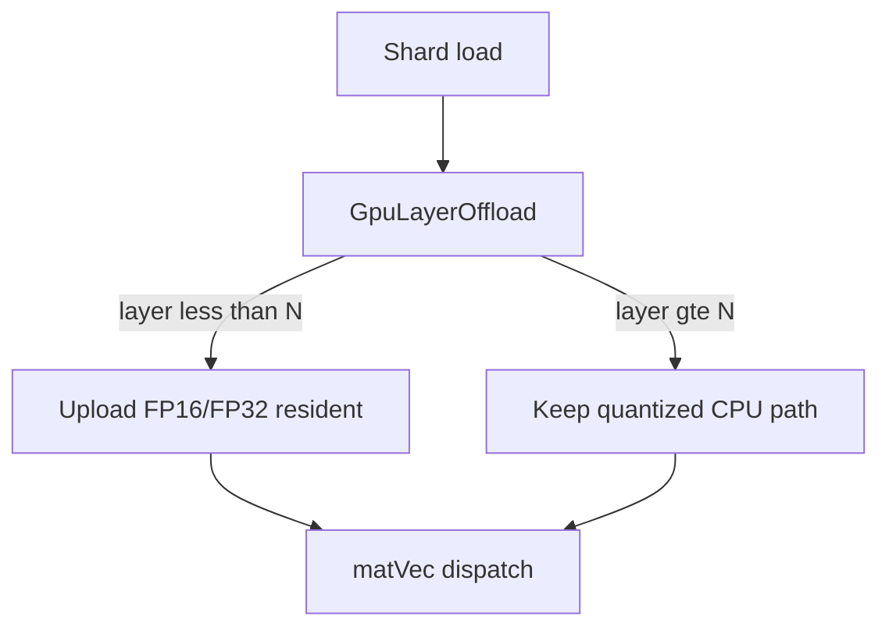

# Tier 5: Hybrid `--gpu-layers` Offload

## Agent handoff

Read and follow `models/CLAUDE.md` before implementing:

1. Unit tests first, only for valuable business logic.
2. Implementation details designed with performance in mind.
3. Follow KISS.
4. Prefer adding new Java classes over extending existing ones.
5. Update `docs/agent-arch.txt`, `docs/howto.md`, `README.md` when applicable.
6. No emojis; be strict and precise.
7. Output: list changed files for preview; never zip files back.

Also read:

- `PLAN-Infra-ROADMAP.md`
- `node/.../GpuMatVec.java`, `DeviceHalfMatrix`, `ResidentWeightMatrix`
- Transformer handler weight upload paths (`LlamaTransformerHandler`, Phi-3, Qwen3 as applicable)
- `LoraResidentWeights` patterns (reuse ideas; do not couple training)
- Shard load / GPU context lifecycle

## Execution placement

| Field | Value |
|-------|-------|
| **Phase** | P0 |
| **Exec step** | 2 (before Tier 1) |
| **Depends on** | None |
| **Blocks** | Tier 6, Tier 1 (P0 step 2) |

Bake-off (2026-08-31): mistral-7b on GTX 1080 (8 GiB) was **0.01×** llama tg (100% CPU MatVec fallback). Current ([`20260911T235203Z`](../perf-compare/20260911T235203Z/)): `--gpu-layers auto` + `--mmq on` **0.43×** llama (**P0 0.15× met**). See [`PLAN-Infra-PERF-ANALYSIS.md`](PLAN-Infra-PERF-ANALYSIS.md).

## Overview

llama.cpp `-ngl` / `--n-gpu-layers` keeps N transformer layers on GPU and leaves the rest on CPU — essential when the model exceeds VRAM. Juno today is closer to all-resident or CPU fallback per projection/OOM.

## Scope and compatibility

Goals:

1. CLI `--gpu-layers N|all|auto` and env `JUNO_GPU_LAYERS`.
2. Layer-granularity residency: layers `[0, N)` on GPU; `[N, L)` CPU quantized matmul.
3. `auto` fits by uploading until OOM then backing off (required before exit).
4. Cluster: each node applies policy to shard-local layers (document index semantics).

Non-goals:

- Row/tensor split across GPUs inside one JVM (Juno already has multi-JVM TP/PP).
- Custom attention kernels (Tier 13).
- Changing LoRA training upload policy (separate LoRA tiers).

## Chosen design

| Value | Behavior |
|-------|----------|
| `0` | All weights CPU quantized (equivalent to forcing CPU matmul for layers) |
| `N` | First N layers resident |
| `all` | Current full-resident behavior |
| `auto` | Grow residency until OOM, then reduce by one layer and continue |

Prefer new `GpuLayerOffload` policy class over scattering conditionals in every handler.

## Implementation

### 1. Policy class — tests first

- Parse/validate `N|all|auto`; resolve concrete N given layer count and optional VRAM probe hooks.

### 2. Handler load / matVec dispatch

- Selective upload per layer in LLaMA-family handler first; port pattern to Phi-3 / Qwen3 if they share load helpers.
- matVec uses resident matrix when present, else CPU path.

### 3. Parity tests

- Synthetic or tiny fixture: partial residency logits vs all-CPU within declared tolerance.

### 4. Live smoke

- TinyLlama or Phi-3.5 with `N` less than full layer count on a real GPU when available (gated).

### 5. CLI / docs / JFR

- Wire local/cluster launchers; JFR tag `gpuLayers`; performance.md fit note on a fixed SKU.

## Verification and exit gate

**Global rules** ([`PLAN-Infra-ROADMAP.md`](PLAN-Infra-ROADMAP.md) → Execution rules): only one Infra tier in flight at a time; publish a [`docs/perf-compare/`](../perf-compare/README.md) bake-off before marking this tier complete.

Exit only when:

1. `--gpu-layers 0` uses CPU weight matmul for layers.
2. `--gpu-layers all` matches today’s resident path.
3. Partial `N` runs; logits within declared tolerance vs all-CPU.
4. `auto` recovers from OOM without corrupting state (reduce N or fail closed per documented policy).
5. `docs/performance.md` notes max model fit improvement on a fixed GPU SKU.
6. Relevant module tests pass.

## Implementation todos

1. `GpuLayerOffload` + unit tests.
2. Handler selective upload + matVec dispatch (LLaMA first, then Phi/Qwen parity).
3. Parity IT + gated live smoke.
4. CLI/env, JFR, docs; ROADMAP status.
5. List preview files; no zip.

## Preview files (expected)

New: `GpuLayerOffload.java`, tests

Modified: transformer handlers / load path, CLI/run scripts, JFR events, docs, ROADMAP status
