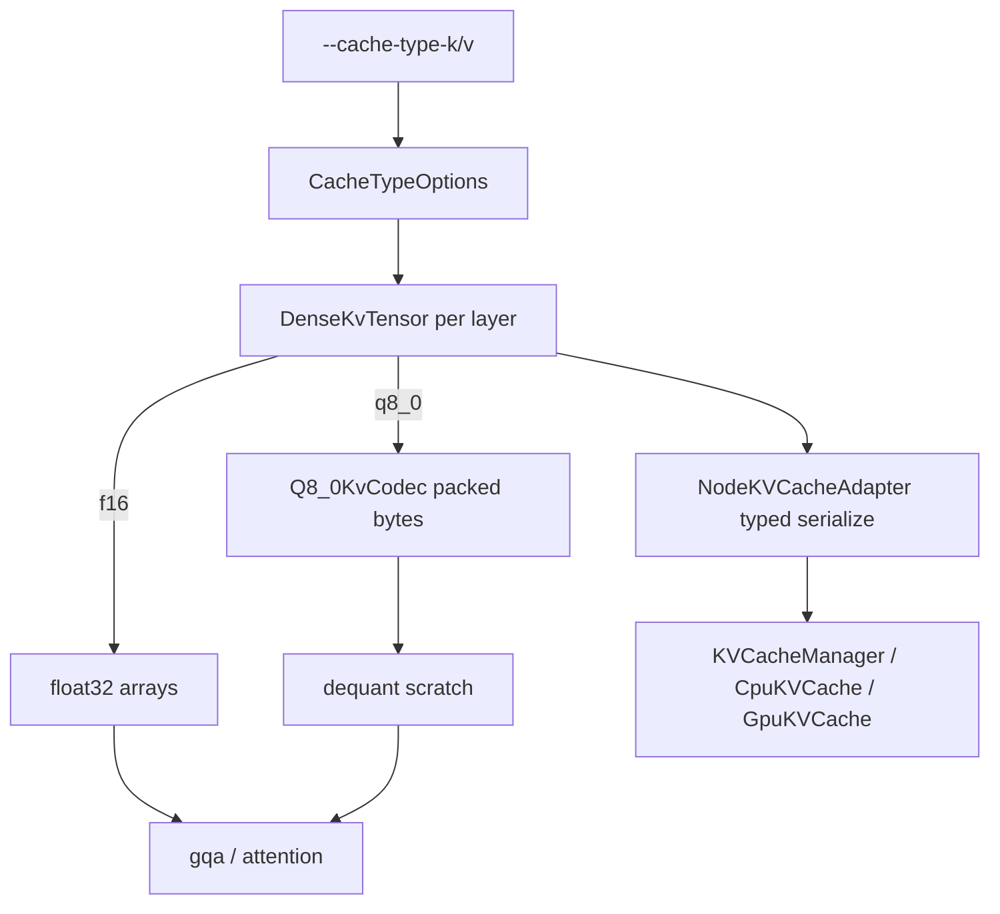

# Tier 6: Quantized KV Cache (`q8_0`)

## Agent handoff

Read and follow `models/CLAUDE.md` before implementing:

1. Unit tests first, only for valuable business logic.
2. Implementation details designed with performance in mind.
3. Follow KISS.
4. Prefer adding new Java classes over extending existing ones.
5. Update `docs/agent-arch.txt`, `docs/howto.md`, `README.md` when applicable.
6. No emojis; be strict and precise.
7. Output: list changed files for preview; never zip files back.

Also read:

- `PLAN-Infra-ROADMAP.md`
- `PLAN-Infra-Tier5.md` (recommended; both are memory tiers)
- `kvcache` module: `CpuKVCache`, `GpuKVCache`, `KVBlock`, `KVCacheManager`
- Attention read/write paths in transformer handlers (`float[][]` dense maps)
- `NodeKVCacheAdapter` (write-through serialization)

## Execution placement

| Field | Value |
|-------|-------|
| **Phase** | P1 |
| **Exec step** | 1 |
| **Depends on** | Tier 5 recommended; Tier 1 minimum |
| **Blocks** | Tier 14 (q8_0 block payload) |
| **Parallel with** | Late P0 if staffed |
| **Status** | **Feature complete** (2026-09-10) |

## Overview

Peer engines shrink KV with quantized cache types (`-ctk` / `-ctv`). Juno starts with **q8_0** only. CLI default remains **`f16`**, which means the **current float32 in-process path** (bit-compatible with today) — not IEEE half packing in this tier.

## Scope and compatibility

Goals:

1. CLI `--cache-type-k f16|q8_0` and `--cache-type-v f16|q8_0` (defaults **f16**); env `JUNO_CACHE_TYPE_K` / `JUNO_CACHE_TYPE_V`.
2. **Primary:** new in-process dense KV store used by transformer handlers; q8_0 packs K/V; attention **dequants to float scratch** for scores / context.
3. **Secondary:** `NodeKVCacheAdapter` / `KVBlock` carry element-type metadata and may serialize q8_0 bytes for manager-tier eviction accounting.
4. ≥2× KV **persistent** memory reduction vs the default float path at equal context length (q8_0 ≈ 34 B / 32 elems vs 4 B/float ≈ **3.8×**).
5. All text handler families (Llama, Phi-2, Phi-3, Qwen3, Qwen3-MoE) + LoRA trainable handlers that own dense KV maps.

Non-goals:

- Other cache types (q4_0 / iq4_nl) in this tier.
- Device-resident quantized attention KV (attention remains host float after dequant).
- Packing default path as IEEE fp16.
- Requiring FlashAttn for quantized V.
- Changing prefix-cache key identity beyond storing quant type metadata.

## Design lock (2026-09-10)

| Decision | Choice |
|----------|--------|
| Primary store | New handler-facing class (e.g. `DenseKvTensor` / session maps) — **not** only extending `KVBlock` |
| CLI `f16` | Current **float32** path; bit-identical to today’s default |
| CLI `q8_0` | GGUF-compatible blocks (32×int8 + fp16 scale = 34 B) |
| GPU / `GpuKVCache` | Manager **serialization** of typed blobs only; no device attention kernels |
| Mixing types | K and V types independent; one session must not silently reinterpret bytes |
| Architectures | Shared store wired into **all** text + LoRA handlers that use dense KV |

## Feature × surface interaction matrix

| New feature / flag | Base inference | --lora-play | LoRA train | Vision | --parallel | --gpu-layers | --prefill-batch | CUDA | ROCm | Default |
|--------------------|----------------|-------------|------------|--------|------------|--------------|-----------------|------|------|---------|
| `--cache-type-k` | **wired** (all text handlers) | **wired** (same dense store) | **explicit no-op** (ephemeral train float KV; follow-up) | **wired** via underlying text handler | **wired** (same store) | **wired** (independent of weight residency) | **wired** | N/A (host KV) | N/A (host KV) | **f16** |
| `--cache-type-v` | **wired** | **wired** | **explicit no-op** (ephemeral train float KV; follow-up) | **wired** | **wired** | **wired** | **wired** | N/A | N/A | **f16** |

Vision / CUDA / ROCm cells: flag applies to host KV regardless of MatVec backend; no silent ignore.

## Cross-feature smoke (before feature complete)

- [x] Base `--cache-type-k q8_0 --cache-type-v q8_0`: greedy short decode vs `f16`; log/policy line names types — [`target/cache-type-smoke/20260910T154500Z/`](../../target/cache-type-smoke/20260910T154500Z/)
- [x] `--lora-play` + q8_0: recall ok on TinyLlama fixture (`My name is Juno`)
- [x] LoRA train + q8_0: loss finite; no crash; ephemeral KV WARNING logged
- [x] `--parallel` + q8_0: multi-decode completes (REPL + `LlamaTransformerHandlerMultiDecodeTest`)
- [x] `--gpu-layers auto` + q8_0: hybrid residency still works — [`target/cache-type-smoke/20260910T163000Z/`](../../target/cache-type-smoke/20260910T163000Z/)
- [ ] Vision (optional if time): one `/v1/vision/chat` with q8_0 text KV
- [x] §2 `compare-llama-cpp.sh` published — [`docs/perf-compare/20260910T170557Z/`](../perf-compare/20260910T170557Z/)
- [x] §2 `compare-lora.sh` published — [`docs/perf-compare/20260910T180703Z-lora/`](../perf-compare/20260910T180703Z-lora/) (wall playback **0.88×**; status **ok**)
- [x] Cluster: launcher accepts `--cache-type-*`; `ClusterHarness` forwards `JUNO_CACHE_TYPE_K/V` to forked node JVMs (no silent ignore)

## Exit checklist (compatibility)

- [x] Interaction matrix complete (no empty cells)
- [x] No silent flag ignore when launcher accepts the flag (cluster nodes get `-DJUNO_CACHE_TYPE_*`)
- [x] `scripts/run.sh` / `run.bat` forward flags for local/cluster/lora
- [x] User-facing docs state `f16` = current float path; q8_0 quality caveat; LoRA train ephemeral no-op
- [x] ROADMAP §5 architectures covered (shared `DenseKvTensor` in all text + LoRA handlers; Llama parity test)
- [x] Bake-off inference [`20260910T170557Z`](../perf-compare/20260910T170557Z/) + LoRA [`20260910T180703Z-lora`](../perf-compare/20260910T180703Z-lora/) + `docs/performance.md` bytes/token note
- [x] LoRA §2 gate clean (wall playback tps; JFR informational)

## Chosen design

- `Q8_0KvCodec` — encode/decode + `encodedBytes(n)` helpers; roundtrip tests.
- `CacheTypeOptions` — parse CLI/env; defaults f16/f16.
- `DenseKvTensor` (name may vary) — capacity growth, `writeToken` / `materialize` for attention.
- `KVBlock` gains element-type (or header) so restore matches.

## Implementation

### 1. Codec — tests first

- Encode/decode roundtrip error bounds; byte-size vs float path helpers (≥2×).

### 2. In-process store + adapter

- New store class; plumb type on `KVBlock` / adapter flush+restore.
- Manager tiers unchanged aside from carrying typed `byte[]` payloads.

### 3. Attention integration

- All handlers: write configured type; read dequants into scratch for attention.
- Parity tests: q8_0 vs f16 short greedy / logit tolerance.

### 4. CLI + benchmarks

- Wire local/cluster; measure bytes/token; record in `docs/performance.md`.

### 5. Docs

- Flags, `f16` meaning, quality caveat, interaction with `--gpu-layers`.

## Verification and exit gate

**Global rules** ([`PLAN-Infra-ROADMAP.md`](PLAN-Infra-ROADMAP.md) → Execution rules): only one Infra tier in flight at a time; publish a [`docs/perf-compare/`](../perf-compare/README.md) bake-off before marking this tier complete.

Exit only when:

1. `f16` path remains bit-compatible with today’s behavior.
2. q8_0 roundtrip unit tests pass.
3. ≥2× KV persistent memory reduction vs default float path at the same context length.
4. Short greedy outputs match or meet the declared token-agreement / logit tolerance vs `f16`.
5. Docs list flags and caveats; `f16` remains default.
6. `mvn test -pl kvcache,node,coordinator -am` (as applicable) passes.
7. §6 matrix smoke + §2 compares published.

## Implementation todos

1. ~~Amend plan + §6 matrix + design lock~~
2. ~~q8_0 codec + `CacheTypeOptions` + roundtrip tests~~
3. ~~`DenseKvTensor` + `KVBlock` type + adapter plumbing~~
4. ~~Attention integration all handlers + parity tests~~
5. ~~CLI + docs; ROADMAP status; cluster prop forward; bake-off~~
6. List preview files; no zip.

## Preview files (expected)

New: `Q8_0KvCodec`, `CacheTypeOptions`, `DenseKvTensor` (names may vary), codec/parity tests

Modified: `KVBlock`, `NodeKVCacheAdapter`, transformer / LoRA handlers, CLI/run scripts, docs, ROADMAP status
