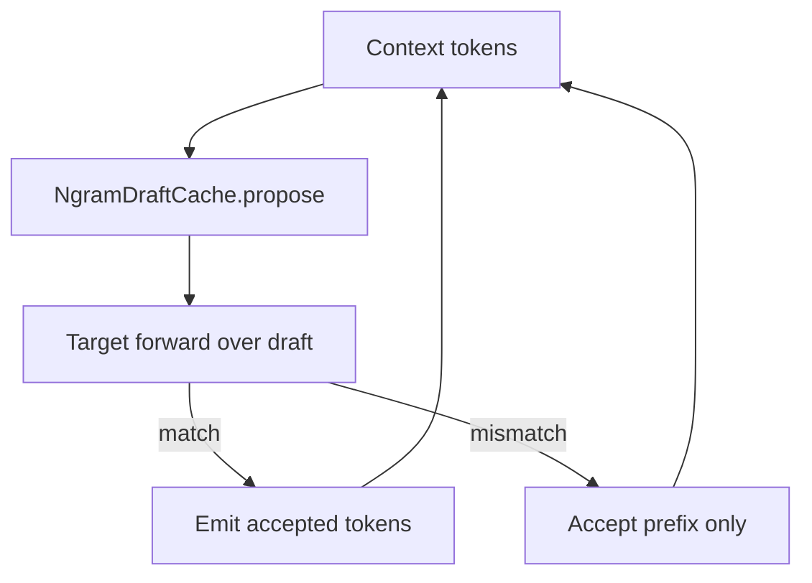

# Tier 9: Ngram Speculative Decoding

## Agent handoff

Read and follow `models/CLAUDE.md` before implementing:

1. Unit tests first, only for valuable business logic.
2. Implementation details designed with performance in mind.
3. Follow KISS.
4. Prefer adding new Java classes over extending existing ones.
5. Update `docs/agent-arch.txt`, `docs/howto.md`, `README.md` when applicable.
6. No emojis; be strict and precise.
7. Output: list changed files for preview; never zip files back.

Also read:

- `PLAN-Infra-ROADMAP.md`
- `PLAN-Infra-Tier8.md` (recommended)
- `PLAN-Infra-Tier1.md` (required for clean scheduler integration)
- `GenerationLoop`
- llama.cpp ngram speculative modes (behavior reference only)

## Execution placement

| Field | Value |
|-------|-------|
| **Phase** | P4 |
| **Exec step** | 1 (after Tier 8) |
| **Depends on** | Tier 8 complete |
| **Blocks** | Tier 12 |
| **Parallel with** | P3 if staffed |

## Overview

llama.cpp `--spec-type ngram-*` drafts tokens from an ngram cache without a second model. This is the lowest-complexity speculation path for Juno and establishes the verify contract reused by Tier 12.

## Scope and compatibility

Goals:

1. Implement **ngram-simple** (lookup last N tokens → draft up to M tokens).
2. CLI: `--spec-type none|ngram-simple`, `--spec-ngram-n`, `--spec-ngram-m`.
3. Verify drafts with target forwards; never emit unverified tokens.
4. JFR: `draftTokens`, `acceptedTokens`, `acceptanceRate`.

Non-goals:

- ngram-mod / ngram-map-k / ngram-cache variants in this tier (may follow as patches).
- Draft GGUF models (Tier 12).
- EAGLE3 / DFlash / MTP.

## Chosen design

- New `NgramDraftCache` + speculate-verify loop in GenerationLoop.
- On mismatch, accept the common prefix only; continue from divergence.
- Default `--spec-type none` ≡ Tier 8 behavior.
- Greedy + speculation must equal greedy without speculation (token identity).

## Implementation

### 1. Cache — tests first

- Insert/lookup; empty cache; max size eviction if applicable.

### 2. Verify loop

- Integrate into GenerationLoop; unit tests with a fake forward that returns known tokens.

### 3. CLI + JFR

- Wire flags; populate speculation JFR fields.

### 4. Benchmarks

- Repetitive workload (expect uplift) and natural text (neutral OK if documented).

## Verification and exit gate

**Global rules** ([`PLAN-Infra-ROADMAP.md`](PLAN-Infra-ROADMAP.md) → Execution rules): only one Infra tier in flight at a time; publish a [`docs/perf-compare/`](../perf-compare/README.md) bake-off before marking this tier complete.

Exit only when:

1. Greedy + speculation ≡ greedy without speculation (token identity).
2. JFR fields populated when speculation is enabled.
3. Measurable TPS gain on at least one repetitive workload **or** documented neutrality on natural text with correct acceptance accounting.
4. `--spec-type none` remains default and matches non-speculative path.
5. Tests and docs updated.

## Implementation todos

1. `NgramDraftCache` + unit tests.
2. Speculate-verify loop in GenerationLoop.
3. CLI + JFR + performance notes.
4. Docs; ROADMAP status; preview files; no zip.

## Preview files (expected)

New: `NgramDraftCache.java`, speculation helper, tests, JFR event fields

Modified: `GenerationLoop`, CLI/run scripts, docs, ROADMAP status
