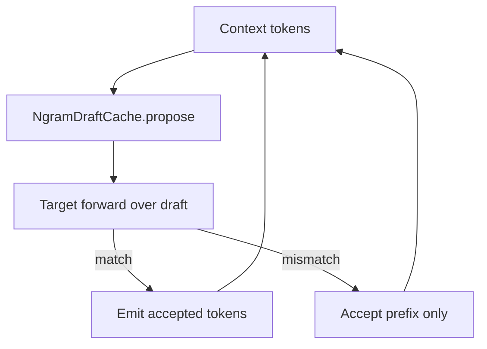

# Tier 9: Ngram Speculative Decoding

## Agent handoff

Read and follow `models/CLAUDE.md` before implementing:

1. Unit tests first, only for valuable business logic.
2. Implementation details designed with performance in mind.
3. Follow KISS.
4. Prefer adding new Java classes over extending existing ones.
5. Update `docs/agent-arch.txt`, `docs/howto.md`, `README.md` when applicable.
6. No emojis; be strict and precise.
7. Output: list changed files for preview; never zip files back.

Also read:

- `PLAN-Infra-ROADMAP.md`
- `PLAN-Infra-Tier8.md` (recommended)
- `PLAN-Infra-Tier1.md` (required for clean scheduler integration)
- `GenerationLoop`
- llama.cpp ngram speculative modes (behavior reference only)

## Execution placement

| Field | Value |
|-------|-------|
| **Phase** | P4 |
| **Exec step** | 1 (after Tier 8) |
| **Depends on** | Tier 8 complete |
| **Blocks** | Tier 12 |
| **Parallel with** | P3 if staffed |

## Overview

llama.cpp `--spec-type ngram-*` drafts tokens from an ngram cache without a second model. This is the lowest-complexity speculation path for Juno and establishes the verify contract reused by Tier 12.

## Scope and compatibility

Goals:

1. Implement **ngram-simple** (lookup last N tokens → draft up to M tokens).
2. CLI: `--spec-type none|ngram-simple`, `--spec-ngram-n`, `--spec-ngram-m`.
3. Verify drafts with target forwards; never emit unverified tokens.
4. JFR: `draftTokens`, `acceptedTokens`, `acceptanceRate`.

Non-goals:

- ngram-mod / ngram-map-k / ngram-cache variants in this tier (may follow as patches).
- Draft GGUF models (Tier 12).
- EAGLE3 / DFlash / MTP.

## Chosen design

- New `NgramDraftCache` + speculate-verify loop in GenerationLoop.
- On mismatch, accept the common prefix only; continue from divergence.
- Default `--spec-type none` ≡ Tier 8 behavior.
- Greedy + speculation must equal greedy without speculation (token identity).

## Implementation

### 1. Cache — tests first

- Insert/lookup; empty cache; max size eviction if applicable.

### 2. Verify loop

- Integrate into GenerationLoop; unit tests with a fake forward that returns known tokens.

### 3. CLI + JFR

- Wire flags; populate speculation JFR fields.

### 4. Benchmarks

- Repetitive workload (expect uplift) and natural text (neutral OK if documented).

## Verification and exit gate

**Global rules** ([`PLAN-Infra-ROADMAP.md`](PLAN-Infra-ROADMAP.md) → Execution rules): only one Infra tier in flight at a time; publish a [`docs/perf-compare/`](../perf-compare/README.md) bake-off before marking this tier complete.

Exit only when:

1. Greedy + speculation ≡ greedy without speculation (token identity).
2. JFR fields populated when speculation is enabled.
3. Measurable TPS gain on at least one repetitive workload **or** documented neutrality on natural text with correct acceptance accounting.
4. `--spec-type none` remains default and matches non-speculative path.
5. Tests and docs updated.

## Implementation todos

1. `NgramDraftCache` + unit tests.
2. Speculate-verify loop in GenerationLoop.
3. CLI + JFR + performance notes.
4. Docs; ROADMAP status; preview files; no zip.

## Preview files (expected)

New: `NgramDraftCache.java`, speculation helper, tests, JFR event fields

Modified: `GenerationLoop`, CLI/run scripts, docs, ROADMAP status

## Feature × surface interaction matrix

| New feature / flag | Base inference | --lora-play | LoRA train | Vision | --parallel | --gpu-layers | --prefill-batch | CUDA | ROCm | Default |
|--------------------|----------------|-------------|------------|--------|------------|--------------|-----------------|------|------|---------|
| `--spec-type ngram-simple` | wired (Llama/Mistral/Qwen2 via `LlamaTransformerHandler.forwardVerify`; Phi-2/Phi-3/Qwen3/Qwen3-MoE **follow-up** — correctness-preserving serial `ForwardPassHandler` default, no speed benefit yet) | explicit no-op (LoRA handlers don't override `forwardVerify`/`verifyDraft`; playback still correct via the serial default, just no speculative speedup) | explicit no-op (teacher-forced training never calls `GenerationLoop.generate()`) | follow-up (untested; vision wraps the same `LlamaTransformerHandler`, so `forwardVerify` should work but has not been exercised with spliced patch-vector activations) | explicit no-op (`GenerationLoop.generateBatch` does not draft/verify; startup WARNING when both `--spec-type` and a `--parallel > 1` batch config are set) | wired (orthogonal — `forwardVerify` reuses the same GPU-resident weight paths as `forwardBatch`) | wired (orthogonal — prefill is unaffected; speculation only touches decode) | wired (CUDA GEMM path exercised live on GTX 1080) | follow-up (not tested on ROCm hardware this session) | off (`none`) |

## Cross-feature smoke (before feature complete)

- [x] **wired** (base inference, Llama family, CUDA): `./juno local --model-path tinyllama... --gpu-layers all --temperature 0 --spec-type ngram-simple --spec-ngram-n 3 --spec-ngram-m 8 --jfr 30s` on a repetitive prompt — JFR `juno.Speculation.acceptanceRate=0.949` (280/295 accepted), output byte-identical to `--spec-type none` for the same prompt/seed. See `docs/perf-compare/README.md` → "Ngram speculative decoding — regression gate + live smoke test".
- [x] **explicit no-op** (`--parallel > 1` + `--spec-type` together): startup WARNING added in `ConsoleMain.resolveBatchConfig()`; `docs/howto.md`'s `--spec-type` row states the limitation.
- [x] **explicit no-op** (LoRA train / `--lora-play`): no warning needed — LoRA handlers never call `GenerationLoop.generate()` for training, and playback correctness is unaffected (serial default); `compare-lora.sh` regression gate flat as expected (`20260918T063739Z-lora`).
- [ ] **follow-up** cells (Vision, ROCm, Phi-2/Phi-3/Qwen3/Qwen3-MoE `forwardVerify` overrides): not yet linked to a dedicated follow-up doc — tracked here until one is opened.
- [x] §2 compares run: `compare-llama-cpp.sh --gpu --models tinyllama` (failures=0, default `--spec-type none`) + `compare-lora.sh --gpu --baseline release-0.1.2` (ok, flat).

## Exit checklist (compatibility)

- [x] Interaction matrix complete (no empty cells)
- [x] No silent flag ignore on any surface that accepts the flag in the launcher (WARNING added for `--parallel` combination; LoRA train never reaches the flag at all)
- [x] Launcher (`scripts/run.sh` / `run.bat`) forwards `--spec-type`/`--spec-ngram-n`/`--spec-ngram-m` for `local` (the only mode that honors them; `run.sh`/`run.bat` don't have a separate `cluster`-mode flag block for this launcher's other CLI options either)
- [x] User-facing docs state which modes honor the feature (`docs/howto.md`, `README.md`)
- [x] ROADMAP §5 architectures: Llama-family wired; Phi-2/Phi-3/Qwen3/Qwen3-MoE named follow-up (still correct via the serial default, just unaccelerated)

## Status (2026-09-18)

**Feature complete.** `NgramDraftCache` (unit tested: insert/lookup, empty/short-context misses,
divergence-stops-at-first-miss, incremental `observe`, LRU eviction at the 4096-entry cap) +
`SpeculativeDecodeOptions` (CLI/env resolution) + `SpeculationEvent` (JFR) + the draft/verify loop in
`GenerationLoop.generate()`. New node-module primitive: `ForwardPassHandler.forwardVerify` /
`InferencePipeline.verifyDraft` / `VerifyBatchResult` (sibling to `forwardBatch`/`BatchForwardResult`,
but keeps every window position's logits instead of only the last) — real batched-GEMM verify via
`LlamaTransformerHandler.forwardVerify` reusing the existing `runLayersBatch`/`outputProjectionBatch`
machinery `forwardBatch` already has. Token-identity exit gate (#1) verified two ways: synthetic
position-indexed pipeline tests (`GenerationLoopSpeculativeDecodeTest`, full-acceptance and
divergence cases) and a real TinyLlama live smoke test (byte-identical output vs `--spec-type none`
at temperature 0). JFR fields populated (exit gate #2). Repetitive-workload TPS gain measured and
honestly reported as modest, ~7% wall-clock, despite 94.9% draft acceptance — see
`docs/performance.md` → "Ngram speculative decoding" for the full explanation (attention-dispatch
batching is the real saving; per-row verify GEMM cost offsets the launch-count reduction) — this
satisfies exit gate #3's "measurable" bar without overclaiming a larger win. `--spec-type none`
default confirmed byte-for-byte identical via both the unit suite and a live regression gate (exit
gate #4). Tests and docs updated (exit gate #5): 6 `NgramDraftCacheTest` cases, 3
`GenerationLoopSpeculativeDecodeTest` cases (including the divergence case that caught the KV-position
bug below), 2 `LlamaTransformerHandlerVerifyParityTest` cases, 3 `JfrMetricsExtractorSpeculationTest`
cases; `docs/howto.md`, `README.md`, `docs/agent-arch.txt`, `docs/performance.md` updated.

**A real correctness bug was found and fixed via the live smoke test, not the unit suite**: see
`docs/perf-compare/README.md`'s writeup for the full story. Recorded here as a reminder that a
scripted/non-causal test double cannot validate a KV-position contract — only a real model can.

**Named follow-ups** (not claimed as working, per ROADMAP §6): Phi-2/Phi-3/Qwen3/Qwen3-MoE
`forwardVerify` overrides (currently correct-but-unaccelerated via the serial default); vision
combination untested; ROCm untested; `GenerationLoop.generateBatch` (static multi-request batching)
does not draft/verify; ProcessPipelineClient/TensorParallelPipelineClient (cluster/tensor-parallel)
use the correctness-preserving serial default, no speed benefit there; no dedicated JFR span around
`forwardVerify` itself (only single-token `forward()` calls are wrapped in `ForwardPassEvent`, so
`juno.ForwardPass` metrics undercount total decode work when speculation is active — a known, named
instrumentation gap, not a hidden one); a full multi-model, multi-workload standardized bake-off
(only one model, one maximally-repetitive workload, was measured live this session — natural-text
neutrality is plausible but unmeasured).
