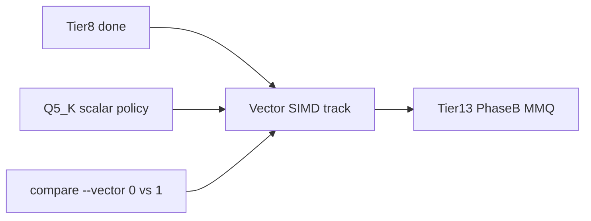

# Vector SIMD track (P0 step 4)

## Purpose

Complete P0 step 4 of [`PLAN-Infra-ROADMAP.md`](PLAN-Infra-ROADMAP.md): lock the vision-safe Q4/Q5 scalar accumulate policy in code and docs, publish a `--vector 0` vs `--vector 1` CPU bake-off, then the critical path advances to Tier 13 Phase B (fused Q4 MMQ).

This is a **parallel track**, not a numbered Infra tier. It still follows ROADMAP Execution rules §2–§5 (perf publish, naming, all supported models).

## Status vs plan

| Item | State |
|------|--------|
| Tiers 13A, 5, 1, 8 | Feature complete |
| Vector SIMD kernels (`VectorQuantKernels`, `SimdThreadPool`) | Shipped |
| Moondream hang fix (`dd4ceba`) | Weight-stationary Q4/Q5/Q8 **accumulate** is inline scalar; `SimdThreadPool.forEachRow` uses common-pool parallel stream |
| Vision gate | `compare-vision.sh` green vs `47-vision` / [`20260904T141315Z-vision`](../perf-compare/20260904T141315Z-vision/) after hang fix |
| Policy | `VectorQuantKernels.policySummary` + [`docs/performance.md`](../performance.md) |
| Bake-off | [`20260904T194612Z`](../perf-compare/20260904T194612Z/) (`--vector 0`) vs [`20260904T195731Z`](../perf-compare/20260904T195731Z/) (`--vector 1`); Juno tg v1/v0 ≈ 0.99–1.03 |

**Track status: Feature complete.** Next Infra tier on the critical path: Tier 13 Phase B.



## Chosen approach

Close the track on the **policy already proven by the hang fix**, without re-enabling `VectorQuantKernels.dot` in weight-stationary loops (that path was ~37–260× slower at vision-scale B on 128-bit SPECIES).

Production Vector usage:

- **Q4_K / Q5_K weight-stationary:** scalar dequant + scalar accumulate (JIT-friendly); row parallel via `SimdThreadPool.forEachRow` → common pool
- **Q8_0 weight-stationary:** `VectorQuantKernels.dequantizeQ8_0` when self-probe passes; scalar accumulate
- **`VectorQuantKernels.dot`:** kept for tests / future gated use; **not** called from hot weight-stationary paths
- **Module gate:** compare script `--vector 0|1` = whether `--add-modules jdk.incubator.vector` is passed (existing harness)

## Implementation

### 1. Code: make policy explicit

In `VectorQuantKernels.java`:

- `policySummary()` stating which quant phases use Vector vs scalar
- Class javadoc: weight-stationary accumulate is intentionally scalar after vision regression; Q8_0 dequant remains the Vector hot path

In `LlamaTransformerHandler` `sgemmQ*WeightStationary`: keep scalar accumulate; comments point at the policy (no Infra tier numbers).

In `SimdThreadPool` / `docs/agent-arch.txt`: hot path is common-pool `IntStream.parallel()`; dedicated `POOL` is diagnostics-only.

Unit: `policySummary()` mentions Q4_K/Q5_K scalar accumulate and Q8_0 dequant Vector.

### 2. Docs

- **Vector SIMD / CPU MatVec** section in `docs/performance.md`
- ROADMAP Vector SIMD row → **Feature complete** after bake-off; P0 phase gate remains open
- No competitor names outside `docs/infra-plan/` / `docs/perf-compare/`

### 3. Bake-off (exit gate)

```bash
./scripts/performance-tests/compare-llama-cpp.sh --cpu --vector 0 --reps 1
./scripts/performance-tests/compare-llama-cpp.sh --cpu --vector 1 --reps 1
```

Publish under `docs/perf-compare/<timestamp>/`, add rows to `docs/perf-compare/README.md`. Expect near-parity on Q4_K_M models (Vector no longer on Q4/Q5 accumulate).

Vision: re-run `compare-vision.sh` only if MatVec dispatch changes again.

### 4. After this lands

Next Infra tier: **Tier 13 Phase B** ([`PLAN-Infra-Tier13.md`](PLAN-Infra-Tier13.md)) — fused Q4 MMQ / batched decode GEMV behind a flag.

## Exit checklist

1. Unit / parity tests for Vector paths in use (Q8_0 dequant + `dot` API) and Q5_K weight-stationary regression bench
2. Published `--vector 0` vs `--vector 1` bake-off row
3. Vision-safe default path documented (scalar Q4/Q5 accumulate)
4. No silent pathological slowdown at vision-scale B

## Preview files

Modified: `VectorQuantKernels.java`, `LlamaTransformerHandler.java` (comments), `SimdThreadPool.java` (javadoc), `docs/agent-arch.txt`, `docs/performance.md`, `PLAN-Infra-ROADMAP.md`, `docs/perf-compare/README.md` + compare artifacts

New: this file (`PLAN-Infra-Vector-SIMD.md`)
