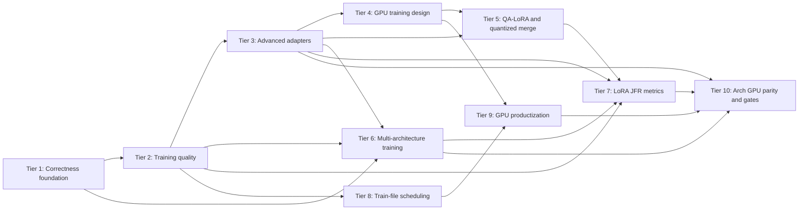

# Juno LoRA Improvement Roadmap

## Purpose

This file is the authoritative execution order for the LoRA improvement plans:

1. `PLAN-LoRA-Tier1.md` — correctness, projection coverage, accumulation, clipping. **Done.**
2. `PLAN-LoRA-Tier2.md` — training orchestration, AdamW, scheduling, dropout, validation, LoRA+. **Done.**
3. `PLAN-LoRA-Tier3.md` — adapter metadata, Kaiming initialization, rsLoRA, DoRA. **Mostly done** (DoRA refresh perf gate open; see Tier 10).
4. `PLAN-LoRA-Tier4.md` — GPU training design: resident transpose, batching, adapter residency. **Primitives started**; finish via Tier 9.
5. `PLAN-LoRA-Tier5.md` — QA-LoRA research and quantization-preserving merge. **Code done**; research matrix deferred.
6. `PLAN-LoRA-Tier6.md` — multi-architecture LoRA training: Qwen2/2.5, Phi-3, dense Qwen3. **CPU mostly done**; live smokes / GPU parity via Tier 10.
7. `PLAN-LoRA-Tier7.md` — JFR metrics for all LoRA adapter modes and operations. **Mostly done**; confirm via Tier 10.
8. `PLAN-LoRA-Tier8.md` — `/train-file` scheduling: chunk CLI, corpus caps, document-level units. **Done.**
9. `PLAN-LoRA-Tier9.md` — GPU LoRA productization and microbatching (complete Tier 4 gates). **Next.**
10. `PLAN-LoRA-Tier10.md` — multi-arch GPU residency parity, gated live smokes, DoRA/Tier 7/5 doc gates.

Read and follow `models/CLAUDE.md` before implementing any tier. Each tier is test-first and must pass its gate before the next dependent tier begins.

## Terminology

- Current Juno training is **LoRA on a quantized GGUF base**.
- Do not call it QLoRA. Juno does not implement QLoRA's NF4, double-quantization, compute-dtype, and paged-training design.
- Do not add NF4/QLoRA merely for branding. The GGUF-native quantized-base path already provides the main frozen-weight memory benefit and should remain the supported design.
- QA-LoRA is a separate grouped-adapter algorithm. It is not QLoRA.
- Dequantize, add a delta, then requantize to Q4_K/Q5_K/Q6_K is an approximate projected merge, not an exact QA-LoRA zero-point merge.

## Dependency graph

Tier 4 primitives may be prototyped earlier, but handler integration must use the stable Tier 1–3 contracts. Tier 5 consumes Tier 3 checkpoint metadata and Tier 4 backend distinctions. Tier 6 requires Tier 1 projection/backward contracts; Tiers 2–3 are recommended so new architecture handlers reuse the shared training loop, optimizer groups, and checkpoint metadata. Tier 6 is independent of Tiers 4 and 5 and should ship on the CPU oracle first. Tier 7 requires Tier 2 train/validation emission and Tier 3 mode identity; it consumes Tier 5 merge metrics and Tier 6 architecture labels when those paths exist, and uses guarded field reads so older recordings still parse.

Tier 8 depends only on Tiers 1–2 and may ship before Tier 9. Tier 9 completes remaining Tier 4 milestones (device CLI, timing, microbatch, speed gates) on the LLaMA/Qwen2 path. Tier 10 ports residency to Phi-3/Qwen3, adds gated live smokes, and closes DoRA / Tier 7 / Tier 5 documentation gates.

## Cross-tier API ownership

### Adapter configuration

- Tier 3 owns `LoraAdapterConfig`: rank, declared alpha, scaling, initialization, and mode.
- Tier 1 owns `LoraTrainingConfig` creation and config-based `LoraTrainer.open`.
- Tiers 2, 4, 5, 6, and 7 extend `LoraTrainingConfig` through a builder; do not introduce competing positional records or duplicate `open` overloads.
- Tier 7 owns the LoRA JFR event catalog and metrics JSON keys; it does not change adapter math.
- External projection keys are lowercase and stable: `wq,wk,wv,wo,wgate,wup,wdown`.
- Tier 6 owns architecture layouts that map those logical keys onto physical GGUF tensors.

### Optimizer

- Tier 1 owns gradient normalization and clipping before optimizer mutation.
- Tier 2 owns parameter groups, schedules, decoupled AdamW, and LoRA+ A/B learning-rate ratios.
- Tier 3 registers DoRA magnitude as another optimizer parameter group; it does not redefine optimizer semantics.
- Tier 4 supplies a device execution implementation that must reproduce the host optimizer contract.
- Tier 6 reuses the Tier 1–3 optimizer contract; architecture handlers must not invent separate optimizer semantics.

### Checkpoint

- Tiers 1–2 retain version-1 compatibility.
- Tier 3 introduces a length-delimited version 2 and retains v1 reads.
- Version 2 reserves extensible algorithm/quantization metadata for Tier 5.
- Tier 6 keeps logical projection keys in checkpoints and resolves physical layout at load time from `general.architecture`.
- Optimizer and schedule state remain outside inference checkpoints unless a separately scoped resumable-training format is approved.

### Merge

- Tier 1 owns projection-to-GGUF mapping and safe F32 merge.
- Tier 3 owns dense LoRA/rsLoRA/DoRA formulas and base fingerprints.
- Tier 5 owns output quantization policy, codec conformance, QA-LoRA grouping, and projected K-quant merge.
- Tier 6 extends merge for architecture layouts, including multi-adapter fused-slice patching for Phi-3.
- F32 remains the default merge policy until Tier 5 quality gates pass.

### Architecture routing

- Tier 1 introduced LLaMA-family LoRA allowlisting.
- Tier 6 replaces default-accept routing with an explicit factory allowlist:
  - LLaMA-family dense models → existing LLaMA LoRA handler
  - Qwen2/Qwen2.5 dense → Qwen2 LoRA handler
  - Phi-3 → Phi-3 LoRA handler
  - Qwen3 dense → Qwen3 LoRA handler
  - Qwen3-MoE, Qwen3.5, Gemma, unknown → explicit rejection

### Observability

- Tiers 1–2 introduced `juno.LoraTrainStep` and optional `juno.LoraValidation`.
- Tier 4 reserved timing-subset fields on train-step events; Tier 9 fills and gates them.
- Tier 7 owns the complete LoRA JFR catalog, programmatic LoRA `--jfr` lifecycle, metrics JSON keys, and mode-identity tagging across train / validate / merge / playback / DoRA refresh / checkpoint.
- Extractions must use guarded field reads so recordings from earlier tiers remain readable.
- Tier 8 owns train corpus scheduling fields on `LoraTrainingConfig`: `chunkTokens`, `maxTrainTokens`.
- Tier 9 owns `--lora-train-device` resolution and microbatch device execution contracts.
- Tier 10 owns shared multi-arch residency helpers and gated live LoRA smoke ownership.

## Tier summaries and exit gates

### Tier 1 — correctness foundation

Deliver all-linear target support, complete forward/backward math, architecture validation, token-weighted gradient accumulation, non-finite rejection, and global clipping.

Exit only when:

- finite-difference tests pass for every supported projection;
- current-position K and inverse-RoPE backward are tested;
- accumulated gradients equal summed independent gradients;
- unequal chunk lengths produce token-weighted loss/gradients;
- v1 checkpoints and legacy Java overloads remain compatible.

### Tier 2 — training quality and LoRA+

Deliver shared training orchestration, warmup/cosine schedules, true A-only AdamW, deterministic train-only dropout, held-out validation, best-weight restoration, and LoRA+.

LoRA+ parameter groups:

- A uses the scheduled base learning rate.
- B uses `baseLearningRate * loraPlusRatio`.
- Ratio `1.0` reproduces ordinary optimizer behavior.
- CLI/env: `--lora-plus-ratio`, `LORA_PLUS_RATIO`.

Exit only when:

- repeated seeded runs are deterministic;
- LoRA+ ratio 1.0 is equivalent to disabled LoRA+;
- scheduler updates equal optimizer updates after accumulation;
- validation is pure and disjoint from training;
- best-weight restoration resets stale optimizer state.

### Tier 3 — rsLoRA, Kaiming, DoRA

Deliver explicit adapter metadata, PEFT-compatible Kaiming initialization, rsLoRA, checkpoint v2, canonical detached-norm DoRA, base fingerprints, and merge/playback parity.

Exit only when:

- hard-coded v1 fixtures load;
- v2 corruption, truncation, duplicate, and enum tests pass;
- LoRA/rsLoRA/DoRA train, save, playback, and F32 merge agree with dense references;
- base fingerprint mismatch fails safely;
- exact DoRA norm refresh meets a measured time/heap budget.

### Tier 4 — GPU training

The current GPU path accelerates frozen forward GEMV only. Tier 4 must add resident frozen transpose backward, microbatched linear algebra, and device residency where benchmarks justify it.

Exit only when:

- CUDA and ROCm transpose adjoint tests pass;
- CPU/GPU losses, gradients, and updates agree within declared FP16/FP32 tolerances;
- GPU backward is at least 2× faster than CPU backward on the reference benchmark;
- end-to-end training has a demonstrated speedup;
- device-resident adapter math is enabled only where it beats host math;
- CPU and FP32-resident fallback paths remain correct.

### Tier 5 — QA-LoRA and quantized merge

First establish conformant GGUF K-quant codecs. Then implement grouped QA-LoRA and evaluate F32, sidecar, and projected source-type merge modes.

Exit only when:

- decode/encode agrees with pinned llama.cpp reference vectors;
- no-op merge is byte-identical;
- grouped adapter forward/backward passes dense-reference and finite-difference tests;
- projected merge reports delta retention and reconstruction metrics;
- held-out quality meets preregistered thresholds.

Do not claim exact QA-LoRA merge for Q4_K/Q5_K/Q6_K without a formal representability proof and exhaustive block tests. Current analysis says those formats are not generally closed under QA-LoRA's learned additive group shifts.

### Tier 6 — multi-architecture LoRA training

Deliver architecture-specific LoRA training and playback for dense Qwen2/Qwen2.5, Phi-3/Phi-3.5, and dense Qwen3 through a shared factory and layout bindings. Keep logical checkpoint keys unchanged and resolve physical tensors from the GGUF architecture.

Exit only when:

- factory allowlisting rejects unsupported architectures;
- each enabled architecture has zero-adapter logit parity with its inference handler;
- architecture-specific RoPE and norm adjoints pass;
- finite-difference adapter gradients pass for enabled targets;
- save/load/playback and F32 merge parity hold, including Phi fused-slice merge;
- training tokenization and chat templates match inference for each architecture;
- gated real-model smokes pass for available Qwen2.5, Phi-3.5-mini, and dense Qwen3 fixtures.

### Tier 7 — LoRA JFR metrics for all modes

Deliver programmatic LoRA `--jfr` lifecycle parity with local mode, mode-identity fields on train/validation events, dedicated events for DoRA norm refresh / merge / playback / checkpoint, and full `JfrMetricsExtractor` coverage so LoRA, rsLoRA, DoRA, and QA-LoRA are comparable from one metrics JSON.

Exit only when:

- LoRA `--jfr` uses programmatic recording and auto-extracts metrics on exit;
- train-step events for `lora`, `rslora`, `dora`, and `qa-lora` carry correct identity fields;
- extractor aggregates train, validation, merge, norm-refresh, and playback series with guarded field reads;
- DoRA-only refresh and projected-merge quality fields appear when those paths run;
- older `.jfr` files without new fields still extract successfully;
- docs list the LoRA metrics contract and launcher help matches behavior.

### Tier 8 — train-file scheduling

Deliver configurable chunk size, seeded max-train-tokens corpus caps, document-level `TrainUnit`s, and doc/help alignment (default 32, recommend 128 for files).

Exit only when:

- REPL no longer hardcodes chunk 32;
- CLI/env and unit tests cover bounds and seeded caps;
- docs/help match defaults and recommendations;
- Tier 1–2 loss/optimizer contracts are unchanged.

### Tier 9 — GPU productization and microbatching

Complete remaining Tier 4 milestones on LLaMA/Qwen2: `--lora-train-device`, filled timing fields, microbatched frozen linears, CPU/GPU parity and speed gates; optional device adapters/Adam only after measured win.

Exit only when Tier 4 product gates in `PLAN-LoRA-Tier4.md` / `PLAN-LoRA-Tier9.md` pass and docs may truthfully describe GPU LoRA training with evidence.

### Tier 10 — multi-arch GPU parity and production gates

Port resident GPU transpose to Phi-3 and dense Qwen3 via a shared helper; add gated live LoRA smokes; resolve DoRA refresh gate; confirm Tier 7 complete; explicitly defer Tier 5 research matrix.

Exit only when the architecture GPU matrix and documentation gates in `PLAN-LoRA-Tier10.md` pass.

## Recommended execution

Historical (complete or in progress):

1. Tier 1 completely — CPU reference correctness.
2. Tier 2, including LoRA+.
3. Tier 3: rsLoRA/Kaiming/checkpoint v2, then DoRA (perf gate left to Tier 10).
4. Tier 6 architecture handlers on the CPU oracle.
5. Tier 4 primitives (resident transpose) started; Tier 5 code; Tier 7 mostly done.

Forward (agent execution order):

1. **Tier 9** — finish Tier 4 productization and microbatching (benefit from Tier 8 longer chunks).
2. **Tier 10** — Phi-3/Qwen3 GPU residency, live smokes, DoRA/Tier 7/5 doc gates.

Tier 8 is complete. Tier 10 should follow Tier 9 Milestone 1 residency contracts so handlers share one upload/transpose helper.

## Explicit deferrals

- NF4/double-quantized QLoRA compatibility.
- Paged optimizers for the small adapter-only state.
- Tensor-parallel LoRA/DoRA training or playback.
- Full custom GPU attention/softmax kernels.
- Claims of exact QA-LoRA merge into GGUF K-quants.
- PiSSA/OLoRA until a reliable SVD/QR implementation and cost budget are approved.
- VeRA, GaLore, and ReLoRA unless a concrete Juno workload justifies them.
- Qwen3-MoE LoRA training.
- Qwen3.5 hybrid DeltaNet/SSM/recurrent LoRA training.
- Qwen2-VL / multimodal LoRA training.
- Gemma LoRA until an audited dense layout and tests exist.
- Distributed pipeline-parallel LoRA training (cross-node backward).
- Prometheus/Grafana exporters for LoRA JFR (Tier 7 ships JSON + console summary only).
