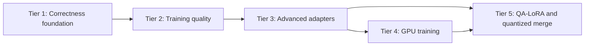

# Juno LoRA Improvement Roadmap

## Purpose

This file is the authoritative execution order for the LoRA improvement plans:

1. `PLAN-LoRA-Tier1.md` — correctness, projection coverage, accumulation, clipping.
2. `PLAN-LoRA-Tier2.md` — training orchestration, AdamW, scheduling, dropout, validation, LoRA+.
3. `PLAN-LoRA-Tier3.md` — adapter metadata, Kaiming initialization, rsLoRA, DoRA.
4. `PLAN-LoRA-Tier4.md` — GPU training: resident transpose backward, batching, adapter residency.
5. `PLAN-LoRA-Tier5.md` — QA-LoRA research and quantization-preserving merge.

Read and follow `models/CLAUDE.md` before implementing any tier. Each tier is test-first and must pass its gate before the next tier begins.

## Terminology

- Current Juno training is **LoRA on a quantized GGUF base**.
- Do not call it QLoRA. Juno does not implement QLoRA's NF4, double-quantization, compute-dtype, and paged-training design.
- Do not add NF4/QLoRA merely for branding. The GGUF-native quantized-base path already provides the main frozen-weight memory benefit and should remain the supported design.
- QA-LoRA is a separate grouped-adapter algorithm. It is not QLoRA.
- Dequantize, add a delta, then requantize to Q4_K/Q5_K/Q6_K is an approximate projected merge, not an exact QA-LoRA zero-point merge.

## Dependency graph

Tier 4 primitives may be prototyped earlier, but handler integration must use the stable Tier 1–3 contracts. Tier 5 consumes Tier 3 checkpoint metadata and Tier 4 backend distinctions.

## Cross-tier API ownership

### Adapter configuration

- Tier 3 owns `LoraAdapterConfig`: rank, declared alpha, scaling, initialization, and mode.
- Tier 1 owns `LoraTrainingConfig` creation and config-based `LoraTrainer.open`.
- Tiers 2, 4, and 5 extend `LoraTrainingConfig` through a builder; do not introduce competing positional records or duplicate `open` overloads.
- External projection keys are lowercase and stable: `wq,wk,wv,wo,wgate,wup,wdown`.

### Optimizer

- Tier 1 owns gradient normalization and clipping before optimizer mutation.
- Tier 2 owns parameter groups, schedules, decoupled AdamW, and LoRA+ A/B learning-rate ratios.
- Tier 3 registers DoRA magnitude as another optimizer parameter group; it does not redefine optimizer semantics.
- Tier 4 supplies a device execution implementation that must reproduce the host optimizer contract.

### Checkpoint

- Tiers 1–2 retain version-1 compatibility.
- Tier 3 introduces a length-delimited version 2 and retains v1 reads.
- Version 2 reserves extensible algorithm/quantization metadata for Tier 5.
- Optimizer and schedule state remain outside inference checkpoints unless a separately scoped resumable-training format is approved.

### Merge

- Tier 1 owns projection-to-GGUF mapping and safe F32 merge.
- Tier 3 owns dense LoRA/rsLoRA/DoRA formulas and base fingerprints.
- Tier 5 owns output quantization policy, codec conformance, QA-LoRA grouping, and projected K-quant merge.
- F32 remains the default merge policy until Tier 5 quality gates pass.

## Tier summaries and exit gates

### Tier 1 — correctness foundation

Deliver all-linear target support, complete forward/backward math, architecture validation, token-weighted gradient accumulation, non-finite rejection, and global clipping.

Exit only when:

- finite-difference tests pass for every supported projection;
- current-position K and inverse-RoPE backward are tested;
- accumulated gradients equal summed independent gradients;
- unequal chunk lengths produce token-weighted loss/gradients;
- v1 checkpoints and legacy Java overloads remain compatible.

### Tier 2 — training quality and LoRA+

Deliver shared training orchestration, warmup/cosine schedules, true A-only AdamW, deterministic train-only dropout, held-out validation, best-weight restoration, and LoRA+.

LoRA+ parameter groups:

- A uses the scheduled base learning rate.
- B uses `baseLearningRate * loraPlusRatio`.
- Ratio `1.0` reproduces ordinary optimizer behavior.
- CLI/env: `--lora-plus-ratio`, `LORA_PLUS_RATIO`.

Exit only when:

- repeated seeded runs are deterministic;
- LoRA+ ratio 1.0 is equivalent to disabled LoRA+;
- scheduler updates equal optimizer updates after accumulation;
- validation is pure and disjoint from training;
- best-weight restoration resets stale optimizer state.

### Tier 3 — rsLoRA, Kaiming, DoRA

Deliver explicit adapter metadata, PEFT-compatible Kaiming initialization, rsLoRA, checkpoint v2, canonical detached-norm DoRA, base fingerprints, and merge/playback parity.

Exit only when:

- hard-coded v1 fixtures load;
- v2 corruption, truncation, duplicate, and enum tests pass;
- LoRA/rsLoRA/DoRA train, save, playback, and F32 merge agree with dense references;
- base fingerprint mismatch fails safely;
- exact DoRA norm refresh meets a measured time/heap budget.

### Tier 4 — GPU training

The current GPU path accelerates frozen forward GEMV only. Tier 4 must add resident frozen transpose backward, microbatched linear algebra, and device residency where benchmarks justify it.

Exit only when:

- CUDA and ROCm transpose adjoint tests pass;
- CPU/GPU losses, gradients, and updates agree within declared FP16/FP32 tolerances;
- GPU backward is at least 2× faster than CPU backward on the reference benchmark;
- end-to-end training has a demonstrated speedup;
- device-resident adapter math is enabled only where it beats host math;
- CPU and FP32-resident fallback paths remain correct.

### Tier 5 — QA-LoRA and quantized merge

First establish conformant GGUF K-quant codecs. Then implement grouped QA-LoRA and evaluate F32, sidecar, and projected source-type merge modes.

Exit only when:

- decode/encode agrees with pinned llama.cpp reference vectors;
- no-op merge is byte-identical;
- grouped adapter forward/backward passes dense-reference and finite-difference tests;
- projected merge reports delta retention and reconstruction metrics;
- held-out quality meets preregistered thresholds.

Do not claim exact QA-LoRA merge for Q4_K/Q5_K/Q6_K without a formal representability proof and exhaustive block tests. Current analysis says those formats are not generally closed under QA-LoRA's learned additive group shifts.

## Recommended execution

1. Implement Tier 1 completely and establish CPU reference correctness.
2. Implement Tier 2, including LoRA+, before adding new adapter algorithms.
3. Implement Tier 3 in two releases if necessary: rsLoRA/Kaiming/checkpoint v2 first, DoRA second.
4. Implement Tier 4 in measured milestones: GPU transpose, batching, adapter residency, optional device optimizer.
5. Begin Tier 5 with codec conformance and experiments; productize projected K-quant merge only if it materially beats ordinary LoRA requantization.

## Explicit deferrals

- NF4/double-quantized QLoRA compatibility.
- Paged optimizers for the small adapter-only state.
- Tensor-parallel LoRA/DoRA training or playback.
- Full custom GPU attention/softmax kernels.
- Claims of exact QA-LoRA merge into GGUF K-quants.
- PiSSA/OLoRA until a reliable SVD/QR implementation and cost budget are approved.
- VeRA, GaLore, and ReLoRA unless a concrete Juno workload justifies them.
