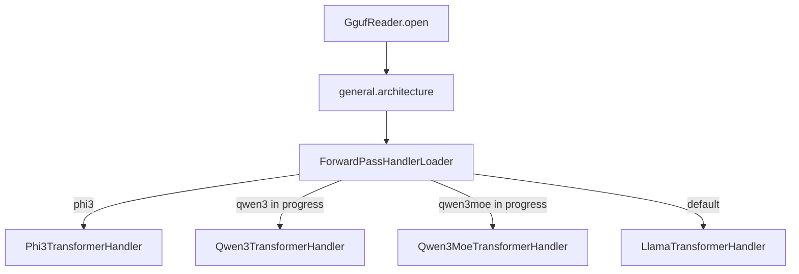
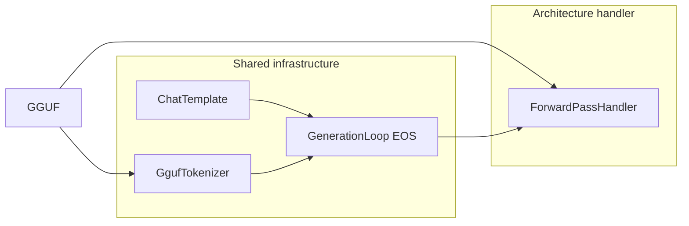
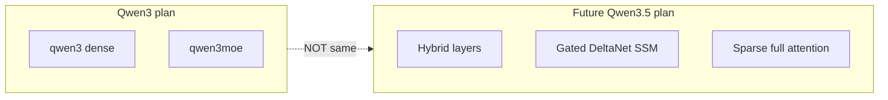
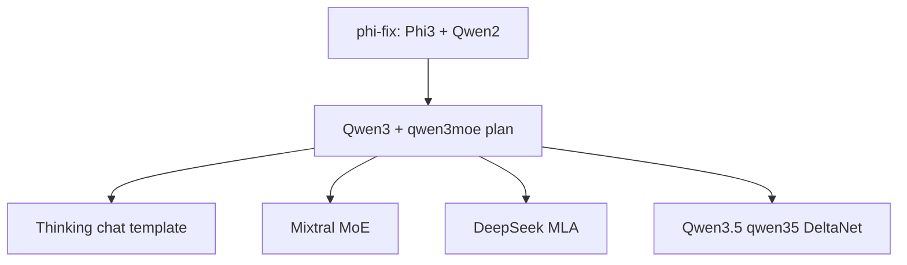

# Juno Model Support — Discussion Summary

Single reference document capturing decisions, status, schemas, and roadmap from this thread.

---

## 1. How Juno selects a model handler

Juno reads `general.architecture` from GGUF metadata and dispatches in [ForwardPassHandlerLoader.java](node/src/main/java/cab/ml/juno/node/ForwardPassHandlerLoader.java):



**Current status:**

| `general.architecture` | Handler | Status |
|------------------------|---------|--------|
| `phi3` | `Phi3TransformerHandler` | **Supported** — cluster validated |
| `llama`, `mistral`, `tinyllama`, … | `LlamaTransformerHandler` | Production baseline |
| `gemma` | `LlamaTransformerHandler` | **Under development** |
| `qwen2` | `LlamaTransformerHandler` (+ QKV bias) | **Under development** |
| `qwen3` | `Qwen3TransformerHandler` | **Under development** |
| `qwen3moe` | `Qwen3MoeTransformerHandler` | **Under development** |
| `qwen35` | — (no handler yet) | **Under development** — hybrid DeltaNet; separate from Qwen3 |

**Core decision:** New architectures get **standalone `ForwardPassHandler` classes** (Phi-3 pattern). Do **not** patch `LlamaTransformerHandler` for Qwen3-specific math. Static math utilities (`rmsNorm`, `matVec`, `gqa`) may be reused from `LlamaTransformerHandler` as Phi-3 already does.

Supporting a model family requires **two layers**:



---

## 2. Model priority roadmap (strategic)

| Tier | Families | Rationale | Juno status |
|------|----------|-----------|-------------|
| **1** | LLaMA 3, Mistral, TinyLlama | Core product, LoRA, distributed inference | Done via `LlamaTransformerHandler` |
| **1b** | Gemma | High adoption; uses Llama handler + `gemma` template | **Under development** |
| **2** | Phi-3 / Phi-3.5 | Dedicated handler | **Supported** |
| **3** | **Qwen 2.x** | High adoption; tokenizer + QKV bias groundwork | **Under development** |
| **4** | **Qwen3 dense + Qwen3-MoE** | Dedicated handlers in progress | **Under development** |
| **5** | Mixtral MoE | Reuse MoE FFN pattern from Qwen3-MoE | Future |
| **6** | DeepSeek MLA (`deepseek2`) | New attention mechanism | Future |
| **7** | **Qwen3.5 (`qwen35`)** | Hybrid DeltaNet + attention — not Qwen3 | **Under development** (separate handler) |
| **Deprioritized** | Multimodal, Mamba/SSM-only, legacy Falcon/MPT | Out of product scope or declining share | Not planned |

---

## 3. Completed work (`phi-fix` branch)

### Commit `a384152` — Phi-3 model fix

| Area | Change | Files |
|------|--------|-------|
| Tokenizer | Honor `add_bos_token=false`; EOG tokens decode to real strings | [GgufTokenizer.java](tokenizer/src/main/java/cab/ml/juno/tokenizer/GgufTokenizer.java) |
| Generation | Stop on `<\|end\|>` | [GenerationLoop.java](coordinator/src/main/java/cab/ml/juno/coordinator/GenerationLoop.java) |
| Transformer | NeoX extended RoPE (`Phi3Rope`, `Phi3RopeConfig`) | [Phi3TransformerHandler.java](node/src/main/java/cab/ml/juno/node/Phi3TransformerHandler.java) |
| Tests | BOS, greedy Hello vs llama.cpp, RoPE load | `GgufTokenizerBosTest`, `Phi3GreedyDecodeIntegrationTest`, … |
| Docs | Debug handoff | [docs/phi3-inference-handoff.md](docs/phi3-inference-handoff.md) |

### Commit `e8b6192` — Qwen2 support

| Area | Change | Files |
|------|--------|-------|
| Transformer | Load/apply `attn_q/k/v.bias` (required for Qwen2) | [LlamaTransformerHandler.java](node/src/main/java/cab/ml/juno/node/LlamaTransformerHandler.java) |
| Tokenizer | GPT-2 `merges` ranks, newline `Ċ`, `im_end` EOG | [GgufTokenizer.java](tokenizer/src/main/java/cab/ml/juno/tokenizer/GgufTokenizer.java) |
| Chat | `qwen`, `qwen2`, `qwen2.5`, `qwen3` → ChatML keys | [ChatTemplate.java](tokenizer/src/main/java/cab/ml/juno/tokenizer/ChatTemplate.java) |
| Generation | Stop on `<\|redacted_im_end\|>` | [GenerationLoop.java](coordinator/src/main/java/cab/ml/juno/coordinator/GenerationLoop.java) |
| CLI | Greedy when `temperature ≈ 0` | [ConsoleMain.java](juno-player/src/main/java/cab/ml/juno/player/ConsoleMain.java) |
| Tests | Synthetic bias, live forward/generation/tokenizer | `Qwen2AttentionBiasTest`, `Qwen2LiveForwardTest`, … |

### Manually verified

- Phi-3.5-mini in **3-node cluster + FLOAT16 + GPU**: coherent output (terminal session)
- TinyLlama cluster still works

---

## 4. Remaining gaps (Gemma and Qwen under development)

| Item | Status |
|------|--------|
| README / RELEASE_NOTES / arch.md — Phi supported; Gemma, Qwen under development | Done |
| Gemma end-to-end validation (cluster, live tests) | In progress |
| Qwen3 / Qwen3-MoE dedicated handlers — load, forward, greedy decode | In progress |
| Qwen2 end-to-end validation (cluster, live tests) | In progress |
| Qwen3.5 (`qwen35`) hybrid DeltaNet handler | Not started |
| Live tests gated on GGUF files in `models/` | Open |
| Real forked-JVM cluster tests for Qwen (only `LocalInferencePipeline` today) | Open |
| `compare-phi3-llama.sh` / `compare-qwen-llama.sh` not in repo | Open |
| LoRA still LLaMA-family only | By design |
| Thinking mode (Qwen3 / Qwen3.5) | Not started |

---

## 5. Qwen implementation plan (in progress)

Full detail: [qwen3_support_plan_d8d609d2.plan.md](/home/medion/.cursor/plans/qwen3_support_plan_d8d609d2.plan.md)

**Overall status:** Qwen 2, Qwen3, and Qwen3.5 are **under development**. Tokenizer, ChatML
template, and QKV-bias groundwork exist; dedicated inference handlers and validation are in
progress. Phi-3 is **supported** and out of this scope.

### Scope

**In:** `qwen3` dense + `qwen3moe` GGUF (local + cluster), non-thinking ChatML

**Out (v1):** thinking template, fused `attn_qkv`, LoRA, Qwen3-VL, **Qwen3.5 (`qwen35`)**

### Architecture vs Qwen2

```mermaid
flowchart TD
    subgraph qwen2 [Qwen2 via LlamaTransformerHandler]
        Q2N[attn_norm] --> Q2QKV[Q K V matmul]
        Q2QKV --> Q2B[+ QKV bias]
        Q2B --> Q2R[RoPE]
        Q2R --> Q2GQA[GQA]
        Q2GQA --> Q2FFN[SwiGLU dense]
    end

    subgraph qwen3 [Qwen3 via Qwen3TransformerHandler — under development]
        Q3N[attn_norm] --> Q3QKV[Q K V matmul]
        Q3QKV --> Q3QN["RMS q_norm per head"]
        Q3QN --> Q3RQ[RoPE Q]
        Q3QKV --> Q3KN["RMS k_norm per head"]
        Q3KN --> Q3RK[RoPE K]
        Q3QKV --> Q3V[V unchanged]
        Q3RQ --> Q3GQA[GQA]
        Q3RK --> Q3GQA
        Q3V --> Q3GQA
        Q3GQA --> Q3FFN[SwiGLU dense]
    end

    subgraph qwen3moe [Qwen3-MoE via Qwen3MoeTransformerHandler — under development]
        Q3MAttn[Same Qwen3 attention] --> Q3MRouter[ffn_gate_inp router]
        Q3MRouter --> Q3MExp[top-k expert SwiGLU]
        Q3MExp --> Q3MSum[weighted sum]
    end
```



| Feature | Qwen2 | Qwen3 dense | Qwen3-MoE |
|---------|-------|-------------|-----------|
| Handler | `LlamaTransformerHandler` | **`Qwen3TransformerHandler`** | **`Qwen3MoeTransformerHandler`** |
| QKV bias | Yes | No | No |
| Q/K norm | No | **Yes** | **Yes** |
| FFN | Dense SwiGLU | Dense SwiGLU | Router + experts |
| RoPE | Standard | Standard (YaRN if needed) | Often YaRN |

### Loader target (core decision)

```java
case "phi3"     -> Phi3TransformerHandler
case "qwen3"    -> Qwen3TransformerHandler      // NEW
case "qwen3moe" -> Qwen3MoeTransformerHandler    // NEW
default         -> LlamaTransformerHandler      // unchanged
```

### New files (planned)

- [Qwen3Config.java](node/src/main/java/cab/ml/juno/node/) — `head_dim` from `attention.key_length`; MoE metadata
- [Qwen3TransformerHandler.java](node/src/main/java/cab/ml/juno/node/) — standalone dense handler (Phi-3 structure)
- [Qwen3MoeTransformerHandler.java](node/src/main/java/cab/ml/juno/node/) — standalone MoE handler
- [Qwen3Rope.java](node/src/main/java/cab/ml/juno/node/) — if YaRN required for MoE models
- Tests + doc updates

**Estimated effort:** ~1.5–2 weeks

---

## 6. Local model files vs plan coverage

| File in `models/` | `general.architecture` | Covered by Qwen3 plan? |
|-------------------|------------------------|-------------------------|
| `Qwen3.5-0.8B.Q4_K_M.gguf` | **`qwen35`** | **No** — hybrid DeltaNet + sparse attention |
| `Qwen3.5-0.8B.Q5_K_M.gguf` | **`qwen35`** | **No** — quant format OK, arch is wrong |
| `qwen3-moe-6x0.6b-3.6b-writing-on-fire-uncensored-q8_0.gguf` | **`qwen3moe`** | **Yes** — target of `Qwen3MoeTransformerHandler` |

### Qwen3.5 (`qwen35`) — separate from Qwen3



Qwen3.5-0.8B layer mix (from GGUF tensor inspection):

- **Most layers:** `ssm_*`, fused `attn_qkv`, `attn_gate` (DeltaNet)
- **Some layers:** `attn_q_norm`, `attn_k_norm`, separate Q/K/V (full attention)

Requires new `Qwen35TransformerHandler` + SSM forward path (~2–4 weeks). Quantization (Q4_K_M, Q5_K_M, Q8_0) is not the blocker.

---

## 7. Features explicitly deferred (next steps after Qwen3)



| Feature | Relation to Qwen3 plan | Notes |
|---------|------------------------|-------|
| **Thinking mode** | Not included | Needs `qwen3()` template, `` boundary, non-greedy defaults |
| **Mixtral MoE** | Next step | Reuse expert FFN code; LLaMA attention (no q/k norm) |
| **DeepSeek dense (MLA)** | Next step | New handler; compressed KV — unrelated to Qwen3 |
| **Qwen3.5** | Separate project | `qwen35` arch, not `qwen3` |
| **Fused QKV GGUFs** | Optional follow-up | Phi-3 already handles fused QKV pattern |

---

## 8. Chat / tokenizer matrix (current)

| Model family | Template key | Handler | Status |
|--------------|--------------|---------|--------|
| LLaMA 3 | `llama3` | Llama | Supported |
| Mistral | `mistral` | Llama | Supported |
| Gemma | `gemma` | Llama | **Under development** |
| TinyLlama | `tinyllama` | Llama | Supported |
| Phi-3 / Phi-3.5 | `phi3` | Phi3 | **Supported** |
| Qwen2 / 2.5 | `chatml` | Llama + QKV bias | **Under development** |
| Qwen3 | `chatml` | Qwen3 / Qwen3Moe | **Under development** |
| Qwen3-MoE | `chatml` | Qwen3Moe | **Under development** |
| Qwen3.5 | `chatml` (partial) | None yet | **Under development** |

Path detection: [ChatModelType.fromPath()](juno-player/src/main/java/cab/ml/juno/player/ChatModelType.java) — `qwen*` → `chatml` today.

---

## 9. Validation strategy (cross-cutting)

1. **Synthetic GGUF** — minimal layers, assert load + finite logits (unit tests always run)
2. **Live greedy vs llama.cpp** — token ID parity on Hello prompt (`@EnabledIf` model present)
3. **GenerationLoop** — end-to-end coordinator path
4. **ModelLiveRunnerIT** — forked JVM cluster with `-DMODELS=…`
5. **Manual REPL** — `./juno --model-path …` cluster smoke

Success criteria for Qwen3 plan: same bar as Phi-3 (`Phi3GreedyDecodeIntegrationTest` pattern).

---

## 10. Core decisions log

| # | Decision | Rationale |
|---|----------|-----------|
| 1 | Prioritize LLaMA-family hardening, then Phi-3, then Qwen 2/3/3.5 | Matches product docs and existing handler investment |
| 2 | **Separate handlers per architecture** (Phi-3 pattern) | Avoids bloating `LlamaTransformerHandler`; clear loader dispatch |
| 3 | **Do not extend LlamaTransformerHandler for Qwen3** | Q/K norms are Qwen3-specific; Qwen2 biases stay for `qwen2` only |
| 4 | Gemma + Qwen work = **`gemma`**, **`qwen2` + `qwen3` + `qwen3moe` + `qwen35`** | User-facing status: under development |
| 5 | **Phi-3 is supported** | Dedicated handler validated local + cluster |
| 6 | **Qwen3.5 is not Qwen3** | `qwen35` hybrid arch requires separate handler (DeltaNet) |
| 7 | Mixtral / DeepSeek MLA are **post-Qwen3** | MoE FFN reuse helps Mixtral; MLA is greenfield |
| 8 | Reuse static math from `LlamaTransformerHandler` | Phi-3 precedent; not the same as sharing the handler class |

---

## 11. Suggested doc location (when executing)

Save this summary to repo as e.g. **`docs/model-support-roadmap.md`** and link from [README.md](README.md) supported-models section. Update when Qwen 2/3/3.5 reach supported status or Qwen3.5 scope begins.
