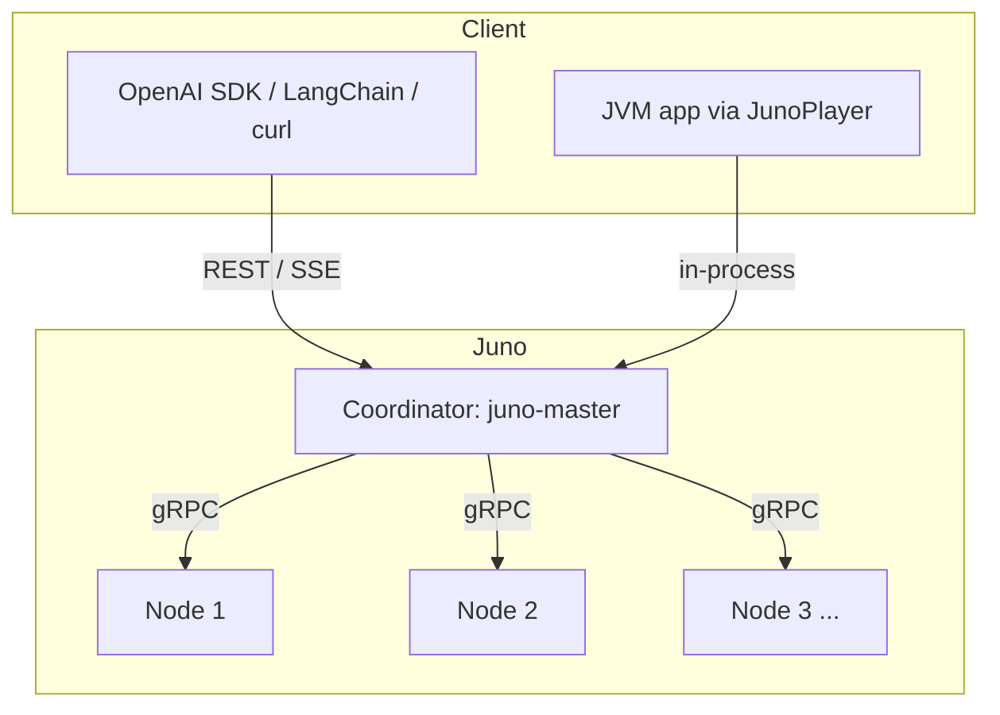

(ch-01)=
# 1. What Is Juno: Distributed Inference, GPU Acceleration, LoRA, and REST in One Engine

Juno (**Java Unified Neural Orchestration**) is a distributed LLM inference and fine-tuning
engine written entirely in Java. There is no Python subprocess, no GIL, and no Spring Boot
anywhere in the stack: the JVM reads a GGUF model file directly and runs the full transformer
forward pass end to end.

Four capabilities define the project, and the rest of this book is organized around them:

## Distributed inference

Juno splits transformer work across JVM processes connected by gRPC, using one of two
strategies:

- **Pipeline parallel** — contiguous layer blocks are assigned to nodes; activations flow
  serially, `node-1 -> node-2 -> node-3`.
- **Tensor parallel** — every node holds full depth but only a horizontal slice of the weight
  matrices (attention heads and a proportional FFN width); the coordinator broadcasts tokens to
  all nodes and reduces partial logits via a star AllReduce.

The coordinator (**juno-master**) and workers (**juno-node**) are shaded JVM jars with zero
sidecar processes. See [Chapter 2](#ch-02) for the full architecture, including the REST layer
and handler routing.

## GPU acceleration

Two vendor backends are supported through Panama FFI (`java.lang.foreign`), not through
JavaCPP/bytedeco:

- **NVIDIA CUDA 12.x / cuBLAS**
- **AMD ROCm 6+ / rocBLAS**

Backend selection is automatic at startup — CUDA first, then ROCm, then CPU — and can be
overridden with `-Djuno.gpu.backend=cuda|rocm|auto`. Weights are device-resident in FP16 with
automatic CPU-quantized fallback if VRAM allocation fails.

## LoRA fine-tuning

Juno trains low-rank adapters in-process on a **quantized GGUF base** — this is LoRA on a
quantized base, not QLoRA (no NF4, no double quantization, no paged optimizer). The training
REPL (`./juno lora`) supports AdamW with warmup/cosine schedules, LoRA+, deterministic train-only
dropout, and held-out validation. Trained adapters can be applied read-only at inference
(`--lora-play`) or baked into a new standalone GGUF (`./juno merge`). Part II covers this in
full, starting with [Chapter 8](#ch-08).

## OpenAI-compatible REST

Any client that speaks the OpenAI Chat Completions wire format works against Juno with only a
`base_url` change:

| Endpoint | Description |
|----------|-------------|
| `POST /v1/chat/completions` | Blocking or SSE streaming completion |
| `GET /v1/models` | List loaded models |
| `GET /v1/models/{model}` | Single model metadata |

Juno adds three namespaced extensions — `x_juno_priority`, `x_juno_session_id`,
`x_juno_top_k` — that never collide with OpenAI's own fields. [Chapter 5](#ch-05) has the full
request/response contract.

## JVM integration

For teams that want to embed Juno rather than run it as a service, a Maven BOM
(`cab.ml:juno-bom`) aligns versions across all `cab.ml` artifacts, and a facade API
(`JunoPlayer`, `LoraTrainer`, `JunoHttpClient`) gives programmatic access to chat, streaming,
embeddings, and LoRA training from ordinary JVM code. See [Chapter 6](#ch-06).

## Observability

Every hot path — matmul, forward pass, token generation, LoRA training — emits custom JFR
(Java Flight Recorder) events, so the whole stack is observable in JDK Mission Control without
an agent or bytecode manipulation. A health dashboard reports per-node CPU load, coordinator
P99 latency, and node throughput. Performance methodology and how to reproduce the published
test matrix are in [Chapter 18](#ch-18).

## How the modules fit together

| Module | Role |
|--------|------|
| `juno-bom` | Maven BOM — aligned versions for all `cab.ml` artifacts |
| `api` | OpenAPI spec, protobuf/gRPC contracts |
| `registry` | Shard planning, model registry |
| `coordinator` | Scheduler, generation loop, REST |
| `node` | Transformer handlers, GGUF, GPU matmul (CUDA + ROCm via Panama FFI) |
| `lora` | Adapter tensors, optimizer |
| `tokenizer`, `sampler`, `kvcache`, `health`, `metrics` | Shared infrastructure |
| `juno-player` | CLI REPL and cluster harness |
| `juno-node`, `juno-master` | Shaded deploy jars |

## Requirements and supported models

JDK 25+ and Maven 3.9+ to build. GPU acceleration is optional: NVIDIA needs CUDA 12.x and a
current driver, AMD needs ROCm 6+ (Linux only); CPU-only inference requires neither. On
Windows, `juno.bat` at the project root delegates to `scripts\run.bat` and every flag and
environment override documented in this book applies equally.

Juno reads GGUF files with LLaMA-compatible architectures, across quantizations F32, F16, BF16,
Q8_0, Q4_0, Q2_K, Q3_K, Q4_K, Q5_K, and Q6_K. Chat templates: `llama3`, `mistral`, `gemma`,
`tinyllama`/`zephyr`, `chatml`, `phi3`. **Phi-3 / Phi-3.5** is fully supported via a dedicated
handler and template. **Gemma**, **Qwen2**, **Qwen3**, and **Qwen3.5** are under active
development — see [Chapter 16](#ch-16) for the full status matrix and roadmap.

---

[Table of Contents](../index.md) &nbsp;|&nbsp; [Chapter 2: Architecture Reference: Pipeline and Tensor Parallelism, REST Layer, Handler Routing →](#ch-02)
