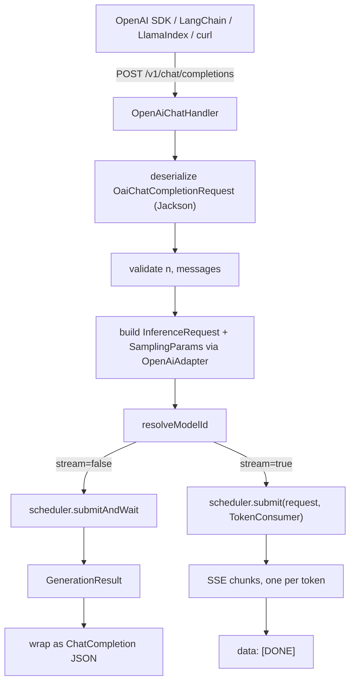

(ch-02)=
# 2. Architecture Reference: Pipeline and Tensor Parallelism, REST Layer, Handler Routing

This chapter is the internal architecture reference for Juno. For usage instructions see
[Chapter 3](#ch-03) and [Chapter 4](#ch-04); for LoRA internals see [Chapter 8](#ch-08).

## Distribution strategies

Two strategies are available, selected with `--pType` at startup.

### Pipeline parallel (`--pType pipeline`, default)

Transformer layers are split into contiguous blocks and assigned to nodes. The activation
tensor flows serially: `node-1 -> node-2 -> node-3`. Each node holds a contiguous depth slice.
Adding nodes increases total VRAM, enabling larger models. Cost: N-1 sequential gRPC hops per
decode step.

```
[Client]  REST (Javalin) / gRPC streaming
    |
[Coordinator]
    |-- GgufTokenizer       (BPE from GGUF metadata)
    |-- ChatTemplateFormatter
    |-- RequestScheduler    (virtual threads, CompletableFuture)
    |-- Sampler             (temperature / top-k / top-p / rep. penalty)
    |-- KVCacheManager      (GPU tier + CPU tier + PrefixCache trie)
    +-- GenerationLoop      (prefill + decode + session KV reuse)
              |
              | gRPC activations (FLOAT16 / INT8 / FLOAT32, BE or LE wire order)
              | serial: node-1 -> node-2 -> node-3
              |
    +--------------------------------------------+
    |  Node 1       Node 2       Node 3  ...      |
    |  L 0-7        L 8-14       L 15-21          |
    |  + embed                   + output proj    |
    |  NodeKVCacheAdapter wired into each handler  |
    |  LoraAdapterSet (optional, read-only)        |
    +--------------------------------------------+
```

### Tensor parallel (`--pType tensor`)

Every node holds all transformer layers but only a horizontal slice of the weight matrices:
attention heads `[headStart, headEnd)` and a proportional FFN width slice. The coordinator
broadcasts the input token embedding to all nodes simultaneously, collects partial logit
vectors, and reduces them via element-wise sum (star AllReduce). Adding nodes increases
throughput and reduces per-node memory pressure. Cost: one broadcast plus N parallel gRPC calls
per decode step. Constraint: `numHeads % nodeCount == 0`.

```
[Coordinator]
    +-- GenerationLoop
              |
              | broadcast same tokens to all nodes (parallel)
              |
    +--------------------------------------------+
    |  Node 1       Node 2       Node 3  ...      |
    |  L 0-21       L 0-21       L 0-21           |
    |  heads 0-10   heads 11-21  heads 22-32      |
    |  rank=0       rank=1       rank=2            |
    +--------------------------------------------+
              |
              | partial logits from each node (parallel)
              |
    [AllReduce: element-wise sum -> full logit vector]
              |
    [Sampler]
```

Star AllReduce requires no InfiniBand and no inter-node communication beyond the coordinator;
the coordinator collects and sums in O(N x vocabSize).

## REST API layer

`InferenceApiServer` (Javalin) is the single HTTP entry point on the coordinator. It exposes
two API surfaces that share the same underlying `RequestScheduler` and `GenerationLoop`.

**Juno native API**

| Method | Path | Handler |
|--------|------|---------|
| `POST` | `/v1/inference` | `handleBlockingInference` — blocking, returns `GenerationResult` |
| `POST` | `/v1/inference/stream` | `handleStreamingInference` — SSE, one event per token |
| `GET` | `/v1/models` | `OpenAiChatHandler.handleListModels` |
| `GET` | `/v1/models/{modelId}` | `OpenAiChatHandler.handleGetModel` |
| `DELETE` | `/v1/models/{modelId}` | `handleUnloadModel` |
| `GET` | `/v1/cluster/health` | `handleClusterHealth` — per-node health rollup |

**Health and console**

| Method | Path | Handler |
|--------|------|---------|
| `GET` | `/` | `handleConsole` — embedded coordinator web console |
| `GET` | `/health-ui` | `handleHealthDashboard` — node health dashboard HTML |
| `POST` | `/health/probe` | `handleHealthProbeProxy` — proxies probe to `HealthReporter` |
| `GET` | `/health-data` | `handleHealthDataProxy` — proxies health JSON from nodes |

**OpenAI-compatible API** (full contract in [Chapter 5](#ch-05))

| Method | Path | Handler |
|--------|------|---------|
| `POST` | `/v1/chat/completions` | `OpenAiChatHandler.handleChatCompletion` |
| `GET` | `/v1/models` | `OpenAiChatHandler.handleListModels` |
| `GET` | `/v1/models/{model}` | `OpenAiChatHandler.handleGetModel` |



`OpenAiAdapter` is a pure static utility class with no state: it maps OpenAI's
`frequency_penalty` (−2..2) to Juno's `repetitionPenalty` (≥1) via `1 + max(0, fp/2)`,
validates that `n == 1`, converts `StopReason` to an OpenAI finish reason, and formats
completion IDs as `chatcmpl-` plus a UUID without hyphens. No changes to `GenerationLoop`, the
scheduler, the sampler, the tokenizer, or any node code are required by the OpenAI layer — it is
a pure translation shim above the scheduler.

## Handler routing

`ForwardPassHandlerLoader` reads `general.architecture` from GGUF metadata and dispatches to an
architecture-specific handler:

```
ForwardPassHandlerLoader
    phi3      -> Phi3TransformerHandler   (fused QKV/gate-up, NeoX RoPE — supported)
    qwen3     -> Qwen3TransformerHandler  (Q/K norms, dense SwiGLU — under development)
    qwen3moe  -> Qwen3MoeTransformerHandler (Q/K norms, MoE FFN, YaRN RoPE — under development)
    *         -> LlamaTransformerHandler  (separate tensors, quantized weights;
                                            llama, mistral, tinyllama supported;
                                            gemma, qwen2 under development)

LoRA overlay (optional):
    load(..., LoraAdapterSet)  <- wraps base handler in LoraTrainableHandler
                                  adapters applied read-only during inference
                                  base GGUF is never modified

MatVec (injected into handler):
    CpuMatVec    <- parallel IntStream
    CudaMatVec   <- cublasSgemv_v2 (FP32 host) / resident FP32 or FP16:
                    implements GpuMatVec; Llama + Phi-3 GPU use DeviceHalfMatrix +
                    cublasHSSgemvStridedBatched; per-thread CUDA stream + async H2D/D2H;
                    GpuContext.shared(dev); weights uploaded once at load time;
                    releaseGpuResources() frees VRAM on unload.
    RocmMatVec   <- rocblas_sgemv (FP32 host) / resident FP32 or FP16:
                    implements GpuMatVec; same three compute paths as CudaMatVec;
                    backed by RocmBindings (libamdhip64.so + librocblas.so).
                    opTranspose=112 (rocblas_operation_transpose vs cuBLAS 1).
    GpuBindings  <- vendor-neutral interface; both CudaBindings and RocmBindings implement it.
    GpuMatVec    <- sealed interface (permits CudaMatVec, RocmMatVec); exposes upload/uploadHalf
                    so transformer handlers route GPU weight upload on any GPU vendor.
                    All CUDA/HIP symbols accessed via GpuBindings (Panama FFI).

KV cache wiring (per node, after loadShard()):
    NodeKVCacheAdapter  <- serializes float[][] K/V into KVBlock,
                           flushes write-through to KVCacheManager (GPU + CPU tiers),
                           restores on local cache miss,
                           propagates evict() to both stores
```

Backend selection is automatic via `selectBindings()` in `GpuContext`: CUDA first, then ROCm,
then CPU. Override with `-Djuno.gpu.backend=cuda|rocm|auto`. `selectBackend()` in
`ForwardPassHandlerLoader` reads `JUNO_USE_GPU` and `-Djuno.cuda.device` (defaults to `0`).

## Key design decisions

**No Python, no subprocess.** The JVM reads GGUF binary directly via `GgufReader` and runs the
full transformer forward pass end to end.

**Panama FFI instead of JavaCPP/bytedeco.** `GpuBindings` is a vendor-neutral interface resolved
at class-init via `java.lang.foreign.Linker` and `SymbolLookup`. The resulting `MethodHandle`
instances are thread-safe and carry zero per-call Java overhead — the JIT eliminates argument
boxing for typed `invokeExact` call sites. The only runtime requirement is
`--enable-native-access=ALL-UNNAMED` on the JVM command line, injected automatically by
`node/pom.xml` surefire config and by all launcher scripts.

**No Spring Boot.** Javalin for REST. Virtual threads
(`Executors.newVirtualThreadPerTaskExecutor()`) on the gRPC `ServerBuilder` are required to
avoid OS-thread saturation under concurrent prefill sessions.

**OpenAI wire compatibility without framework coupling.** `OpenAiChatHandler` and `OpenAiAdapter`
are new classes added to the coordinator module; no existing classes were modified beyond
`InferenceApiServer` wiring and CLI flag parsing. Adding new classes rather than extending
`InferenceApiServer` keeps each concern isolated and the existing server stable.

**Lazy dequantization on CPU; eager upload on GPU.** On the CPU path, dequantization runs one
256-element block at a time inside the matmul loop (peak live float footprint ~1 kB instead of
~65 MB). On the GPU path, Llama and Phi-3 dequantize once on load and upload to
`DeviceHalfMatrix` (FP16 on device) via `GpuMatVec.uploadHalf()`. If `cudaMalloc` or `hipMalloc`
fails, both handlers close partial GPU buffers and fall back to CPU quantized matmul for those
projections.

**Explicit GPU weight lifecycle.** `ForwardPassHandler.releaseGpuResources()` closes all
`DeviceHalfMatrix` / `DeviceFloatMatrix` buffers. `EmbeddedNodeServer` calls it on shard unload,
reload, and handler swap so VRAM is freed without waiting for GC.

**Configurable activation byte order.** `ActivationCodec` reads `juno.byteOrder` once at
class-load time and branches to `ActivationBECodec` (big-endian, default) or `ActivationLECodec`
(little-endian, native x86 order). `ClusterHarness` injects `-Djuno.byteOrder` into every forked
node process; the AWS deploy script writes it into `/etc/juno/node.env` for systemd-managed
nodes.

**KV cache wired at the node level.** `NodeKVCacheAdapter` connects `LlamaTransformerHandler` and
`Phi3TransformerHandler` to `KVCacheManager` (GPU byte-budget LRU plus a Caffeine W-TinyLFU CPU
tier). Every forward pass flushes K/V data write-through into both tiers; on local cache miss,
the next forward pass at that position restores transparently.

**LoRA fine-tuning without touching the base model.** `LoraTrainableHandler` wraps
`LlamaTransformerHandler` and adds trainable low-rank adapters on Q and V projections by
default; frozen weights stay quantized at all times. Adapters persist to a `.lora` binary
checkpoint. Details in [Chapter 8](#ch-08).

**Native LoRA merge.** `LoraMerge` writes a new GGUF where the LoRA-patched projection tensors
are stored as F32, because the LoRA delta (~6x10^-4 per element) is smaller than Q4_K
quantization noise (~3x10^-3) — re-quantizing would erase the training. All other tensors are
copied verbatim. See [Chapter 10](#ch-10).

**GPT-2 BPE and SentencePiece BPE both supported.** `GgufTokenizer` reads
`tokenizer.ggml.model` from GGUF metadata. Value `"gpt2"` activates the GPT-2/tiktoken path
(Llama 3+); any other value uses SentencePiece (Llama 1/2, TinyLlama, Mistral). Detection is
automatic at load time.

**AWS infrastructure fully scripted.** `juno-deploy.sh` is the unified cluster lifecycle script;
hardware is auto-detected during bootstrap. See [Chapter 7](#ch-07).

**Full JFR instrumentation across every hot path.** Six custom event types —
`juno.MatVec`, `juno.ForwardPass`, `juno.TokenProduced`, `juno.Tokenizer`,
`juno.TemplateFormat`, `juno.LoraTrainStep` — make every layer observable in JDK Mission Control
without an agent. In cluster mode, the coordinator and every forked node JVM each write their
own `.jfr` file. `juno.TokenProduced` is a coordinator-side instantaneous event fired once per
token delivered to a client after sampling and EOS checks; `JfrMetricsExtractor` derives
aggregate TPS directly from the span between the first and last event timestamps and the total
count. See [Chapter 18](#ch-18) for the full metrics workflow.

**Stub mode.** `EmbeddedNodeServer` uses an internal `StubForwardPassHandler` (zero-filled
arrays) before a shard is loaded, so integration tests run without a model file or GPU and boot
in seconds.

## Module dependencies

```
juno-master (fat jar)
    +-- juno-player
    +-- coordinator
    +-- node
    |     +-- lora
    |     +-- kvcache
    |     +-- tokenizer
    |     +-- sampler
    |     +-- registry
    |     +-- api
    +-- health
    +-- metrics

juno-node (fat jar)
    +-- node
    +-- health
```

All modules share a common parent POM (`cab.ml:juno`) that manages dependency versions, compiler
settings, and plugin configuration.

---

[← Chapter 1: What Is Juno](#ch-01) &nbsp;|&nbsp; [Table of Contents](../index.md) &nbsp;|&nbsp; [Chapter 3: Commands and Flags →](#ch-03)
