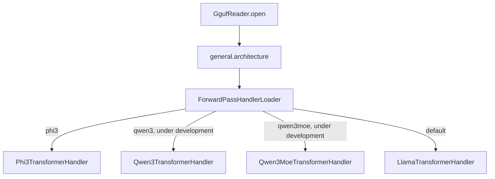
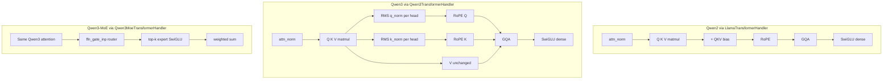
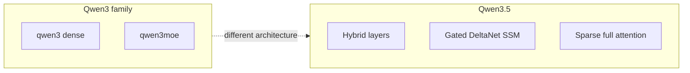

(ch-11)=
# 11. Model Support Matrix: Handlers, Status, and the Qwen/Gemma Roadmap

Juno reads `general.architecture` from GGUF metadata and dispatches to an architecture-specific
handler in `ForwardPassHandlerLoader` (introduced in [Chapter 2](#ch-02)). This chapter is the
single reference for what is supported today, what is in progress, and the design rule that
governs how new architectures get added.

## Current status

| `general.architecture` | Handler | Status |
|------------------------|---------|--------|
| `llama`, `mistral`, `tinyllama`, … | `LlamaTransformerHandler` | Supported — production baseline |
| `phi3` | `Phi3TransformerHandler` | Supported — validated local and cluster |
| `gemma` | `LlamaTransformerHandler` | Under development |
| `qwen2` | `LlamaTransformerHandler` (+ QKV bias) | Under development |
| `qwen3` | `Qwen3TransformerHandler` | Under development |
| `qwen3moe` | `Qwen3MoeTransformerHandler` | Under development |
| `qwen35` | No handler yet | Under development — hybrid DeltaNet, a distinct architecture from Qwen3 |

**Design rule.** New architectures get their own standalone `ForwardPassHandler` class (the
Phi-3 pattern), rather than accreting special cases inside `LlamaTransformerHandler`. Static math
utilities (`rmsNorm`, `matVec`, `gqa`) may be reused from `LlamaTransformerHandler`, as Phi-3
already does, but the control flow and tensor layout for a new family live in their own class.
Supporting a model family end to end always spans two layers: shared infrastructure
(`GgufTokenizer`, `ChatTemplate`, the EOS handling in `GenerationLoop`) plus the architecture
handler itself.

## Model priority

| Priority | Families | Status |
|---|---|---|
| 1 | LLaMA 3, Mistral, TinyLlama | Supported — `LlamaTransformerHandler` |
| 1b | Gemma | Under development — Llama handler + `gemma` template |
| 2 | Phi-3 / Phi-3.5 | Supported — dedicated handler |
| 3 | Qwen 2.x | Under development — tokenizer and QKV-bias groundwork in place |
| 4 | Qwen3 dense + Qwen3-MoE | Under development — dedicated handlers in progress |
| 5 | Mixtral MoE | Not started — planned reuse of the MoE FFN pattern from Qwen3-MoE |
| 6 | DeepSeek MLA (`deepseek2`) | Not started — new attention mechanism |
| 7 | Qwen3.5 (`qwen35`) | Under development — separate handler, hybrid DeltaNet + attention |
| Deprioritized | Multimodal, Mamba/SSM-only, legacy Falcon/MPT | Not planned |

## Phi-3 and Qwen2: what shipped

Phi-3 support required three coordinated changes, described in detail as a debugging narrative
in [Chapter 12](#ch-12): tokenizer handling of `add_bos_token=false` and EOG-token decoding
(`GgufTokenizer`), an explicit stop condition on `<|end|>` in `GenerationLoop`, and a dedicated
NeoX extended-RoPE implementation (`Phi3Rope`, `Phi3RopeConfig`) inside
`Phi3TransformerHandler`. Phi-3.5-mini has been manually verified in a 3-node cluster with
FLOAT16 activations and GPU acceleration, producing coherent output; TinyLlama cluster inference
continues to work unaffected.

Qwen2 support loads and applies `attn_q/k/v.bias` in `LlamaTransformerHandler` (required for
Qwen2, absent from LLaMA/Mistral/TinyLlama), reads GPT-2 BPE merge ranks and the `Ġ`/`Ċ`
whitespace-encoding convention plus the `<|im_end|>` end-of-generation token in
`GgufTokenizer`, and maps `qwen`, `qwen2`, `qwen2.5`, and `qwen3` chat inputs to ChatML template
keys in `ChatTemplate`. `GenerationLoop` also stops on `<|im_end|>`, and the CLI switches to
greedy decoding automatically when `--temperature` is at or near zero.

## Qwen3 and Qwen3-MoE: architecture differences

Qwen3 differs from Qwen2 in three ways that motivate a dedicated handler rather than extending
`LlamaTransformerHandler`: per-head RMS normalization on Q and K after the QKV projection but
before RoPE, no QKV bias (Qwen2 has bias, Qwen3 does not), and — for Qwen3-MoE — a router
(`ffn_gate_inp`) selecting a top-k set of expert SwiGLU blocks whose outputs are combined with a
weighted sum, in place of a single dense FFN.

| Feature | Qwen2 | Qwen3 dense | Qwen3-MoE |
|---------|-------|-------------|-----------|
| Handler | `LlamaTransformerHandler` | `Qwen3TransformerHandler` | `Qwen3MoeTransformerHandler` |
| QKV bias | Yes | No | No |
| Q/K norm | No | Yes | Yes |
| FFN | Dense SwiGLU | Dense SwiGLU | Router + experts |
| RoPE | Standard | Standard (YaRN where required) | Often YaRN |

Scope for the current Qwen3 work: `qwen3` dense and `qwen3moe` GGUF, local and cluster
inference, non-thinking ChatML formatting. Out of scope for this phase: the thinking-mode
template, fused `attn_qkv` tensors, LoRA for the MoE variant, Qwen3-VL, and `qwen35`.

## Qwen3.5 is a different architecture, not a Qwen3 variant

GGUF tensor inspection of Qwen3.5-0.8B shows most layers using `ssm_*` tensors, fused
`attn_qkv`, and an `attn_gate` (the Gated DeltaNet pattern), with a minority of layers using
separate Q/K/V tensors plus `attn_q_norm`/`attn_k_norm` (full attention). A `qwen35` GGUF
therefore needs its own `Qwen35TransformerHandler` with an SSM forward path; quantization format
(Q4_K_M, Q5_K_M, Q8_0) is not the blocker.

## Chat template and tokenizer matrix

| Model family | Template key | Handler | Status |
|--------------|--------------|---------|--------|
| LLaMA 3 | `llama3` | Llama | Supported |
| Mistral | `mistral` | Llama | Supported |
| TinyLlama | `tinyllama` | Llama | Supported |
| Phi-3 / Phi-3.5 | `phi3` | Phi3 | Supported |
| Gemma | `gemma` | Llama | Under development |
| Qwen2 / 2.5 | `chatml` | Llama + QKV bias | Under development |
| Qwen3 | `chatml` | Qwen3 / Qwen3Moe | Under development |
| Qwen3-MoE | `chatml` | Qwen3Moe | Under development |
| Qwen3.5 | `chatml` (partial) | None yet | Under development |

`ChatModelType.fromPath()` currently maps any `qwen*` filename to the `chatml` template key;
thinking-mode formatting is not yet implemented.

## LoRA trainability versus inference support

Inference support and LoRA trainability are tracked separately, since a model can be inference-
ready before its training math is validated. The current LoRA allowlist — described fully in
[Chapter 8](#ch-08) — accepts `llama`/`mistral`/`tinyllama`, `qwen2`/`qwen2.5`, `phi3`, and dense
`qwen3`, and explicitly rejects `qwen3moe`, `qwen35`, `gemma`, and any unrecognized architecture.

## Validation strategy

Every architecture, supported or in progress, is checked against the same five-layer strategy:

1. **Synthetic GGUF** — minimal layers, asserts the model loads and produces finite logits; runs
   in the ordinary unit test suite with no model file required.
2. **Live greedy decode versus llama.cpp** — token-ID parity on a fixed prompt, gated on a real
   model file being present.
3. **`GenerationLoop` integration** — the full coordinator path, including sampling and stop
   conditions.
4. **`ModelLiveRunnerIT`** — a real forked-JVM cluster test, gated on `-Dmodels=…` (see
   [Chapter 3](#ch-03)).
5. **Manual REPL smoke test** — `./juno --model-path …` against a live cluster.

---

[← Chapter 10: Producing Standalone Merged Models](#ch-10) &nbsp;|&nbsp; [Table of Contents](../index.md) &nbsp;|&nbsp; [Chapter 12: Case Study: Debugging Phi-3 Inference End to End →](#ch-12)
