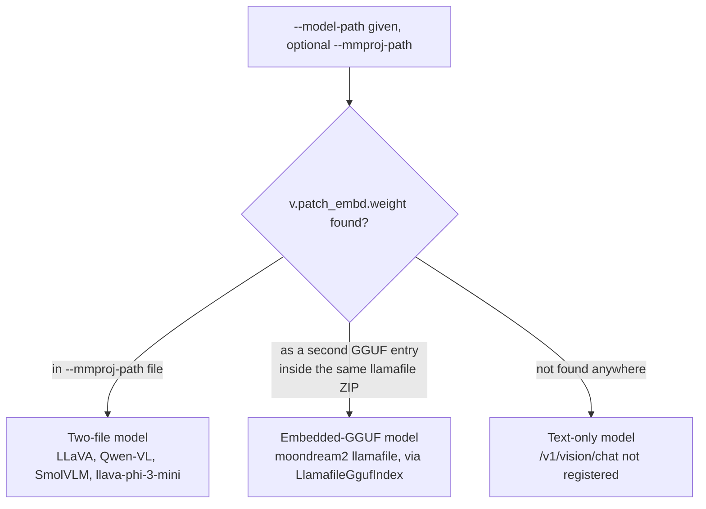

(ch-12-1)=
# 12.1. Overview

Juno supports multimodal inference, image plus text producing text, through the `vision`
module. An image-to-text (I2T) request is answered by the same JVM, the same handler
architecture, and the same `LlamaTransformerHandler`/`Phi3TransformerHandler` transformer stack
already described in [Handler Routing](#ch-2-3); a vision request differs only in how the prompt
is built before it reaches that stack.

Tested architectures:

| Family | Text backbone | Vision encoder |
|---|---|---|
| LLaVA-1.5 | LLaMA-2 (`LlamaTransformerHandler`) | CLIP ViT |
| LLaVA-1.6 | Mistral (`LlamaTransformerHandler`) | CLIP ViT |
| llava-phi-3-mini | Phi-3 (`Phi3TransformerHandler`) | CLIP ViT |
| moondream2 | Phi-2 (`Phi2TransformerHandler`) | SigLIP ViT |

## Detection is tensor-based, not metadata-based

A model is classified as a vision model by the presence of the CLIP/SigLIP patch-embedding
tensor `v.patch_embd.weight`, never by reading `general.architecture`. LLaVA-family releases
report `general.architecture=llama` (or `qwen2`, `phi3`, and so on) because that field describes
the text backbone; checking the architecture string alone can never find a vision model.
`LlavaHandlerFactory.isVisionArchitecture(Path, Path)` performs this probe.

## Two ways a vision encoder ships

Real-world GGUF releases package the CLIP/SigLIP encoder in one of two shapes, and Juno
auto-detects which one it is looking at:

- **Two-file models** (LLaVA, Qwen-VL, SmolVLM): the base LLM GGUF and the vision encoder ship as
  two separate files, conventionally `model.gguf` plus `mmproj-*.gguf`. Pass the second file with
  `--mmproj-path`; see [Chapter 12.2](#ch-12-2).
- **Embedded-GGUF models**: some llamafiles bundle both the LLM and the vision encoder as two
  GGUF entries inside one ZIP. moondream2 is the primary example: a phi-2 text model as the first
  entry, a SigLIP vision encoder as the second. `LlamafileGgufIndex` finds the second entry
  automatically; no `--mmproj-path` is needed.

## Request shape

A vision request carries one image and a chat-style message list. Internally the image is
encoded into a fixed number of patch vectors (576 for a standard 24x24-patch CLIP ViT at
336x336 input resolution), and the prompt text is built with that many `<image>`-token
placeholders standing in for the picture. Both streams, patches and text tokens, are then run
through the ordinary transformer stack together, exactly as described in
[Chapter 12.4](#ch-12-4).

## What this part covers

- [12.2](#ch-12-2) Model Requirements and Loading -- flags, the image token ID, and the known
  `--local`-only limitation.
- [12.3](#ch-12-3) REST API -- `/v1/vision/chat`, request and response shapes, model id
  resolution, error handling.
- [12.4](#ch-12-4) Architecture -- the request pipeline, module layout, and thread-safety and
  memory constraints.
- [12.5](#ch-12-5) Known Issues and Fixes -- the debugging history for both supported encoder
  families, including what is verified and what is still open.
- [12.6](#ch-12-6) Performance -- why a vision request is prefill-heavy, what batched prefill
  changed, and what is still a design plan rather than shipped code.
- [12.7](#ch-12-7) Testing -- running the vision module's test suite.

## See also

- [Chapter 2.3 -- Handler Routing](#ch-2-3)
- [Chapter 1.4 -- Supported Models](#ch-1-4)
- [Chapter 3.2 -- Flags](#ch-3-2)

---

[Table of Contents](../index.md) &nbsp;|&nbsp; [12.2 Model Requirements and Loading ->](#ch-12-2)