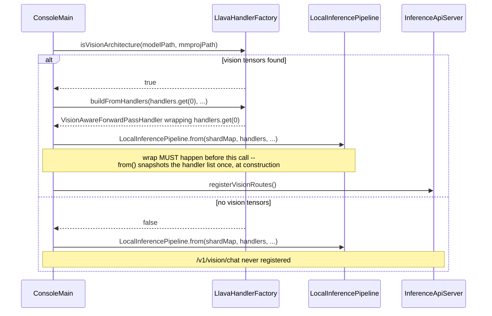

(ch-12-2)=
# 12.2. Model Requirements and Loading

## Two-file models

Most public llama.cpp-format multimodal releases ship the vision encoder in a separate GGUF
file, conventionally named `mmproj-*.gguf`. Pass it explicitly with `--mmproj-path`:

```bash
./juno local --model-path ../models/llava-v1.5-7b-Q4_K_M.gguf \
             --mmproj-path ../models/mmproj-model-f16.gguf \
             --nodes 1 --api-port 8081
```

| Model | Base file | mmproj file |
|---|---|---|
| llava-v1.5-7b | `llava-v1.5-7b-Q4_K_M.gguf` | `mmproj-model-f16.gguf` |
| llava-v1.6-mistral-7b | `llava-v1.6-mistral-7b.Q4_K_M.gguf` | `mmproj-model-f16.gguf` |
| llava-phi-3-mini | `llava-phi-3-mini-int4.gguf` | its own mmproj file |

`--mmproj-path` (environment override `MMPROJ_PATH`) is read by `ConsoleMain` and forwarded to
`VisionModelPaths`, which resolves which file to open for vision tensors: the mmproj file when
one is given, otherwise the base model file (the embedded case below). Mixing an mmproj file
from an unrelated checkpoint fails fast with an embedding-dimension mismatch when
`VisionAwareForwardPassHandler` is constructed, rather than silently producing garbage output.

## Embedded-GGUF models

Some llamafiles bundle both the LLM and the vision encoder as two separate GGUF entries inside
the same ZIP. moondream2 is the primary example: its `.llamafile` contains a phi-2 text model
(first entry) and a SigLIP vision encoder (second entry). Juno detects this automatically via
`LlamafileGgufIndex`. No `--mmproj-path` is needed, point at the llamafile directly:

```bash
./juno local --model-path ../models/moondream2-q5_k.llamafile --api-port 8081
```

At startup, expect a log line naming the discovered embedded entry and its offset, followed by
a positive `isVisionArchitecture` check. If the two lines do not appear, the file was not probed
as a vision model, and `/v1/vision/chat` will not be registered for that run.

## Image token ID

The image token ID is the vocabulary ID substituted for each patch position in the prompt. It
defaults to `32000` (LLaVA/LLaMA convention), the same default moondream2 uses. Override it for
a different convention with a system property:

```bash
-Djuno.vision.image_token_id=32044    # Phi-3 Vision
```

`LlavaHandlerFactory` resolves the value in this order: the system property first (an explicit
override always wins), then a model-specific default, then the `32000` last resort.

## Loading sequence

`ConsoleMain.prepareVisionHandler()` (`local` mode) checks
`LlavaHandlerFactory.isVisionArchitecture(modelPath, mmprojPath)` before the pipeline is built.
If it returns true, it wraps the first text handler in a `VisionAwareForwardPassHandler` via
`LlavaHandlerFactory.buildFromHandlers()`, reading only the CLIP/SigLIP encoder tensors from the
resolved vision-weights file. `ConsoleMain.registerVisionRoutes()` then registers `POST
/v1/vision/chat` and `POST /v1/vision/chat/stream` on the same `InferenceApiServer` used for
text chat, once it exists.



The ordering in that diagram is load-bearing: `LocalInferencePipeline.from()` reads
`handlers.get(i)` once, at construction, and stores that exact reference in each `NodeStage`; it
never re-reads the list afterward. Wrapping `handlers.get(0)` after `from()` has already run has
no effect on the already-built pipeline, a real regression traced and fixed via JFR thread-dump
analysis; see [Chapter 12.5](#ch-12-5) for the full trace.

No code change is needed to use a new LLaVA-family checkpoint, only a correct `--mmproj-path`
pointing at that checkpoint's own mmproj file.

## Known limitation: `--local` mode only

Only `--local` mode wires vision routes today. `runClusterRepl()` (`--cluster` mode) does not
call the vision-preparation path, so `/v1/vision/chat` is not registered when forking separate
node JVMs. Use `--local --nodes 1` for vision models. See [Chapter 3.4](#ch-3-4) for the general
cluster-vs-local tradeoffs.

## See also

- [Chapter 12.3 -- REST API](#ch-12-3)
- [Chapter 12.4 -- Architecture](#ch-12-4)
- [Chapter 3.2 -- Flags](#ch-3-2)
- [Chapter 3.3 -- Local Mode](#ch-3-3)

---

[<- 12.1 Overview](#ch-12-1) &nbsp;|&nbsp; [Table of Contents](../index.md) &nbsp;|&nbsp; [12.3 REST API ->](#ch-12-3)