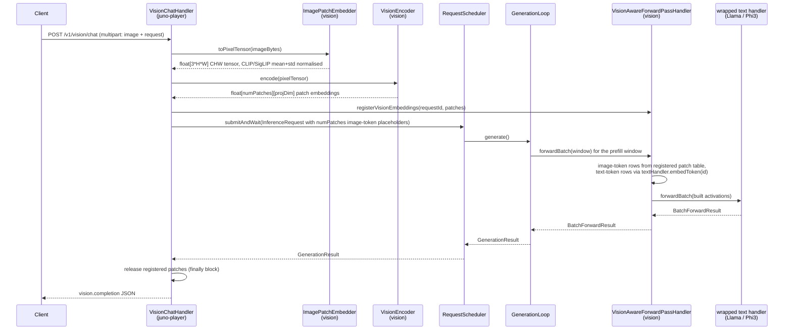

(ch-12-4)=
# 12.4. Architecture

## Request flow



`VisionAwareForwardPassHandler` is a `ForwardPassHandler` decorator: it detects the image token
ID at a given position and substitutes the corresponding patch vector for the ordinary embedding
lookup, then delegates every remaining layer to the wrapped text handler unchanged. This is the
same handler-decoration pattern `LoraTrainableHandler` uses to layer adapter weights over a base
handler; see [Chapter 2.3](#ch-2-3).

Both the batched-prefill window path (`forwardBatch`, the default since batched prefill shipped,
see [Chapter 12.6](#ch-12-6)) and the single-token path (`forward`) are implemented: image-token
positions splice in the registered patch vector, and text-token positions call
`textHandler.embedToken(tokenId)` for the real embedding-table row rather than a zero vector.
Leaving text positions at zero was a real, shipped-then-fixed bug; see
[Chapter 12.5](#ch-12-5).

## Module layout

```
vision/
  src/main/java/cab/ml/juno/vision/
    VisionConfig.java                   GGUF metadata -> encoder shape, image mean/std, GELU variant
    VisionModelPaths.java               resolves base-model vs mmproj file for vision tensors
    ImagePatchEmbedder.java             raw bytes -> float[3*H*W] CHW tensor, EXIF-corrected
    VisionEncoder.java                  CLIP/SigLIP ViT forward pass (pure Java)
    VisionAwareForwardPassHandler.java  ForwardPassHandler decorator
    LlavaHandlerFactory.java            detection + wiring: isVisionArchitecture, buildFromHandlers
    StubForwardPassHandler.java         deterministic fake handler shared by vision tests
  src/test/java/cab/ml/juno/vision/
    VisionConfigTest.java
    VisionConfigNormalizationTest.java
    VisionModelPathsTest.java
    ImagePatchEmbedderTest.java
    VisionEncoderTest.java
    VisionAwareForwardPassHandlerTest.java
    VisionAwareForwardPassHandlerBatchTest.java
    LlavaHandlerFactoryEmbeddedVisionTest.java

juno-player/
  src/main/java/cab/ml/juno/player/
    VisionChatHandler.java              Javalin route handler for /v1/vision/chat(/stream)
```

`VisionChatHandler` lives in `juno-player`, not `vision`, since it is the HTTP-facing glue that
depends on `InferenceApiServer`/`RequestScheduler` (`coordinator` module) as well as the vision
module's encoder classes; the `vision` module itself has no HTTP or scheduler dependency.

## Key constraints

- **No new dependencies.** Image decoding uses `javax.imageio` (JDK built-in).
- **No GGUF write.** The vision module is read-only with respect to the model file.
- **Thread-safe.** `VisionEncoder` weights are immutable after load; `VisionAwareForwardPassHandler`
  uses a `ConcurrentHashMap` keyed by request id, so concurrent requests never share patch state.
- **Memory.** Patch embeddings are released immediately after `scheduler.submitAndWait()`
  returns, via the `finally` block in `VisionChatHandler`.

## Encoder differences the pipeline must accommodate

CLIP and SigLIP encoders are close enough in shape (both are ViT-style transformer stacks with a
patch-embedding tensor and a linear or 2-layer projector) that one `VisionEncoder` class handles
both, but three points genuinely differ per file and are resolved from the file's own tensors
and metadata rather than assumed, per the debugging history in [Chapter 12.5](#ch-12-5):

- **Pixel normalization.** CLIP defaults to OpenAI's `mean=[0.4815,0.4578,0.4082]`,
  `std=[0.2686,0.2613,0.2758]`; SigLIP defaults to `mean=std=[0.5,0.5,0.5]`. `VisionConfig`
  prefers the GGUF's own `clip.vision.image_mean` / `clip.vision.image_std` metadata when
  present, else falls back by encoder family, detected via CLS-token presence
  (`v.class_embd` present -> CLIP defaults, absent -> SigLIP defaults).
- **Post-encoder LayerNorm.** CLIP's `post_layernorm` applies only to the pooled CLS output,
  which LLaVA-style callers never touch for per-patch features, so CLIP mmproj files legitimately
  omit an equivalent step here. SigLIP applies `post_layernorm` to every patch in the full
  sequence before any downstream use. `VisionEncoder` loads `v.post_ln.weight`/`v.post_ln.bias`
  as a genuinely optional pair, absent means the step is skipped entirely, not run with an
  identity weight, since CLIP files must see zero behavior change.
- **GELU variant.** `clip.use_gelu` (llama.cpp's own flag) distinguishes standard (tanh-approx)
  GELU from `quick_gelu` (`x * sigmoid(1.702x)`, OpenAI CLIP's original activation).
  `VisionConfig.useGelu` reads this per file, defaulting to `true` for files that omit the key.

## See also

- [Chapter 2.3 -- Handler Routing](#ch-2-3)
- [Chapter 2.6 -- Module Map](#ch-2-6)
- [Chapter 12.2 -- Model Requirements and Loading](#ch-12-2)
- [Chapter 12.5 -- Known Issues and Fixes](#ch-12-5)

---

[<- 12.3 REST API](#ch-12-3) &nbsp;|&nbsp; [Table of Contents](../index.md) &nbsp;|&nbsp; [12.5 Known Issues and Fixes ->](#ch-12-5)