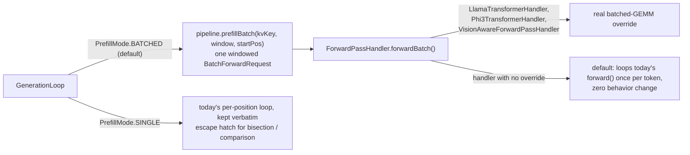

(ch-12-6)=
# 12.6. Performance

## Why vision requests are prefill-heavy

A vision request pushes 576 or more CLIP/SigLIP patch tokens through the transformer before any
text token is generated, on top of whatever the chat template and question add. Prefilling that
many tokens one position at a time, the original implementation, meant paying a full
32-layer forward pass per token, dominated by the same ~7 weight matrices per layer read from
memory once per token instead of once per prompt. Long text-only prompts hit the identical wall;
vision requests were simply the workload that made it visible first, since 576+ tokens of
guaranteed prefill is far larger than a typical chat prompt.

## Batched prefill (shipped)

The sequential per-position prefill loop was replaced with genuine batched matrix-matrix (GEMM)
execution across all new prompt tokens for a request, gated behind `--prefill single|batched`,
defaulting to `batched`. `PrefillMode` lives in the `coordinator` module alongside
`GenerationLoop`, which is the only class that reads it.



`VisionAwareForwardPassHandler.forwardBatch()` is the direct fix for the original multi-minute
vision-request stall: it builds the full window's activation matrix, image-token rows from the
registered patch table, text-token rows via `embedToken()`, in one pass, then hands the whole
window to the wrapped text handler's `forwardBatch()` rather than looping one forward pass per
patch token. See [Chapter 12.4](#ch-12-4) for the surrounding request pipeline.

`--prefill single` remains available as a byte-for-byte fallback to the pre-batching behavior,
useful for bisecting a regression or comparing against an older baseline, without a rebuild. See
[Chapter 3.2](#ch-3-2) for the flag's full CLI reference entry.

### Where the speedup actually shows up

Batched prefill's benefit depends on the compute path, not just on the flag being set:

| Path | Effect of `--prefill batched` |
|---|---|
| GPU (CUDA / ROCm) | Large: many sequential kernel launches collapse into a single batched BLAS GEMM call |
| CPU, float32 weights | Real: `CpuMatVec.sgemm`'s weight-stationary blocking loads each weight row once and reuses it across the whole batch |
| CPU, quantized weights (Q4_K_M, the default for the example models in [Chapter 1.4](#ch-1-4)) | No compute saved: the quantized dot-product path still loops the batch sequentially per weight row, since applying weight-stationary blocking to quantized bytes would require dequantizing the full matrix first, which costs more than it saves |

A measured run against `tinyllama-1.1b-chat-v1.0-q4_k_m.gguf` (CPU, Q4_K_M, single prompt) found
`--prefill batched` and `--prefill single` statistically identical in end-to-end throughput,
4.71 TPS vs 4.74 TPS, confirming the table above: on this quantized-CPU configuration, batched
prefill removes the `Arrays.copyOfRange` O(N-squared) copy pattern and reduces allocation
pressure, but the dominant per-token weight-matrix read is unchanged, since it is still a
sequential loop over the batch for quantized weights specifically. This is expected, not a
regression, and is the reason the following section exists.

An earlier version of the batched path also introduced a real, since-fixed regression: the first
`transformerLayerBatch` implementation allocated a large temporary `float[][]` burst per prefill
call (on the order of 150 MB across all layers for a mid-sized prompt), released all at once,
which caused GC pauses inflating decode-tail latency even though total matmul time was unchanged.
The fix was a single reusable `BatchWorkspace` allocated once per `runLayersBatch` call, with
zero-allocation `Into`-suffixed variants of the hot inner loops writing into it, dropping
per-prefill allocation from roughly 150 MB to roughly 5 MB.

## Vector API / SIMD adoption (design plan, not implemented)

A companion design document proposes replacing the scalar inner-loop dot products in the CPU
matmul paths, `matVec` (F32), all seven quantized raw-bytes paths (Q2_K through Q8_0, F16), and
the attention score/weighted-sum loops in `gqa()`, with `jdk.incubator.vector` SIMD lane
operations, behind a proposed `--cpuLoops scalar|vector` flag defaulting to `vector`. This is the
change that would give the quantized-weights CPU path in the table above a real speedup, since it
targets the arithmetic inside each row's dot product rather than how many times a row is
streamed from memory.

**As of this writing, this plan exists only as a design document.** No `VectorMatVecOps`,
`VectorSupport`, `CpuLoopMode`, or `--cpuLoops` flag exists anywhere in the source tree. It is
listed here because it is the intended next step for closing the CPU-quantized gap identified
above, not because it is available to use today. Do not reference `--cpuLoops` in user-facing
material or assume its presence when reasoning about current CPU throughput.

## Measuring a vision request

Use the standard JFR workflow ([Chapter 7.1](#ch-7-1)) with `--jfr`:

```bash
./juno local --model-path ../models/llava-v1.5-7b-Q4_K_M.gguf \
             --mmproj-path ../models/mmproj-model-f16.gguf \
             --nodes 1 --api-port 8081 --jfr 10m
```

`juno.ForwardPass.prefill.count` and `juno.ForwardPass.prefill.p95_ms` isolate prefill cost from
decode cost in the resulting metrics; a healthy batched run shows `prefill.count` near zero,
since a single windowed call replaces what used to be one `ForwardPass` event per prefilled
token, while `juno.MatVec.count` and `juno.MatVec.duration.total_ms` show whether the underlying
matmul work itself changed. See [Chapter 12.5](#ch-12-5) for how this same JFR technique was used
to trace vision-specific hangs, as distinct from the throughput measurement here.

## See also

- [Chapter 7.1 -- JFR and Metrics](#ch-7-1)
- [Chapter 7.2 -- Performance Methodology](#ch-7-2)
- [Chapter 2.4 -- GPU Acceleration](#ch-2-4)
- [Chapter 3.2 -- Flags](#ch-3-2)

---

[<- 12.5 Known Issues and Fixes](#ch-12-5) &nbsp;|&nbsp; [Table of Contents](../index.md) &nbsp;|&nbsp; [12.7 Testing ->](#ch-12-7)