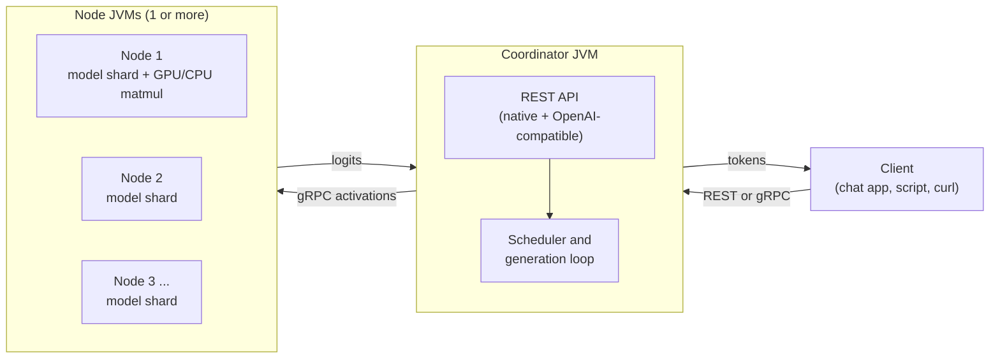

(ch-2-1)=
# 2.1. Overview

**Java Unified Neural Orchestration.** Juno is distributed LLM inference and fine-tuning
written entirely in Java. The JVM reads GGUF binary directly and runs the full transformer
forward pass end to end, with no subprocess and no separate inference runtime.

This section is the technical reference for how Juno is built. For task-oriented guides, see the
[CLI reference](#ch-3-1), [REST API](#ch-5-1),
and [LoRA fine-tuning](#ch-4-1) sections instead.

## The big picture

A single GGUF model file is split across one or more node JVMs, either by depth (pipeline
parallel) or by width (tensor parallel); see [Distributed inference](#ch-2-2) for both
strategies. The coordinator JVM never runs model math itself: it tokenizes, schedules, samples,
and streams tokens back to the client.

## What is in this section

- [Distributed inference](#ch-2-2): the two parallelism strategies
  (pipeline and tensor) and how activations flow between nodes over gRPC.
- [Handler routing](#ch-2-3): how `ForwardPassHandlerLoader` dispatches to the
  correct transformer implementation based on GGUF metadata, and the current architecture
  support matrix.
- [GPU acceleration](#ch-2-4): the CUDA and ROCm backends, Panama FFI bindings, and
  backend selection.
- [Key design decisions](#ch-2-5): the non-GPU architectural choices behind the
  REST layer, KV cache wiring, tokenizer support, AWS scripting, and JFR instrumentation.
- [Module map](#ch-2-6): the Maven module layout and dependency graph.

## See also

- [Chapter 2.6 -- Module Map](#ch-2-6)
- [Chapter 2.2 -- Distributed Inference](#ch-2-2)
- [Chapter 1.1 -- Requirements](#ch-1-1)

---

[<- 1.4 Supported Models](#ch-1-4) &nbsp;|&nbsp; [Table of Contents](../index.md) &nbsp;|&nbsp; [2.2 Distributed Inference ->](#ch-2-2)
