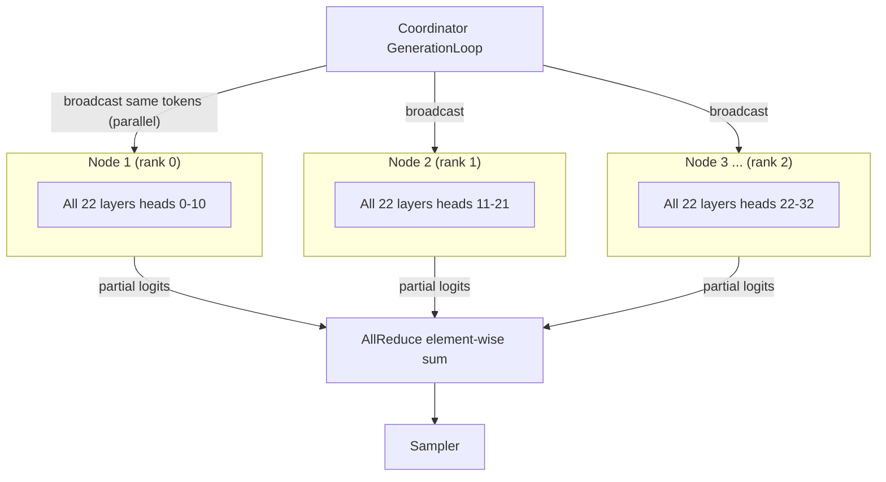

(ch-2-2)=
# 2.2. Distributed Inference

Juno splits transformer inference across JVM processes connected by gRPC. Two distribution
strategies are available, selected with `--pType` at startup. This page is the authoritative
description; the feature overview and README link back here instead of repeating it.

### Pipeline parallel (`--pType pipeline`, default)

Transformer layers are split into contiguous blocks and assigned to nodes. The activation
tensor flows serially: `node-1 -> node-2 -> node-3`. Each node holds a contiguous depth
slice. Adding nodes increases total VRAM, enabling larger models. Cost: N-1 sequential gRPC
hops per decode step.

```{mermaid}
flowchart TD
    subgraph Coordinator
        REST["REST / gRPC streaming"]
        Tok["Tokenizer, ChatTemplateFormatter, RequestScheduler"]
        Samp["Sampler (temperature / top-k / top-p)"]
        KV["KVCacheManager (GPU + CPU tiers + PrefixCache trie)"]
        GL["GenerationLoop (prefill + decode + session KV reuse)"]
        REST --> Tok
        Tok --> GL
        GL --> KV
        GL --> Samp
    end

    subgraph "Node 1 (layers 0–7)"
        H1["LlamaTransformerHandler + NodeKVCacheAdapter + embed layer + optional LoraAdapterSet"]
    end
    subgraph "Node 2 (layers 8–14)"
        H2["LlamaTransformerHandler + NodeKVCacheAdapter + optional LoraAdapterSet"]
    end
    subgraph "Node 3 (layers 15–21)"
        H3["LlamaTransformerHandler + NodeKVCacheAdapter + output projection + optional LoraAdapterSet"]
    end

    GL -->|"gRPC activations (FLOAT16 / INT8 / FLOAT32)"| H1
    H1 -->|"gRPC activations (serial)"| H2
    H2 -->|"gRPC activations (serial)"| H3
    H3 -->|"logits"| GL
```

Every node also wires a `NodeKVCacheAdapter` into its handler, and, if a LoRA adapter is
attached, a read-only `LoraAdapterSet`.

### Tensor parallel (`--pType tensor`)

Every node holds all transformer layers but only a horizontal slice of the weight matrices:
attention heads `[headStart, headEnd)` and a proportional FFN width slice. The coordinator
broadcasts the input token embedding to all nodes simultaneously, collects partial logit
vectors, and reduces them via element-wise sum (star AllReduce). Adding nodes increases
throughput and reduces per-node memory pressure. Cost: one broadcast + N parallel gRPC calls
per decode step.



Constraint: `numHeads % nodeCount == 0`.

Star AllReduce requires no InfiniBand and no inter-node communication. The coordinator
collects and sums in O(N x vocabSize).

## See also

- [Chapter 2.3 -- Handler Routing](#ch-2-3)
- [Chapter 2.4 -- GPU Acceleration](#ch-2-4)
- [Chapter 3.2 -- Flags](#ch-3-2)

---

[<- 2.1 Overview](#ch-2-1) &nbsp;|&nbsp; [Table of Contents](../index.md) &nbsp;|&nbsp; [2.3 Handler Routing ->](#ch-2-3)
