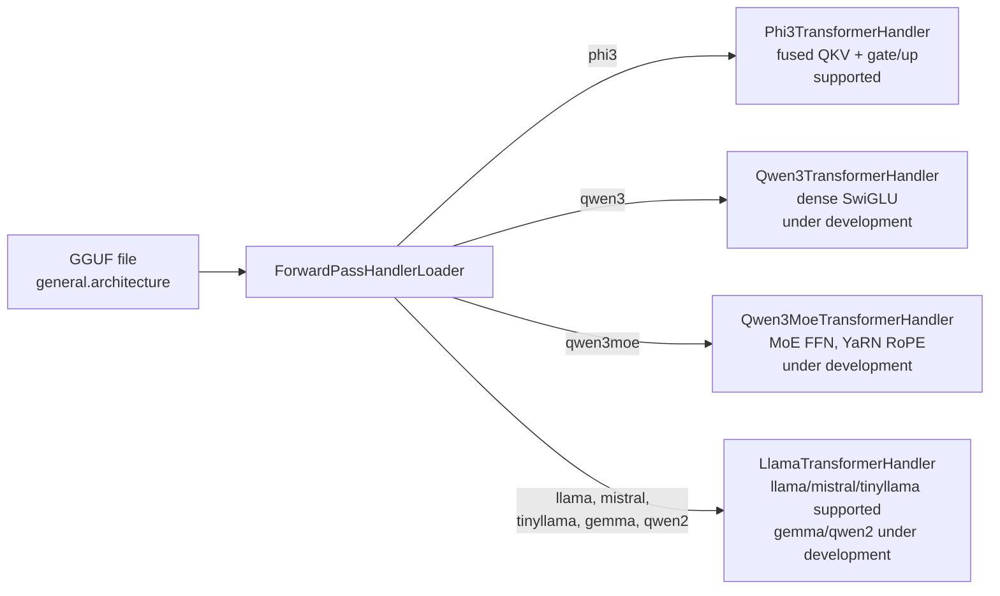
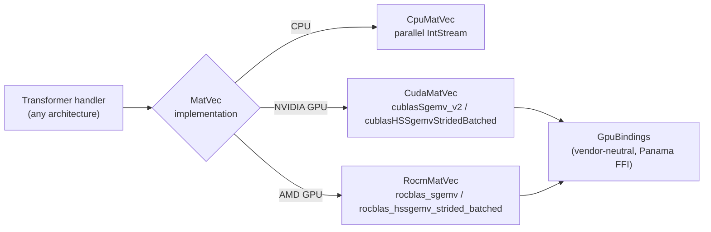
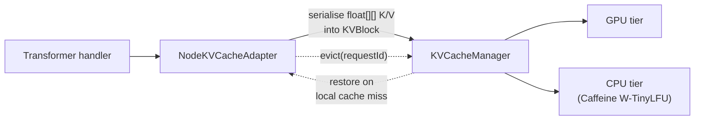

(ch-2-3)=
# 2.3. Handler Routing

`ForwardPassHandlerLoader` reads `general.architecture` from GGUF metadata and dispatches to the
matching transformer handler:

If a `.lora` adapter is attached, `load()` wraps whichever handler was selected in
`LoraTrainableHandler`. Adapters are applied read-only during inference; the base GGUF on disk
is never modified.

Each handler delegates its matrix-vector multiplication to an injected `MatVec`
implementation, chosen independently of architecture routing:

`CudaMatVec` and `RocmMatVec` both implement the sealed `GpuMatVec` interface and expose
`upload()` / `uploadHalf()` so a handler never needs to know which GPU vendor it is running
against. Weights upload once at load time; `releaseGpuResources()` frees VRAM on unload. See
[GPU acceleration](#ch-2-4) for the full backend story.

After `loadShard()`, every node also wires its handler into the KV cache:

Backend selection is automatic via `selectBindings()` in `GpuContext`: CUDA first, then ROCm,
then CPU. Override with `-Djuno.gpu.backend=cuda|rocm|auto`. `selectBackend()` in
`ForwardPassHandlerLoader` reads `JUNO_USE_GPU` and `-Djuno.cuda.device` (defaults to `0`).

## Supported vs. under-development architectures

| `general.architecture` | Handler | Status |
|---|---|---|
| `llama`, `mistral`, `tinyllama` | `LlamaTransformerHandler` | Supported |
| `phi3` | `Phi3TransformerHandler` | Supported |
| `qwen2`, `qwen2.5` | `LlamaTransformerHandler` (frozen QKV biases) | Under development |
| `gemma` | `LlamaTransformerHandler` (SentencePiece path) | Under development |
| `qwen3` | `Qwen3TransformerHandler` | Under development |
| `qwen3moe` | `Qwen3MoeTransformerHandler` | Under development |
| `qwen35` | Separate hybrid DeltaNet plan, not yet implemented | Under development |

No LoRA training or `--lora-play` inference is available for architectures marked under
development. See [Supported models](#ch-1-4) for the
user-facing summary of this table.

## See also

- [Chapter 2.2 -- Distributed Inference](#ch-2-2)
- [Chapter 2.4 -- GPU Acceleration](#ch-2-4)
- [Chapter 1.4 -- Supported Models](#ch-1-4)

---

[<- 2.2 Distributed Inference](#ch-2-2) &nbsp;|&nbsp; [Table of Contents](../index.md) &nbsp;|&nbsp; [2.4 GPU Acceleration ->](#ch-2-4)
