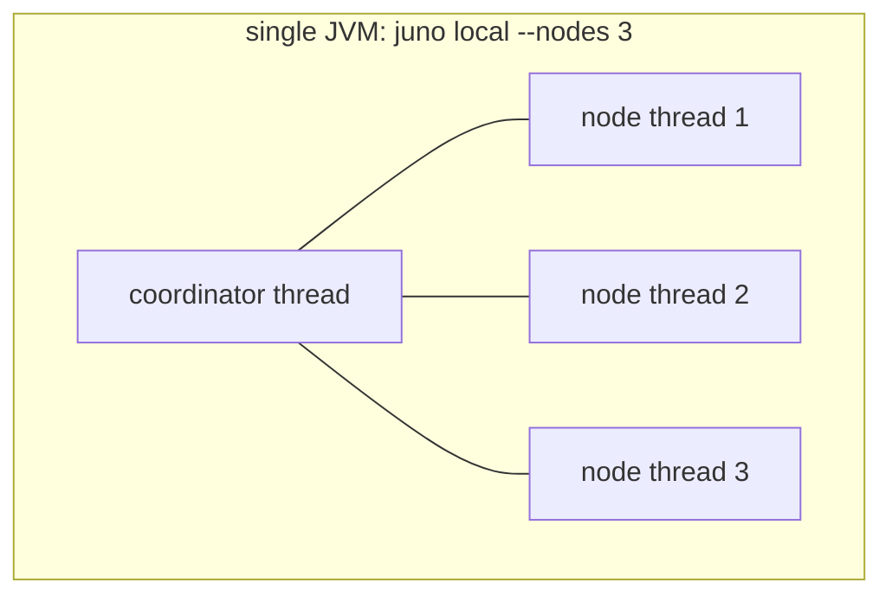
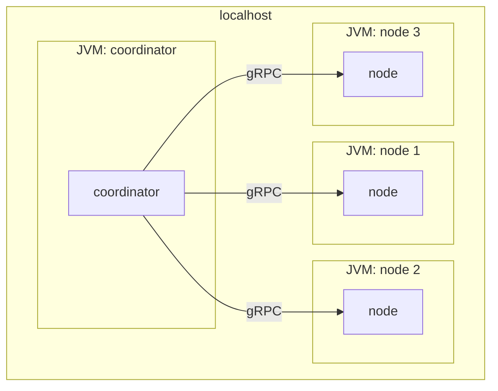
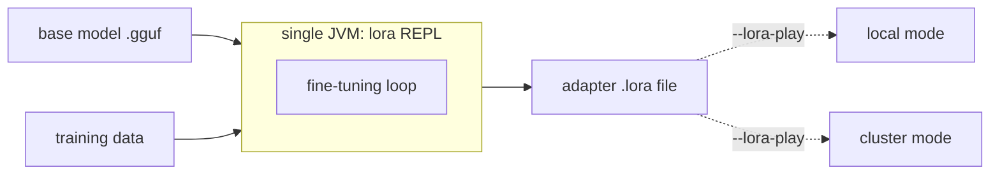
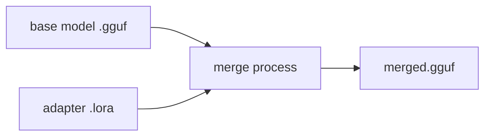

(ch-3-1)=
# 3.1. Commands

Unified stand-alone launchers sit at the project root: `./juno` on Linux/macOS,
`juno.bat` on Windows (delegates to `scripts\run.bat`). Requires JDK 25+ and pre-built jars
(`mvn clean package -DskipTests`).

> All examples in this reference use `./juno`. Replace with `juno.bat` on Windows and use
> backslashes for paths (for example `--model-path models\model.gguf`). All flags, environment
> variables, and subcommands are identical across platforms.

| Command | Description |
|---------|-------------|
| `cluster` | 3-node cluster (default command): forked JVMs, real gRPC. Default `--pType pipeline`; use `--pType tensor` for AllReduce mode |
| `local` | In-process REPL: all transformer shards in one JVM, no forking, no gRPC |
| `lora` | LoRA fine-tuning REPL: single in-process JVM, adapter persisted to a `.lora` file |
| `merge` | Bake a trained `.lora` adapter into a new standalone GGUF; no sidecar needed at inference time |
| `test` | 8 automated real-model smoke checks (6 pipeline + 2 tensor); exits 0 if all pass, 1 if any fail |

## Juno modes topology

The four modes differ in how many OS processes and threads they use and in what each
one is for. The diagrams below use `--nodes 3` as the example, matching the table above.

### local

Single JVM parallelism for the distributed nature of Juno. `juno local --nodes 3` starts
4 threads inside one JVM: 1 coordinator thread and 3 node threads.

### cluster

`cluster` is the default command. Separate JVMs run alongside one another on the same
machine, so `juno --nodes 3` (or `juno cluster --nodes 3`) starts 4 JVMs on localhost: 1
coordinator JVM and 3 node JVMs, talking over real gRPC. This is the most memory
consuming and slowest way to run Juno. For local inference, use `local` mode instead.

### lora

A separate, stand-alone mode for fine-tuning models, with its own set of options. It
runs as a single in-process JVM and persists the result to a `.lora` adapter file. The
adapter can then be applied to any Juno mode with `--lora-play`.

### merge

Bakes an adapter file back into the model: `model.gguf` plus `adapter.lora` produces
`merged.gguf`. No sidecar `.lora` file or `--lora-play` flag is needed at inference
time afterward.

## See also

- [Chapter 3.2 -- Flags](#ch-3-2)
- [Chapter 3.3 -- Local Mode](#ch-3-3)
- [Chapter 3.4 -- Cluster Mode](#ch-3-4)
- [Chapter 3.5 -- LoRA Mode](#ch-3-5)
- [Chapter 3.6 -- Merge Mode](#ch-3-6)
- [Chapter 3.7 -- Test Mode](#ch-3-7)

---

[<- 2.6 Module Map](#ch-2-6) &nbsp;|&nbsp; [Table of Contents](../index.md) &nbsp;|&nbsp; [3.2 Flags ->](#ch-3-2)