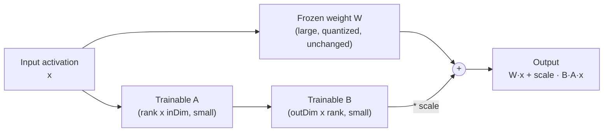

(ch-4-1)=
# 4.1. Concepts

Parameter-efficient fine-tuning for GGUF-based models, implemented entirely in Java. Training
runs on a quantized GGUF base model. This is not QLoRA: Juno does not implement NF4,
double-quantization, compute-dtype, or paged Adam. QA-LoRA is a separate grouped-adapter
algorithm described below.

Training runs inside the same JVM process as the rest of Juno, with no PEFT library and no
separate Python training step to shell out to.

## The core idea



For each frozen weight matrix **W**, LoRA inserts two small trainable matrices **A** (rank x inDim)
and **B** (outDim x rank). Instead of updating the (large) frozen weight directly, training only
ever adjusts the (small) **A** and **B** matrices; at inference time their product is added on
top of the frozen weight's normal output. Because rank is typically 4-16 while the frozen
dimensions run into the thousands, **A** and **B** together hold a tiny fraction of the
parameters that **W** does, which is what makes this fine-tuning method cheap to train and cheap
to store:

```
W_effective = W + scale * B * A
```

**Scaling modes** (set at adapter creation; authoritative in the checkpoint):

| Mode | Formula | Flag |
|------|---------|------|
| Standard (default) | `scale = alpha / rank` | `--lora-scaling standard` |
| rsLoRA | `scale = alpha / sqrt(rank)` | `--lora-scaling rslora` |

**Initialization:**

| Mode | A init | B init | Flag |
|------|--------|--------|------|
| `kaiming-uniform` (default) | `U(-1/sqrt(inDim), +1/sqrt(inDim))` matching PyTorch `kaiming_uniform_(a=sqrt(5))` | zeros | `--lora-init kaiming-uniform` |
| `legacy-normal` | `N(0, 0.01)` | zeros | `--lora-init legacy-normal` |

Use `legacy-normal` only to reproduce historical runs. Newly created adapters default to
Kaiming-uniform.

**DoRA** (`--lora-mode dora`) adds per-row magnitude rescaling on top of the LoRA delta:

```{mermaid}
flowchart LR
    Input2["Input x"]
    W2["W (frozen)"]
    A2["A (trained)"]
    B2["B (trained)"]
    Scale2["× scale"]
    Delta["LoRA delta\nscale·B·A·x"]
    Dir["direction =\nW + scale·B·A"]
    Norm["norm(direction)\nper row (detached)"]
    Mag["magnitude\n(separate AdamW group,\ndecay off)"]
    Div["magnitude / norm(direction)"]
    Out2["output =\n(mag / norm) · (W·x + delta)"]

    Input2 --> W2 --> Out2
    Input2 --> A2 --> B2 --> Scale2 --> Delta --> Out2
    Dir --> Norm --> Div
    W2 & Scale2 --> Dir
    Mag --> Div --> Out2
```

```
direction = W + scale * B * A
output    = (magnitude / norm(direction)) * (W*x + scale*B*A*x)
```

Row norms are detached from gradients (canonical PEFT-style DoRA). Magnitude is a separate
AdamW parameter group with decay off. DoRA is correctness-complete: train, save, playback,
and F32 merge are fully tested. Norm refresh is not production-perf-gated. Prefer standard
LoRA or rsLoRA for large all-linear jobs until a measured refresh budget is published.

**QA-LoRA** (`--lora-mode qa-lora`) uses sum-pooled grouped A:

```
pooled[group] = sum(input[groupStart : groupEnd])
delta         = scale * B * A * pooled
```

A is shaped `[rank x groupCount]` rather than `[rank x inDim]`. Group width is auto-detected
from the tensor GGML type: 32 for Q4_K / Q5_K, 16 for Q6_K. See the [Merging adapters](05-merging-adapters.md) section for merge
capability policies.

## Parameter efficiency at a glance

For `rank=8` on `wq` and `wv` across all 22 layers of TinyLlama-1.1B:

| | Frozen base | LoRA addition |
|---|---|---|
| Parameters | 1,100,048,000 | 720,896 |
| Memory (F32) | ~4.3 GB | 2.8 MB |
| Is trained | No | Yes |

**Default targets** are `wq` and `wv`. Use `--lora-targets all` for all seven dense linear
projections (`wq,wk,wv,wo,wgate,wup,wdown`). Targets are stored in the checkpoint and resolved
at load time.


---

## See also

- [Chapter 4.2 -- Architecture Support](#ch-4-2)
- [Chapter 4.3 -- Training Guide](#ch-4-3)
- [Chapter 9.3 -- LoRA and Merge Licensing](#ch-9-3)

---

[<- 3.8 Diagnostics and Tracing](#ch-3-8) &nbsp;|&nbsp; [Table of Contents](../index.md) &nbsp;|&nbsp; [4.2 Architecture Support ->](#ch-4-2)
