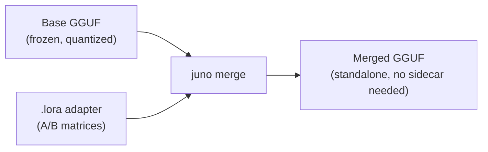

(ch-4-5)=
# 4.5. Merging Adapters



Merging bakes a trained adapter's effect directly into a copy of the base model's weights, so
the result loads and runs like any other GGUF, with no `.lora` file needed alongside it at
inference time.

```bash
# 1. Fine-tune
./juno lora --model-path /models/tinyllama.gguf
#   you > /train-qa What is your name? A: Juno
#   you > /save

# 2. Merge (produces /models/tinyllama-merged.gguf)
./juno merge --model-path /models/tinyllama.gguf

# 3. Run (no .lora file needed)
./juno local --model-path /models/tinyllama-merged.gguf
#   you > what is your name?
#   bot > Juno
```

The LoRA delta per weight element (~6x10^-4) is smaller than Q4_K quantization noise (~3x10^-3).
Re-quantizing the merged weights back to Q4_K destroys the delta entirely. `LoraMerge` stores
patched projection tensors as F32 and copies all other tensors verbatim in their original
quantized form. All-linear merges expand file size substantially. The output is a valid GGUF v3
file.

Phi-3 fused-slice merge correctly patches `attn_qkv` at Q/K/V row ranges and `ffn_up` at
gate/up row ranges without overwriting earlier slices.

**Merge policies** (`--lora-merge`):

| Policy | Behaviour |
|--------|-----------|
| `f32-preserve` (default) | Adapted tensors written as F32. Safe for all modes and architectures. |
| `source-type-projected` | Decode, add delta, re-encode with versioned `juno-kquant-v1` encoder (approximate requantization). Reports delta retention, RMSE, saturation per tensor. Use only when file size matters more than precision. |
| `sidecar-only` | Forbids bake-in merge; use overlay playback only. |

Exact QA-LoRA zero-point merge into K-quants is not supported. Use `f32-preserve` or sidecar
for production deployment.

**Programmatic API:**

```java
LoraMerge.Result r = LoraMerge.merge(
    Path.of("TinyLlama.Q4_K_M.gguf"),
    Path.of("TinyLlama.Q4_K_M.lora"),
    Path.of("TinyLlama.Q4_K_M-merged.gguf"));

System.out.println("Patched " + r.adaptersApplied() + " tensors");
// Patched 44 tensors
```

## See also

- [Chapter 3.6 -- Merge Mode](#ch-3-6)
- [Chapter 9.3 -- LoRA and Merge Licensing](#ch-9-3)
- [Chapter 4.4 -- Inference with a Trained Adapter](#ch-4-4)

---

[<- 4.4 Inference with a Trained Adapter](#ch-4-4) &nbsp;|&nbsp; [Table of Contents](../index.md) &nbsp;|&nbsp; [4.6 Programmatic API ->](#ch-4-6)
