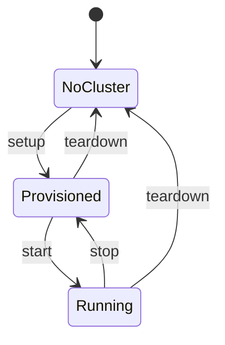
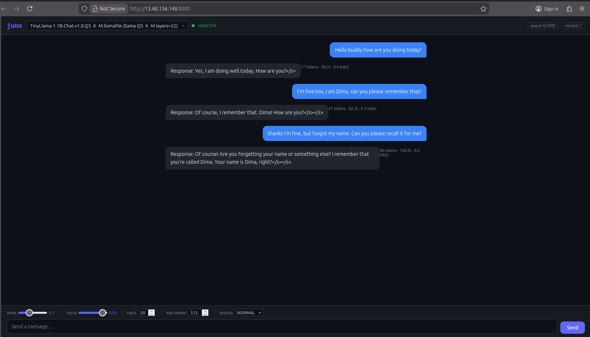

(ch-6-2)=
# 6.2. AWS Deployment

`juno-deploy.sh` is the unified cluster lifecycle script for AWS. It handles bootstrap, start,
stop, teardown, and status for a full Juno cluster on EC2.



```bash
./launcher.sh juno-deploy.sh setup      [options]
./launcher.sh juno-deploy.sh start
./launcher.sh juno-deploy.sh stop
./launcher.sh juno-deploy.sh teardown
./launcher.sh juno-deploy.sh status
./launcher.sh juno-deploy.sh scan-regions
```

## Setup options

| Option | Default | Description |
|--------|---------|-------------|
| `--instance-type TYPE` | `g4dn.xlarge` | EC2 instance type |
| `--node-count N` | `3` | Number of inference nodes |
| `--coordinator node1\|separate` | `node1` | Co-located or separate coordinator |
| `--model-url URL` | TinyLlama Q4_K_M | Model to download during bootstrap |
| `--ptype pipeline\|tensor` | `pipeline` | Parallelism type |
| `--dtype FLOAT32\|FLOAT16` | `FLOAT16` | Activation wire format |
| `--jfr DURATION` | (none) | JFR on all JVMs, for example `5m` |
| `--lora-play PATH` | (none) | Local path to a `.lora` file. Must be absolute or relative to the working directory; resolved via `realpath`. The file is copied via SCP to every node after bootstrap. |

## AWS hardware quotas

AWS accounts start with conservative default vCPU limits for On-Demand instances. GPU instance
families (`g4dn`, `g4ad`, `g5`, `p3`) consume vCPUs against these per-region quotas, not against
general-purpose ones. A default account is typically capped at 0 or 32 running GPU vCPUs, which
is not enough to provision even a single-node `g4dn.xlarge` cluster (4 vCPUs each). Without a
quota increase the `setup` command will fail with `InsufficientInstanceCapacity` or
`VcpuLimitExceeded` errors at launch time. Request the increase before running `setup`; approval
usually takes a few minutes to a few hours.

For Nvidia hardware `g4dn.xlarge`:

```
aws service-quotas request-service-quota-increase   --service-code ec2   --quota-code L-DB2E81BA   --desired-value 12   --region eu-north-1
```

For Radeon hardware `g4ad.2xlarge`:

```
aws service-quotas request-service-quota-increase   --service-code ec2   --quota-code L-1216C47A   --desired-value 60   --region eu-north-1
```

The responce is like:

```
{
    "RequestedQuota": {
        "Id": "1234567890abcdefghijklmnopqrstuvwxyz0987",
        "ServiceCode": "ec2",
        "ServiceName": "Amazon Elastic Compute Cloud (Amazon EC2)",
        "QuotaCode": "L-1216C47A",
        "QuotaName": "Running On-Demand Standard (A, C, D, H, I, M, R, T, Z) instances",
        "DesiredValue": 60.0,
        "Status": "PENDING",
        "Created": "2026-06-04T22:17:29.313000+03:00",
        "Requester": "{\"accountId\":\"123456789098\",\"callerArn\":\"arn:aws:iam::123456789098:user/ml.cab.admin\"}",
        "QuotaArn": "arn:aws:servicequotas:eu-north-1:123456789098:ec2/L-1216C47A",
        "GlobalQuota": false,
        "Unit": "None",
        "QuotaRequestedAtLevel": "ACCOUNT"
    }
}

```

To verify Nvidia Quotas later:

```
aws service-quotas list-requested-service-quota-change-history --service-code ec2 --region eu-north-1 --query "RequestedQuotas[?QuotaCode=='L-DB2E81BA'].[Status,DesiredValue,Created]" --output table
```

Or verify Radeon Quotas please do:
```
aws service-quotas list-requested-service-quota-change-history --service-code ec2 --region eu-north-1 --query "RequestedQuotas[?QuotaCode=='L-1216C47A'].[Status,DesiredValue,Created]" --output table
```

outputs:

```
-------------------------------------------------------------
|          ListRequestedServiceQuotaChangeHistory           |
+--------------+-------+------------------------------------+
|  CASE_OPENED |  12.0 |  2026-04-02T01:56:51.160000+03:00  |
+--------------+-------+------------------------------------+
```

## GPU on AWS instances

GPU drivers are pre-installed in the golden AMI by `make-ami.sh`. Node bootstrap runs `lspci` to
detect the GPU vendor and sets `JUNO_USE_GPU=true`; there is no DKMS compilation at boot.

- **NVIDIA (g4dn, g5, g6, p\*):** CUDA 12.3 + nvidia-open. Backend auto-selects CUDA.
- **AMD Radeon (g4ad):** ROCm 7.2.4 + amdgpu-dkms. The AMI sets
  `HSA_OVERRIDE_GFX_VERSION=10.1.0` in `/etc/environment` to work around the missing gfx1011
  rocBLAS kernels on the Radeon Pro V520 (upstream issue ROCm/rocm-libraries#4347); rocBLAS uses
  the gfx1010 dispatch path, which runs correctly on Navi12 silicon. Backend auto-selects ROCm
  when CUDA libraries are absent.

## LoRA deploy flow

```bash
# Train locally
./juno lora --model-path /path/to/model.gguf
you > /train-qa What is my name? A: Dima
you > /save

# Deploy to AWS with adapter
cd scripts/aws
./launcher.sh juno-deploy.sh setup \
  --instance-type m7i-flex.large \
  --model-url https://huggingface.co/.../tinyllama-1.1b-chat-v1.0-q4_k_m.gguf \
  --lora-play /absolute/path/to/model.lora
```

After all nodes finish bootstrap and before starting the coordinator, `_scp_lora_to_nodes()`
stops each `juno-node.service` synchronously, copies the file to `/opt/juno/models/` via SCP,
patches `JUNO_LORA_PLAY_PATH` in `/etc/juno/node.env`, and restarts the service. The coordinator
only starts after all nodes are confirmed active.

**Expected coordinator log:**

```
INFO: LoRA inference overlay configured -- nodes will load:
      /opt/juno/models/tinyllama-1.1b-chat-v1.0-q4_k_m.lora
```

**Expected node log:**

```
INFO: Detected architecture: llama  backend=CpuMatVec  file=...  lora=44 adapters
```



*A cluster deployed with `juno-deploy.sh setup`, answering a chat prompt through the REPL client.*

## AWS cluster JFR

```bash
./launcher.sh juno-deploy.sh setup --jfr 2m ...
# Ctrl+C -> recordings collected from all nodes -> metrics printed -> instances stopped
```

## See also

- [Chapter 6.1 -- On-Prem Cluster](#ch-6-1)
- [Chapter 3.4 -- Cluster Mode](#ch-3-4)
- [Chapter 7.1 -- JFR and Metrics](#ch-7-1)

---

[<- 6.1 On-Prem Cluster](#ch-6-1) &nbsp;|&nbsp; [Table of Contents](../index.md) &nbsp;|&nbsp; [6.3 Windows Notes ->](#ch-6-3)